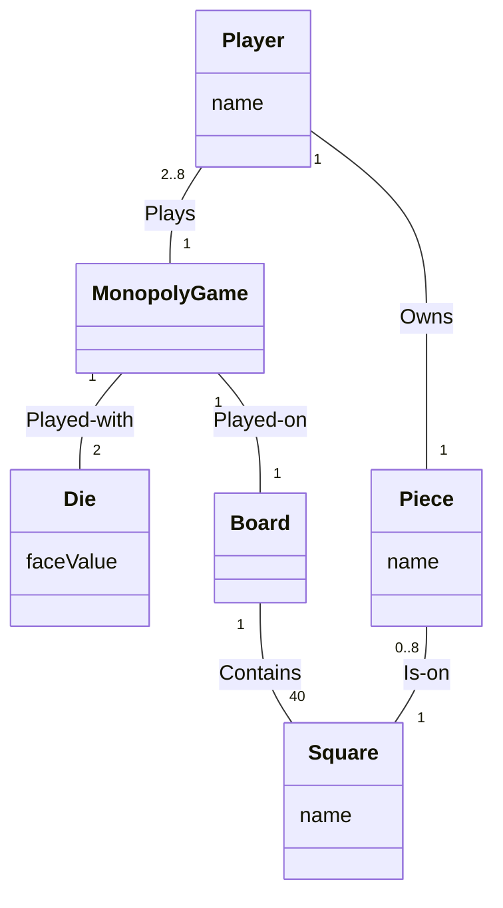
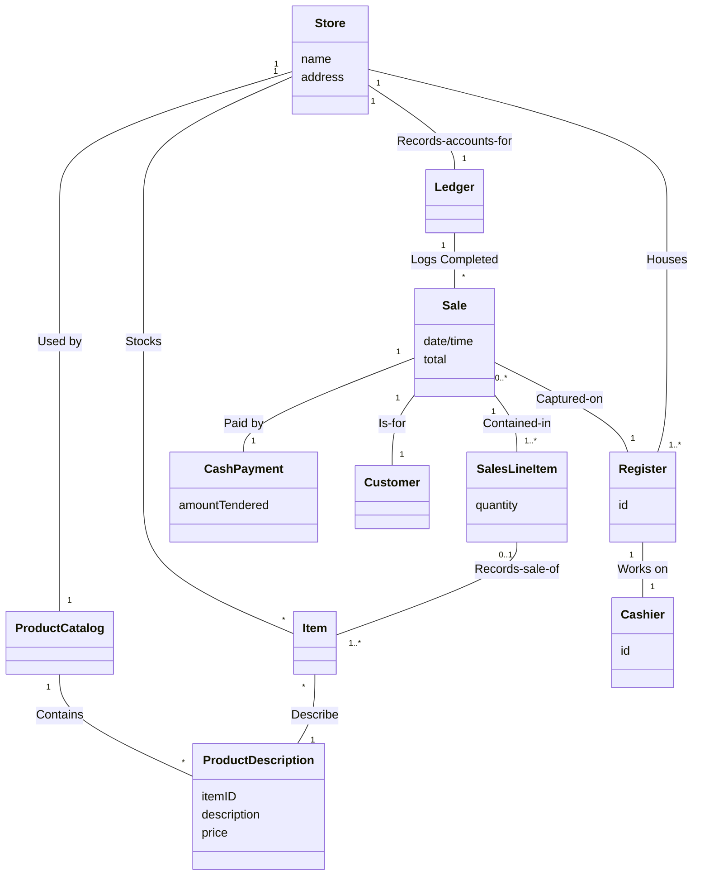

![[assets/存款物品系统类图.png]]

# 特点

- 与[[类图]]类似
- 只有[[关系#泛化(Generalize)|泛化关系]]和[[关系#关联 4bb4a0|关联关系]]
	- 所有关联关系都要有名字
- 类只有属性,没有方法
	- 属性不需要声明它的类型(如int, string)
- 所有List都表示成类及其组成

# 绘制过程

1. 写出概念类及其含义
2. 写出概念类之间关系及其名称
3. 确定概念类的属性

# 例子

## 大富翁游戏 (Monopoly Game)

**类含义说明：**

*   **MonopolyGame (大富翁游戏)**: 代表游戏的整体运行和状态，是游戏的控制器。
*   **Die (骰子)**: 游戏使用的道具，具有面值 (`faceValue`) 属性，用于决定移动步数。
*   **Board (棋盘)**: 游戏的场地，包含所有的方格。
*   **Player (玩家)**: 参与游戏的人，具有名字 (`name`) 属性。
*   **Piece (棋子)**: 代表玩家在棋盘上的位置标记，具有名字 (`name`) 属性。
*   **Square (方格)**: 棋盘上的每一个具体格子，具有名字 (`name`) 属性。

## 销售终端系统 (POS System) #重点

**类含义说明：**

*   **Sales LineItem (销售明细)**: 销售交易中的一行，包含购买数量 (`quantity`) 和对应的商品信息。
*   **Item (具体商品)**: 实际库存中的物理商品实例。
*   **ProductDescription (商品描述)**: 商品的通用属性描述，包含商品ID (`itemID`)、描述 (`description`)、价格 (`price`) 等。
*   **Ledger (总账)**: 用于记录销售和财务数据的账本。
*   **Store (商店)**: 发生交易的实体场所，具有名称 (`name`) 和地址 (`address`)。
*   **Product Catalog (商品目录)**: 所有商品描述的集合，用于查找商品信息。
*   **Sale (销售)**: 一次具体的销售交易记录，包含日期时间 (`date/time`)、总价 (`total`)。
*   **Register (收银机)**: 处理销售交易的终端设备，具有编号 (`id`)。
*   **CashPayment (现金支付)**: 支付的一种形式，包含实付金额 (`amountTendered`)。
*   **Customer (顾客)**: 购买商品的人。
*   **Cashier (收银员)**: 操作收银机处理交易的员工，具有编号 (`id`)。

