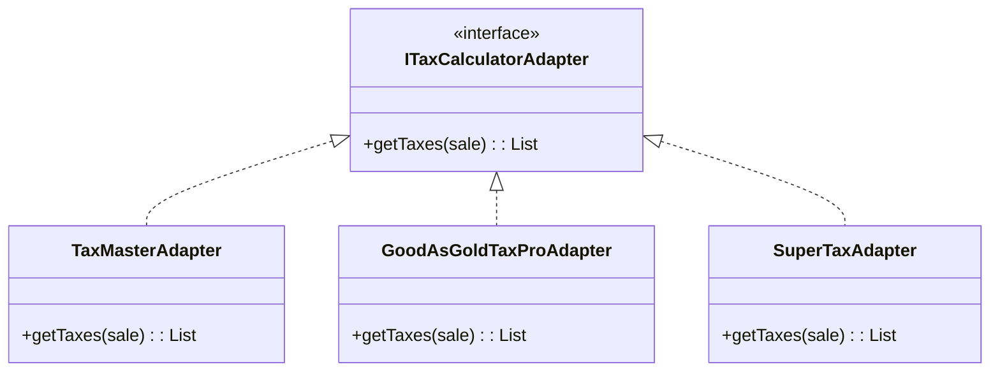
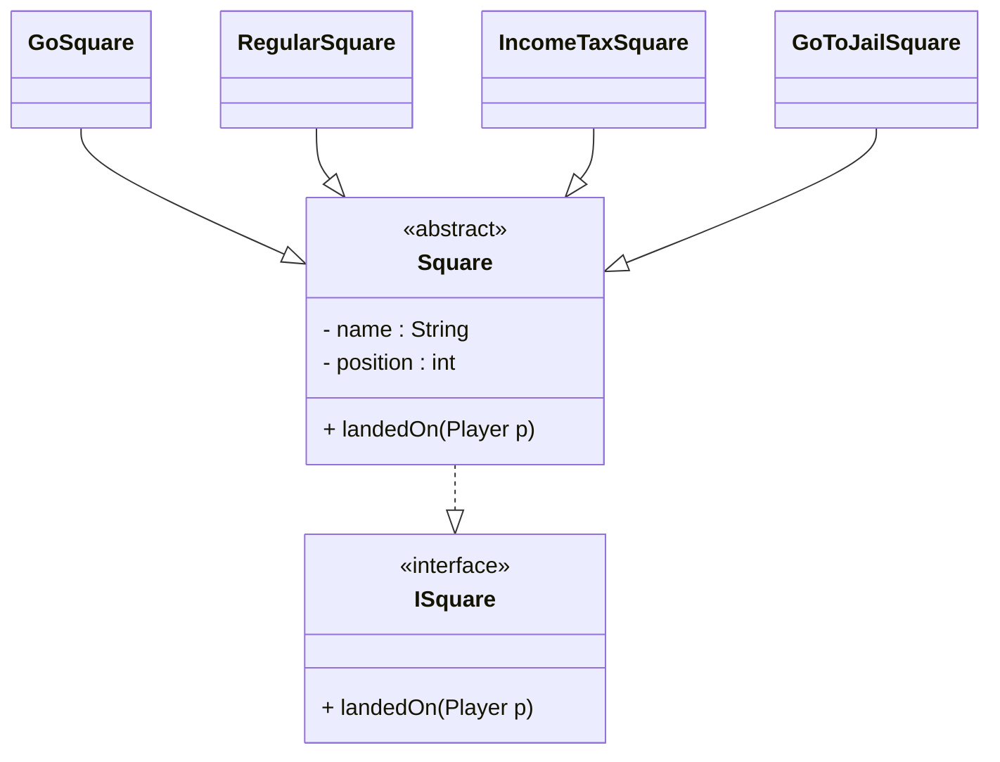

General Responsibility Assignment Software Patterns
>一组指导如何在面向对象设计中合理分配责任的原则（或模式）

具体例子:
1. [[NextGen POS]]

### 创建者 (Creator)
>谁应该创建对象A?
>: 谁包含、记录、使用或拥有创建某对象所需信息，谁就应该创建该对象。

创建者原则的应用体现在**创建**上
- 在[[顺序图]]中, 使用create[[消息]]
- 在[[领域模型]]中, 使用[[关系#^01765a|组合关系]], 被创建者->创建者 #todo 可能有错,领域模型中似乎只有关联关系?
![[assets/考试.png]]
![[assets/销售创建支付顺序图.png]]

### 信息专家（Information Expert）
>分配职责给对象的基本原则是什么?
>: 把职责交给最懂这件事、信息最全的对象

因为太基本, 正常合理的实现都能体现信息专家原则
### 低耦合（Low Coupling）
>如何最小化一个改动的影响?
>: 尽量减少对象之间的依赖，让系统更灵活易改

**Low Coupling 的目标不是“耦合越低越好”，而是“避免让系统依赖那些未来会改变的部分”**
#### 耦合
>一个软件元素对另一个软件元素的依赖程度。

 一个类 X 与类 Y 之间，常见的耦合包括：
1. X 有 Y 类型的属性
2. X 调用 Y 的方法
3. X 的方法参数或局部变量是 Y 类型
4. X 的方法返回 Y
5. X 继承自 Y（**强耦合**）
导致**如果 Y 变了，X 也可能受影响**

##### 高耦合不一定有害
>你需要把精力放在那些“现实中会频繁变化”的地方。

举例：
- 支付系统需要接不同厂商的税率计算器 → 这个地方必须谨慎处理耦合
- Java 库（java.util）是稳定的 → 高耦合完全没问题

所以：
> “高耦合有害”取决于你耦合的对象是否“高不稳定（unstable）”。

#### [[GRASP#信息专家（Information Expert）|信息专家原则]]会自动引导我们选择耦合更低的设计。
因为：
- 信息专家 A 已经拥有所有 B 信息
- 让它来做事情不需要额外依赖A
- 若把责任交给别人（如 C） 
    ➜ 必须获取那些信息  
    ➜ 耦合必然上升

### 高内聚（High Cohesion）
>如何让代码可理解,可维护,**低耦合**?
>: 让一个类的职责紧密相关，且并不承担过多任务。

![[assets/内聚对比图.png]]

#### Cohesion (内聚) 
衡量两个方面：
1. **代码数量**  
    做的事越多，类越大，越难维护。
2. **这些事是否高度相关**  
    比如一个类既处理数据库又负责随机数生成→职责不相关 → 内聚差。

#### 反例:上帝类(God Class)
操作集中在God Class中
- 以后系统任何变化都要修改这个类
- 任何小改动都有可能引入错误

#### 实践
分配职责时保持高内聚，把无关或过多的职责拆给其他对象

### 控制器（Controller）
>UI 的消息发送给哪个对象?(这个对象需要控制整个系统的具体运行)
>: 用一个负责接收用户输入或系统事件的对象来协调处理流程。

 >[!important] 核心思想
 >- UI 不做业务逻辑
 >- Controller 不做实际业务，它只负责接收和分发
>- Controller 必须是一个稳定、不易变化的位置  （UI 会变，业务对象会变，但 Controller 作为入口是稳定的）
>- Controller 与业务对象的耦合应当合理、不过度

Controller 是 _UI 层之后最先接收系统操作_ 的对象。  
它的职责是：
1. **接收来自 UI 的系统级请求**
2. **把这个请求转换成真实的业务操作**
3. **进一步把动作分发给真正负责业务的领域对象**
它不负责“做事情”，它负责“转发和协调”。


#### ✔️ Option 1：代表整个系统的“根对象”

例如：
- MonopolyGame
- GameApplication
- ATMSystem
- LibrarySystem
适用于系统操作不多、逻辑层不太复杂的情况。

#### ✔️ Option 2：代表一个 Use Case 的对象（会话控制器）

**命名方式**一般为：
- `<UseCaseName>Handler`
- `<UseCaseName>Coordinator`
- `<UseCaseName>Session`
例如：
- PlayMonopolyGameHandler
- BorrowBookSession
- WithdrawCashSession
- RegisterUserSession
适用于系统操作种类多、流程复杂的情况。


### 多态（Polymorphism）
>变化的行为交给“会变化的类”自己管理

多态一般通过两种方式共同实现：

1. **抽象类（abstract class）**
2. **接口（interface）**

#### 区别：接口 vs 抽象类

| 特性           | 接口 (Interface)           | 抽象类 (Abstract Class)            |
| :------------- | :------------------------- | :--------------------------------- |
| **核心本质**   | **Can-do** (行为契约)      | **Is-a** (类别抽象)                |
| **设计目的**   | 规范不同类的**共同行为**   | 复用子类的**共同代码** (属性/方法) |
| **状态(字段)** | 无 (通常只有常量)          | 有 (可以包含成员变量)              |
| **多继承**     | 支持多实现 (implements)    | 仅支持单继承 (extends)             |
| **例子**       | `Flyable` (鸟和飞机都能飞) | `Animal` (狗是动物，猫是动物)      |

```java
// 1. 接口：定义标准 (Can-do)
interface Flyable {
    void fly();
}

// 2. 抽象类：复用代码 (Is-a)
abstract class Bird implements Flyable {
    String color; // 只有类能存状态
    void sleep() { System.out.println("Zzz..."); } // 复用逻辑
}

// 3. 具体类
class Sparrow extends Bird { // 麻雀是鸟
    public void fly() { System.out.println("扑腾翅膀飞"); }
}

class Airplane implements Flyable { // 飞机不是鸟，但也能飞
    public void fly() { System.out.println("喷气推进飞"); }
}
```

> [!TIP] 选择建议
> - 优先使用 **接口** 定义 API（为了灵活性和多态）。
> - 使用 **抽象类** 提供默认实现或复用公共代码（为了减少重复）。
> - 最佳实践：**接口 + 抽象骨架类** (Interface + BaseAbstractClass)。

> [!NOTE] 关键点总结
> 抽象类可以有“状态”（成员变量）和“具体逻辑”，用于复用代码。
> 接口通常只定义“行为规范”（方法签名），不保存状态。




更建议使用接口+抽象类的实现方式



### 纯粹制造者（Pure Fabrication）
>按信息专家原则分配职责时, 却会导致 **低内聚、高耦合、重复代码或不合理设计**怎么办?
>: 允许创建一个不对应现实世界的“人工”类。**把职责从领域对象(根据 Expert 原则)移到专业服务类**

#### 示例
需求：把一个 `Sale` 对象保存到数据库。

**候选方案 ：Sale 自己保存自己（Expert）**

为什么 Expert 会建议这么做？
因为：
- Sale 拥有全部需要保存的数据
- 所以它“看起来”是信息最全、最适合保存自己的对象

如果把“保存到数据库”放到 Sale 中，会导致：

❌ **低内聚**：Sale 必须包含大量数据库代码，和“销售”这个概念无关  
❌ **高耦合**：Sale 依赖 JDBC / SQL / ORM 等数据库接口  
❌ **低复用**：其他类也需要保存怎么办？每个类都写重复数据库操作？

这显然是糟糕设计。

**解决方案：创建 Pure Fabrication**
创建一个不属于领域模型的类，例如：
**PersistentStorage（或 SaleDAO、Repository 等）**

职责：
- 保存 Sale
- 从数据库加载 Sale
- 保存其他对象（可扩展）
- 隐藏底层数据库逻辑

这解决了所有问题
### 间接性（Indirection）
>如何分配职责，使对象之间避免直接[[GRASP#耦合|耦合]]？如何保持[[GRASP#低耦合（Low Coupling）|低耦合]]？
>: 为了减少直接耦合，引入中间对象。

使用[[GRASP#多态（Polymorphism）|多态]]和[[GRASP#纯粹制造者（Pure Fabrication）|纯粹制造者]]都会自然符合间接性原则

### 受保护变换（Protected Variations）
>如何构建系统，使变化发生时不影响稳定部分？
>: 把可能变化的地方隔离，通过接口或抽象来保护系统不受变化影响。

#### 核心机制（Core Mechanisms）
- 数据封装（Encapsulation）
- 抽象 / 接口
- 多态（Polymorphism）
- 间接层（Indirection）
- 标准化协议

两个根据 PV 衍生的原则
- [[GRASP#Liskov Substitution Principle （LSP）——里氏替换原则|里氏替换原则]]
- Law of Demeter

#### LSP 与 Law of Demeter 的关系

| 内容         | LSP                      | Law of Demeter（结构隐藏） |
| ------------ | ------------------------ | -------------------------- |
| 保护变化     | ✔ 不同实现的变化         | ✔ 对象结构变化             |
| 依赖稳定抽象 | ✔ 类型抽象（接口、父类） | ✔ 结构抽象（封装连接）     |
| 防止破坏系统 | ✔ 不安全的子类替换       | ✔ 不稳定的对象结构         |
| 本质归属     | Protected Variations     | Protected Variations       |

所以：

> **LSP + Law of Demeter 都是 Protected Variations 的特殊形式。**

只是保护的对象不同：

- LSP 保护 **不同实现（行为变化）**
- LoD 保护 **对象结构（连接关系变化）**

## 补充的原则
### 低表示差距（LRG: Low Representational Gap）  
> 软件设计应该尽量像现实世界的概念一样自然。

例如:
- 现实中棋盘包含格子，  
- 在领域模型中 Board 也包含 Square。
- OO 开发者常常遵循这种结构：
- **容器负责创建其所包含的对象。**


### 开放-封闭原则 (OCP: Open-Closed Principle)
> 软件实体（类、模块、函数等）应该对扩展开放，对修改封闭。
>: Open for extension, closed for modification.

**这意味着：**
- **Open for extension (对扩展开放)**: 当需求变化时，我们可以通过添加新代码来扩展模块的功能。
- **Closed for modification (对修改封闭)**: 在扩展功能时，不需要修改已有的、可工作的代码。

**实现关键**:
- 依赖抽象（Interface/Abstract Class）而不是具体实现。
- 也就是 **Polymorphism (多态)** 和 **Protected Variations (受保护变化)** 的体现。

### Liskov Substitution Principle （LSP）——里氏替换原则

> 若 S 是 T 的子类型，那么任何使用 T 的程序，在替换为 S 时，其行为不应被破坏。

也就是说：

> **当一个地方依赖一个父类或接口时，不应该因为使用了某个子类实现，就出现异常或不符合预期的行为。**

- 软件应该依赖“稳定的抽象”（接口、超类）
- 任何实现该抽象的子类，都必须能安全替换原来的类型
- 使得系统能够在**不修改客户端代码**的前提下，替换实现从而支持变化

### ✔ 例子：税率计算器

```java
public void addTaxes(ITaxCalculatorAdapter calculator, Sale sale) {
	List taxLineItems = calculator.getTaxes(sale);
}
```

不论传入的是：
- `TaxMasterAdapter`
- `EZTaxAdapter`
- 一个未来的新第三方适配器
该方法都必须**正常工作**。
**这就是 LSP 的核心：客户端只依赖抽象，不依赖实现差异。**


### Law of Demeter
> 对象只应该与“熟人(familiars)”通信，而不是结构链上远处的“陌生人(strangers)”。

#### ✔ 在一个方法内，你可以安全地访问：

1. `this`
2. 方法参数
3. 本对象的属性
4. 属性中的集合元素
5. 方法中创建的对象

#### ❌ 不应该访问：

- 属性的属性的属性……（链式调用）
- 结构中深处的对象（陌生人）

#### ⭐ 为什么“不要与陌生人说话”？

因为：
- 对象结构（模型之间的连接关系）在系统早期常常会变
- 客户端如果依赖过深的结构，就会导致**高耦合、易脆弱**
- 一旦结构调整，所有写着 `a.getB().getC().getD()` 的代码都会坏掉

**这种对“结构不稳定”的耦合，本质上就是违反 Protected Variations。**

---

# ⭐ 4. 示例：违反 Law of Demeter（轻微版本）

`Money amount = sale.getPayment().getTenderedAmount();`

解释：

- `sale` 是“熟人”
    
- `payment` 是 `sale` 的熟人，但对当前对象而言是“陌生人”
    
- `getTenderedAmount()` 访问了陌生人对象的内部结构，轻微违反了 Law of Demeter
    

问题虽小，但结构一变就坏：

- 如果以后 `Sale` 不再直接持有 `Payment`，这段代码就要改
    

---

# ⭐ 5. 严重的违反（脆弱设计）

`AccountHolder holder =     sale.getPayment().getAccount().getAccountHolder();`

或更糟糕的：

`F someF = foo.getA().getB().getC().getD().getE().getF();`

**这个链越长，对对象结构的依赖越大 → 系统越脆弱。**

---

# ⭐ 6. 解决方式：为“熟人”添加额外行为（封装路径）

要满足 Law of Demeter，就要把远端数据的“路径隐蔽”起来。

系统重构方式：

## ❌ 原来（违反 Do not talk to strangers）

`Money amount = sale.getPayment().getTenderedAmount();`

## ✔ 改进：让 “Sale” 暴露稳定接口

`Money amount = sale.getTenderedAmountOfPayment();`

另一个例子：

`AccountHolder holder = sale.getAccountHolderOfPayment();`

这样：
- 客户端只依赖 `Sale` 的稳定接口
- 不关心其内部是否仍然使用 Payment → Account → Holder
- 保护结构变化（对象连接关系变化）不影响客户端


### 面向接口编程 (Program to Interface, rather than Implementation)
> 客户（Client）应该依赖于抽象（接口或抽象类），而不是具体类。

- **核心思想**: 变量的声明类型应该是超类型（Super Type），通常是接口或抽象类。
- **目的**: 减少耦合，提高系统的灵活性和可维护性。
- **好处**:
    - 可以在不修改客户端代码的情况下替换实现（[[GRASP#多态（Polymorphism）|多态]]）。
    - 易于测试（可以轻松 Mock 接口）。
    - 隐藏了实现的细节。

### 用组合而不用继承 (Favor composition over inheritance)
> 通过组合（Has-a）而不是继承（Is-a）来复用代码。

- **继承的问题（白盒复用）**:
    - **破坏封装**: 子类往往必须了解父类的实现细节，父类对子类是透明的。
    - **强耦合**: 父类实现的任何改变都可能强制子类改变（脆弱的基类问题）。
    - **静态关系**: 编译时决定关系，运行时无法改变继承的实现。

- **组合的优势（黑盒复用）**:
    - **封装性好**: 对象被作为黑盒对待，只能通过接口交互，不破坏封装。
    - **低耦合**: 依赖于对象提供的接口而非具体实现细节。
    - **动态灵活**: 运行时可以动态改变行为（例如通过 Setter 注入不同的策略对象，如策略模式）。