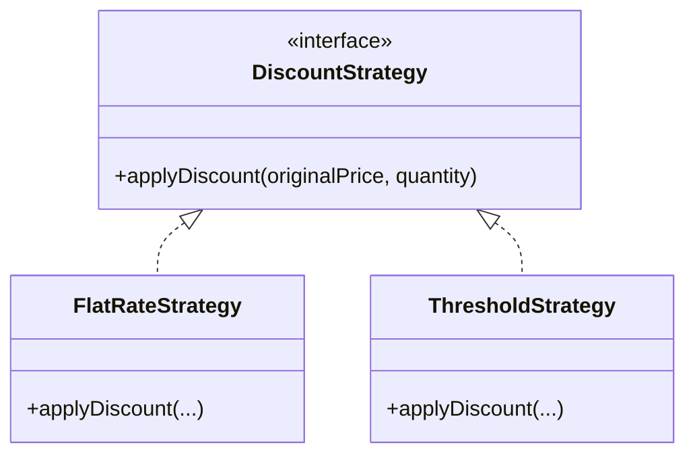
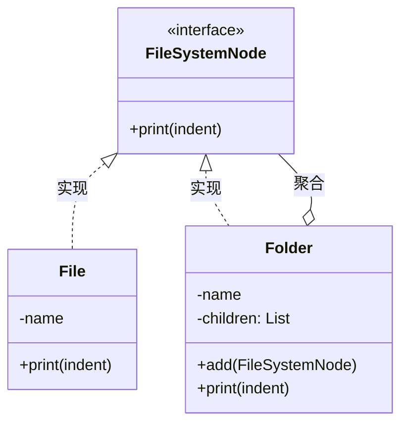
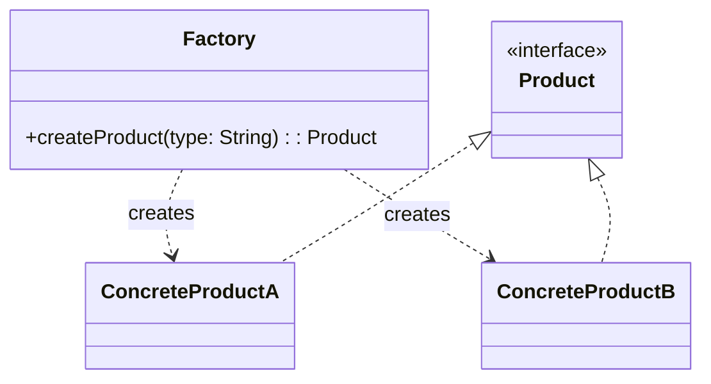
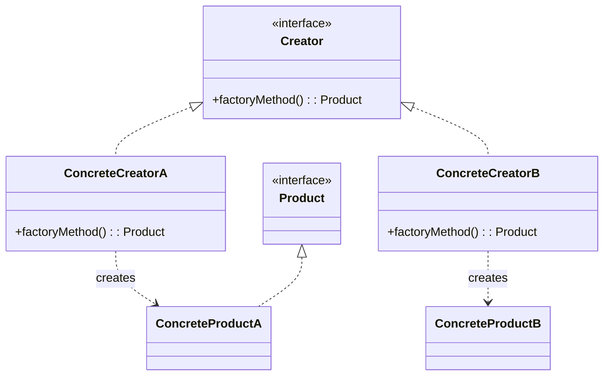
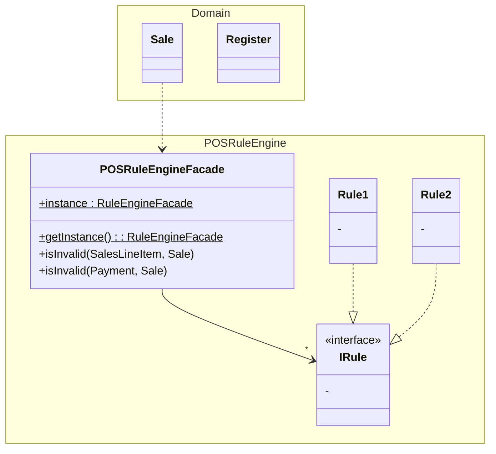
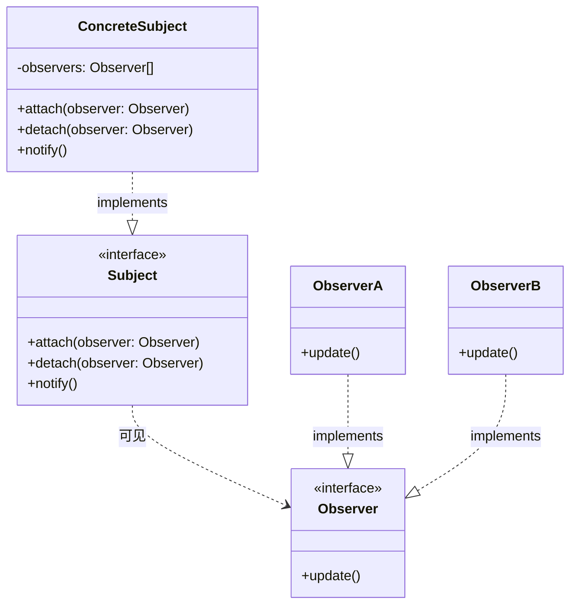
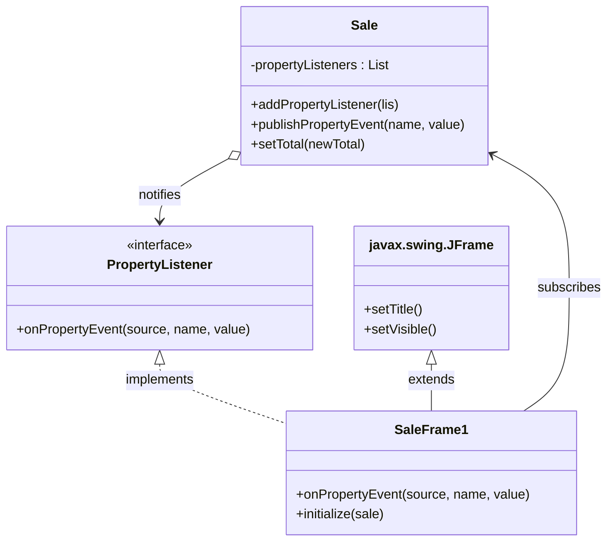
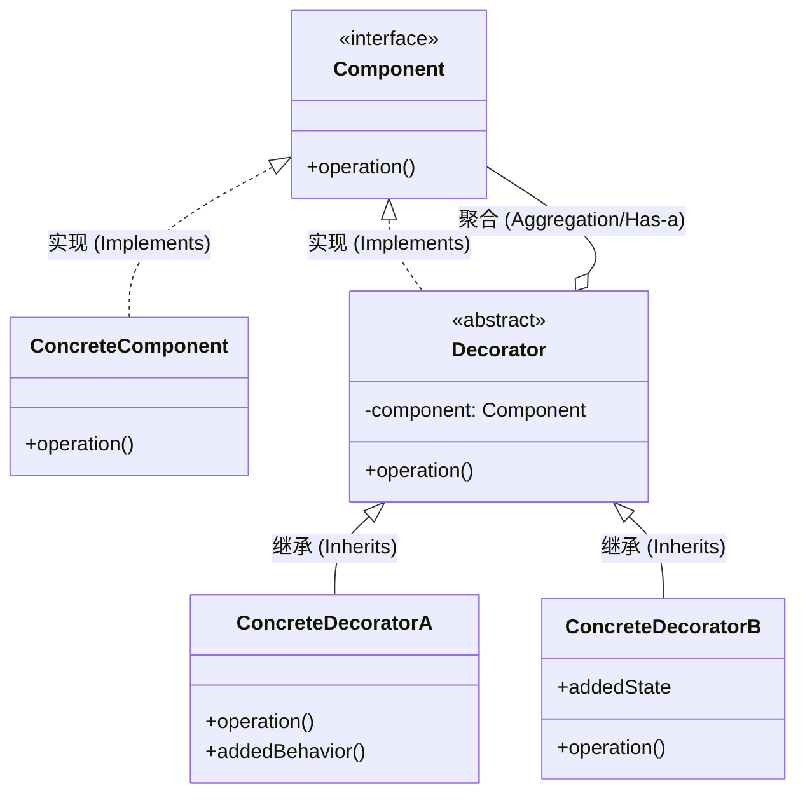
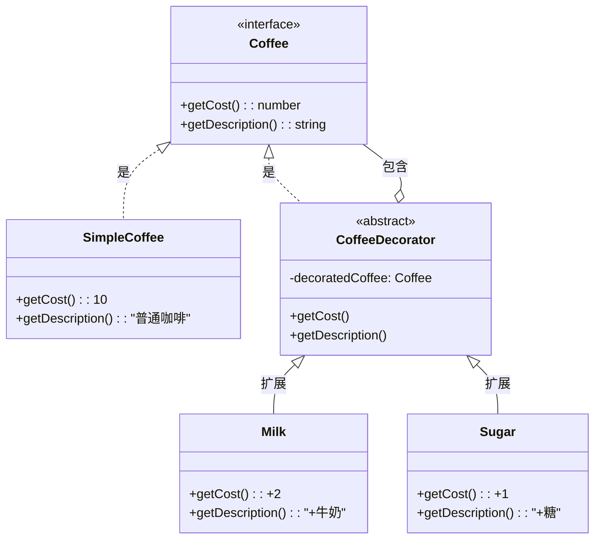

Gang of Four Design Patterns
> 23种经典的设计模式，分为创建型、结构型、行为型三类。

## GoF 与 GRASP 的关系
> GRASP 是“原理”，GoF 是“应用”。

GoF 模式其实是多个 GRASP 原则的**具体组合应用**。

### 以 Adapter 为例
Adapter 模式本质上使用了以下 GRASP 原则：

1.  **Indirection (间接性)**: 引入了一个中间对象（Adapter），打断了 Client 和 ExternalService 的直接联系。
2.  **Polymorphism (多态)**: 为不同的 ExternalService 提供了统一的接口。
3.  **Pure Fabrication (纯虚构)**: Adapter 不是领域模型中的概念，而是为了设计而创造出来的类。

**最终目的**：
实现 **Protected Variations (受保护变化)** 和 **Low Coupling (低耦合)**。

## 1. 适配器 (Adapter)
> 如何解决接口不兼容的问题？或者如何为具有不同接口的类似组件提供稳定的接口？
>: 通过一个中间的适配器对象，将原有的接口转换为另一个接口。

### 核心思想
- **中间层**: 增加一个间接层来适配变化的API。
- **多态**: 客户端只依赖统一的接口。
- **保护**: 保护系统不受外部接口变化的影响（Protected Variations）。


![[assets/适配器模式类图.png]]


## 2. 策略 (Strategy)
> 如何处理一组相关的算法（如不同的定价规则），使它们可以灵活互换？
>: 定义一系列算法，把它们封装起来，并且使它们可互换。

### 核心思想
- **封装变化**: 把变化的算法从使用它的类中分离出来。
- **组合优于继承**: 通过组合（持有Strategy对象）而不是继承来实现行为变化。

### 类图特点
- 使用Strategy的Context与Strategy interface是[[关系#聚合|聚合关系]]

### 示例: 灵活的打折方案


## 3. 组合 (Composite)
> 如何像处理单个对象一样一致地处理对象组合？
>: 将对象组合成树形结构以表示“部分-整体”的层次结构。

### 核心思想
- **一致性**: 客户端不需要区分是处理单个对象（Leaf）还是处理一堆对象（Composite）。
- **递归**: 组合对象内部遍历调用子对象的方法。
- **树形结构**: 典型的树状数据结构实现。

### 核心结构
组合模式包含三个角色：

1. Component (抽象构件) ：定义了叶子和容器共同的接口（例如 FileSystemNode ，定义 delete() ）。
2. Leaf (叶子构件) ：树的叶子节点，没有子节点（例如 File ）。
3. Composite (容器构件) ：树的枝干节点，包含子节点（例如 Folder ）。它实现了接口，并在内部遍历调用子节点的方法。

### 示例: 文件系统
文件（File）是叶子，文件夹（Folder）是容器。对用户来说，删除/复制/打印路径的操作应该是一致的。



### 代码实现 (TypeScript)

```typescript
// 1. Component
interface FileSystemNode {
    print(indent: string): void;
}

// 2. Leaf
class File implements FileSystemNode {
    constructor(private name: string) {}
    print(indent: string) {
        console.log(`${indent}- File: ${this.name}`);
    }
}

// 3. Composite
class Folder implements FileSystemNode {
    private children: FileSystemNode[] = [];
    constructor(private name: string) {}
    
    add(node: FileSystemNode) {
        this.children.push(node);
    }

    print(indent: string) {
        console.log(`${indent}+ Folder: ${this.name}`);
        // 关键：递归调用
        for (const child of this.children) {
            child.print(indent + "  ");
        }
    }
}
```

### 和装饰器模式的区别
- 结构相似 ：它们都涉及到一个类包含另一个类，且实现相同接口。
- 目的不同 ：
  - Decorator ：为了 增强功能 （加牛奶、加糖）。通常是一对一的包装。
  - Composite ：为了 表示整体-部分关系 （文件夹包含文件）。是一对多的聚合，形成树状结构。

## 4. 工厂 (Factory)
> 谁负责创建**复杂的对象**（如适配器或策略）？
>: 定义一个用于创建对象的接口，让子类决定实例化哪一个类。

### 核心思想
- **分离关注点 (Separation of Concerns)**: 将“复杂的创建逻辑”与“业务逻辑”分离开。
- **纯虚构 (Pure Fabrication)**: 工厂类通常不是领域概念，而是为了保持高内聚而创造的辅助类。
- **数据驱动设计 (Data-Driven Design)**: 可以从配置文件读取类名，动态加载类，无需修改代码即可切换实现。

### 4.1 简单工厂 (Simple Factory)
> 这是一个具体的类，不是 GoF 的 23 种模式之一，但使用极其广泛。

#### 核心思想
由一个工厂类根据传入的参数（如字符串），动态决定创建哪一个产品类的实例。



#### 优缺点
- **优点**: 客户端免除了创建对象的责任，实现了责任分割。
- **缺点**: 
    - **违反 OCP (开放-封闭原则)**: 一旦添加新产品（如 ProductC），就必须修改工厂类的 `if-else` 或 `switch` 逻辑。
    - **全责风险**: 工厂类集中了所有创建逻辑，一旦出错，整个系统受影响。

---

### 4.2 工厂方法 (Factory Method)
> GoF 23 种模式之一。
> 定义一个用于创建对象的接口，让子类决定实例化哪一个类。

#### 核心思想
将“创建对象的职责”下放给子类。基类（或接口）只定义创建的标准，不负责具体创建。



#### 优缺点
- **优点**: 
    - **符合 OCP**: 增加新产品时，只需增加一个新的 Factory 子类，不需要修改原有代码。
    - **高内聚**: 每个 Factory 只负责一种产品的创建。
- **缺点**: 
    - **类爆炸**: 每增加一个产品，就需要增加一个对应的 Factory 类，增加了开发量和系统复杂度。

## 5. 外观 (Facade)
> 如何为一组复杂的子系统接口提供一个一致的、简单的入口？
>: 定义一个高层接口，让子系统更易于使用。

### 核心思想
- **简化接口**: 客户端只需要跟 Facade 说话，不需要认识子系统里的几十个类。
- **解耦**: 客户端不依赖子系统的具体实现（Protected Variations）。
- **单例 (Singleton)**: Facade 对象通常是单例。

### 示例: POS 规则引擎
POS 系统需要处理各种复杂的业务规则（如“使用礼券时只能买一件商品”、“慈善捐赠限制”）。
如果让 `Sale` 类直接去调用底层的规则引擎（可能是几百个规则类），代码会乱成一团。

**解决方案**: `POSRuleEngineFacade`。



#### 图解说明

1.  **静态成员 (Static Members)**:
    *   `instance` 和 `getInstance()` 带有下划线，表示它们是**类级别**的成员（Static），而不是实例级别的。这是 **Singleton (单例)** 模式的应用，确保整个系统只有一个 `POSRuleEngineFacade` 实例。

2.  **箭头含义**:
    *   `Sale ..> POSRuleEngineFacade` (虚线箭头): **依赖 (Dependency)**。
        *   表示 `Sale` 在某个方法中**临时使用**了 `POSRuleEngineFacade`（通常通过调用 `getInstance()`），但并不长期持有它作为成员变量。
    *   `POSRuleEngineFacade --> "*" IRule` (实线箭头): **关联 (Association)**。
        *   表示 `POSRuleEngineFacade` **持有** `IRule` 的引用（通常是成员变量）。
        *   `*` 表示**一对多**关系，即 Facade 内部维护了一个规则列表 (`List<IRule>`)。
    *   `Rule1 ..|> IRule` (虚线空心三角): **实现 (Realization/Implementation)**。
        *   表示 `Rule1` 类**实现**了 `IRule` 接口。

## 6. 观察者 (Observer)
> 不同的订阅者对象对发布者对象的状态改变感兴趣，并希望在发布者产生事件时以自己独特的方式做出反应。且发布者希望保持低耦合。
>: 定义一个“订阅者”或“监听器”接口。订阅者实现此接口。发布者可以动态注册感兴趣的订阅者，并在事件发生时通知它们。

### 核心思想
- **Model-View Separation (模型-视图分离)**: 模型对象（如 `Sale`）不应知道视图对象（如 `Window`）。
- **Low Coupling (低耦合)**: 模型只依赖于通用的接口（如 `PropertyListener`），而不依赖具体的 GUI 类。
- **Protected Variations (受保护变化)**: 即使更换了 UI 框架（如从 Swing 换到 Web），模型代码也无需修改。

### 范式



### 示例: POS 销售总额更新
当 `Sale` 的总金额变化时，GUI 窗口需要刷新显示。
但 `Sale` 不能直接调用 `SaleFrame`，否则业务逻辑就和界面绑死了。

**解决方案**: 使用 Observer 模式。



### 实现细节 (Implementation)

在 Java 和 C# .NET 的 Observer 实现中，“事件”通常通过常规消息（如 `onPropertyEvent`）进行传递。此外，在这两种情况下，事件通常被更正式地定义为一个类，并填充适当的事件数据。然后，该事件对象作为参数在事件消息中传递。

例如：

```java
class PropertyEvent extends Event {
    private Object sourceOfEvent;
    private String propertyName;
    private Object oldValue;
    private Object newValue;
    // ...
}

class Sale {
    // 通知监听器的方法
    private void publishPropertyEvent(String name, Object oldVal, Object newVal) {
        // 创建包含事件数据的对象
        PropertyEvent evt = new PropertyEvent(this, name, oldVal, newVal);
        // 遍历所有监听器并分发事件
        for (PropertyListener lis : propertyListeners) {
            lis.onPropertyEvent(evt);
        }
    }
}
```


## 7. 装饰器 (Decorator)
> 如何在不改变原有对象结构的情况下，动态地给该对象增加一些额外的职责？
>: 像“套娃”一样，把对象包装在另一个对象中。

### 模式结构
装饰器模式主要包含四个角色：
1. Component（抽象构件） ：定义对象的接口（例如 ICoffee ）。
2. ConcreteComponent（具体构件） ：最原始的对象（例如 SimpleCoffee ）。
3. Decorator（抽象装饰器） ：持有一个 Component 的引用，并实现 Component 接口。
4. ConcreteDecorator（具体装饰器） ：负责给构件添加新的职责（例如 MilkDecorator ）。



### 示例: 咖啡订单系统
基础咖啡可以添加牛奶、糖等多种调料。如果使用继承会导致类爆炸。



### 关键实现
装饰器类持有 Component 的引用，并在调用 Component 的方法前后添加自己的逻辑。

```typescript
// 1. Component: 定义统一接口
interface Coffee {
    getCost(): number;
    getDescription(): string;
}

// 2. ConcreteComponent: 基础咖啡
class SimpleCoffee implements Coffee {
    getCost() {
        return 10;
    }
    getDescription() {
        return "普通咖啡";
    }
}

// 3. Decorator: 抽象装饰器 (核心：既是Coffee，又包含Coffee)
abstract class CoffeeDecorator implements Coffee {
    protected decoratedCoffee: Coffee; // 持有被装饰对象的引用

    constructor(coffee: Coffee) {
        this.decoratedCoffee = coffee;
    }

    getCost() {
        return this.decoratedCoffee.getCost();
    }

    getDescription() {
        return this.decoratedCoffee.getDescription();
    }
}

// 4. ConcreteDecorator: 具体装饰器 - 牛奶
class Milk extends CoffeeDecorator {
    getCost() {
        return super.getCost() + 2; // 原价 + 2元
    }

    getDescription() {
        return super.getDescription() + " + 牛奶";
    }
}

// 4. ConcreteDecorator: 具体装饰器 - 糖
class Sugar extends CoffeeDecorator {
    getCost() {
        return super.getCost() + 1; // 原价 + 1元
    }

    getDescription() {
        return super.getDescription() + " + 糖";
    }
}

// --- 使用示例 ---

// 1. 点一杯普通咖啡
let myCoffee: Coffee = new SimpleCoffee();
console.log(`${myCoffee.getDescription()} = ￥${myCoffee.getCost()}`);
// 输出: 普通咖啡 = ￥10

// 2. 加牛奶 (把咖啡包进牛奶里)
myCoffee = new Milk(myCoffee);
console.log(`${myCoffee.getDescription()} = ￥${myCoffee.getCost()}`);
// 输出: 普通咖啡 + 牛奶 = ￥12

// 3. 再加糖 (把加了牛奶的咖啡包进糖里)
myCoffee = new Sugar(myCoffee);
console.log(`${myCoffee.getDescription()} = ￥${myCoffee.getCost()}`);
// 输出: 普通咖啡 + 牛奶 + 糖 = ￥13
```

### 装饰器 vs 继承
- **继承**: 静态的，编译时决定。
- **装饰器**: 动态的，运行时组合。

### 相关模式
- **Adapter**: 改变接口。Decorator 保持接口不变，增强功能。
- **Composite**: Decorator 可以看作是只有一个子节点的 Composite。
