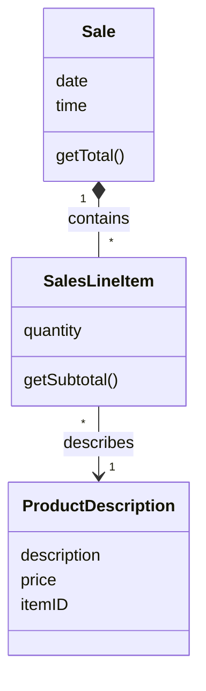
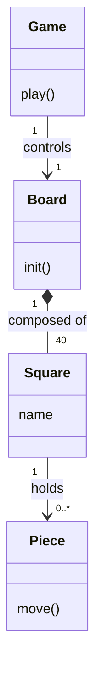
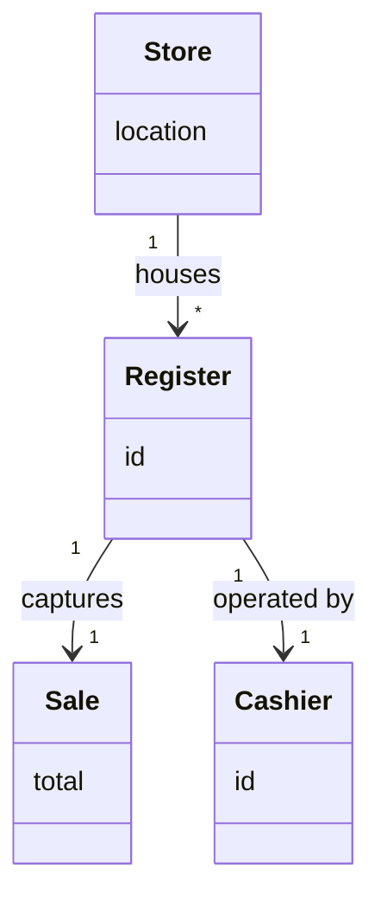

好的，这里有几个关于 GRASP 模式的练习题，旨在考察你对 **Information Expert (信息专家)**、**Creator (创建者)**、**Controller (控制器)** 和 **Low Coupling (低耦合)** 等核心原则的理解。

---

### 练习题

#### 题目 1: 谁来计算小计？ (Information Expert)

**场景：** 在一个销售系统（POS）中，我们需要获取某个销售明细（SalesLineItem）的小计金额（即：`数量 * 单价`）。

请看下面的类图：

**问题：** 根据 **Information Expert (信息专家)** 模式，哪个类最适合负责计算 `SalesLineItem` 的小计（subtotal）？

A. **Sale** (因为它包含所有的 LineItems)
B. **ProductDescription** (因为它包含价格信息)
C. **SalesLineItem** (因为它知道数量，并且关联了价格信息)
D. **Calculator** (一个专门用来计算的工具类)

---

#### 题目 2: 谁来创建棋盘方格？ (Creator)

**场景：** 这是一个简单的棋盘游戏（如大富翁）。整个游戏板（Board）由多个方格（Square）组成。

**问题：** 根据 **Creator (创建者)** 模式，哪个类应该负责实例化（创建）`Square` 对象？

A. **Game**
B. **Piece**
C. **Board**
D. **Square** (自己创建自己)

---

#### 题目 3: 谁来处理系统事件？ (Controller)

**场景：** 用户在收银台的触摸屏上点击了“输入商品”按钮。这产生了一个 `enterItem(itemID, quantity)` 的系统事件。我们需要决定领域层（Domain Layer）中的哪个对象来第一个接收并处理这个消息。

假设类图结构如下（简化版）：

**问题：** 假设 `Register` 代表了整个收银终端系统（Facade），而 `Sale` 代表当前的交易。根据 **Controller (控制器)** 模式，通常推荐将哪个类作为 UI 层之后的第一个入口点来处理 `enterItem` 操作？

A. **Sale** (因为商品是添加给 Sale 的)
B. **Register** (代表整个系统或设备，作为外观控制器 Facade Controller)
C. **Cashier** (因为是收银员在操作)
D. **Store** (因为它是最高层级的对象)

---

#### 题目 4: 降低依赖 (Low Coupling & Indirection)

**场景：** 一个 `Sale` 对象需要将自己保存到数据库中。
**设计 A：** 在 `Sale` 类中直接编写 JDBC 代码连接 MySQL 数据库进行保存。
**设计 B：** 创建一个 `PersistentStorage` 接口，并创建一个负责数据库操作的类 `SaleRepository` 实现该接口。`Sale` 对象只调用接口，不知道具体的数据库实现。

**问题：** 设计 B 相比设计 A，主要体现了哪些 GRASP 模式的好处？（多选）

A. **Pure Fabrication (纯虚构)** - 因为 `SaleRepository` 不是领域概念，而是为了通过分离关注点来支持高内聚而虚构出来的类。
B. **Information Expert (信息专家)** - 因为 `Sale` 最清楚数据，所以它应该自己存。
C. **Protected Variations (受保护变化)** - 隔离了数据库技术的变化对 `Sale` 的影响。
D. **High Cohesion (高内聚)** - 让 `Sale` 专注于业务逻辑，而不是数据库操作。

---

### 答案与解析

#### 题目 1 答案：C. SalesLineItem

**解析：**
**Information Expert** 原则指出：**将职责分配给拥有完成该职责所需信息的类。**
要计算小计（subtotal = quantity * price）：
*   `SalesLineItem` 知道 `quantity`。
*   `SalesLineItem` 知道 `ProductDescription`（通过关联），从而可以获取 `price`。
因此，`SalesLineItem` 拥有计算小计所需的所有信息（直接拥有或通过关联拥有），它是最佳的信息专家。如果让 `Sale` 来算，`Sale` 就必须向 `SalesLineItem` 询问数量，再向 `ProductDescription` 询问价格，这增加了耦合。

#### 题目 2 答案：C. Board

**解析：**
**Creator** 原则建议在以下情况下由类 B 创建类 A：
*   B **包含** 或 **聚合** 了 A (B contains/aggregates A)
*   B 记录 A
*   B 密切使用 A
*   B 拥有 A 初始化所需的数据
在图中，`Board` 与 `Square` 是**组合（Composition）关系**（实心菱形），意味着 `Board` 由 `Square` 组成，且 `Board` 管理着 `Square` 的生命周期。因此，`Board` 是创建 `Square` 的天然候选者。

#### 题目 3 答案：B. Register

**解析：**
**Controller** 模式用于回答：**UI 层应该把系统事件发给领域层的哪个对象？**
通常有两种选择：
1.  **Facade Controller (外观控制器)：** 代表整个系统、设备或子系统的对象（如 `Register`, `Store`, `System`）。
2.  **Use Case Controller (用例控制器)：** 代表当前用例或会话的人造对象（如 `ProcessSaleHandler`）。

在本例中，`Register` 代表了收银终端这个“系统”，它适合作为一个 Facade Controller 来接收 `enterItem` 事件，然后它再将具体的逻辑委托给 `Sale` 去处理。直接发给 `Sale` (A) 通常是不合适的，因为在 `enterItem` 发生之前，`Sale` 对象可能还不存在（或者需要控制器来查找/创建它）。

#### 题目 4 答案：A, C, D

**解析：**
*   **A (Pure Fabrication):** 正确。`SaleRepository` 不是现实世界书店里的概念，而是程序员为了让设计更干净而“虚构”出来的类。
*   **C (Protected Variations):** 正确。通过接口（Indirection），保护了 `Sale` 免受数据库变动（Variation）的影响。
*   **D (High Cohesion):** 正确。设计 B 让 `Sale` 专注业务，`SaleRepository` 专注存储，两者都保持了高内聚。设计 A 让 `Sale` 既做业务又做数据库，导致低内聚。
*   **B (Information Expert):** 错误。虽然 `Sale` 有数据，但让领域对象直接处理持久化会导致它与特定的数据库技术紧耦合，违反了低耦合和高内聚原则。这就是 Information Expert 作为一个基础原则，有时会与其他原则（如低耦合）冲突，此时我们通常优先考虑低耦合。