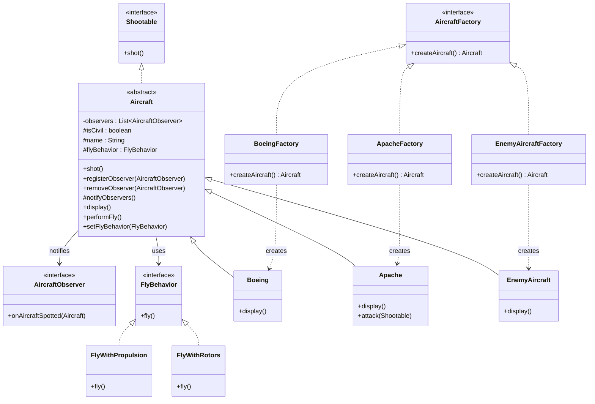

```mermaid
classDiagram
    %% --- Aircraft Observer ---
    class AircraftObserver {
        <<interface>>
        +onAircraftSpotted(Aircraft)
    }

    %% --- Shootable Interface ---
    class Shootable {
        <<interface>>
        +shot()
    }

    %% --- Fly Strategy ---
    class FlyBehavior {
        <<interface>>
        +fly()
    }
    class FlyWithPropulsion { +fly() }
    class FlyWithRotors { +fly() }
    
    FlyBehavior <|.. FlyWithPropulsion
    FlyBehavior <|.. FlyWithRotors

    %% --- Aircraft Hierarchy ---
    class Aircraft {
        <<abstract>>
        -observers : List~AircraftObserver~
        #isCivil : boolean
        #name : String
        #flyBehavior : FlyBehavior
        +shot()
        +registerObserver(AircraftObserver)
        +removeObserver(AircraftObserver)
        #notifyObservers()
        +display()
        +performFly()
        +setFlyBehavior(FlyBehavior)
    }
    Shootable <|.. Aircraft
    Aircraft --> FlyBehavior : uses

    class Boeing { +display() }
    class Apache { 
        +display() 
        +attack(Shootable)
    }
    class EnemyAircraft { +display() }

    Aircraft <|-- Boeing
    Aircraft <|-- Apache
    Aircraft <|-- EnemyAircraft
    Aircraft --> AircraftObserver : notifies

    %% --- Factory Method Pattern ---
    class AircraftFactory {
        <<interface>>
        +createAircraft() Aircraft
    }
    class BoeingFactory { +createAircraft() Aircraft }
    class ApacheFactory { +createAircraft() Aircraft }
    class EnemyAircraftFactory { +createAircraft() Aircraft }

    AircraftFactory <|.. BoeingFactory
    AircraftFactory <|.. ApacheFactory
    AircraftFactory <|.. EnemyAircraftFactory

    BoeingFactory ..> Boeing : creates
    ApacheFactory ..> Apache : creates
    EnemyAircraftFactory ..> EnemyAircraft : creates
```
