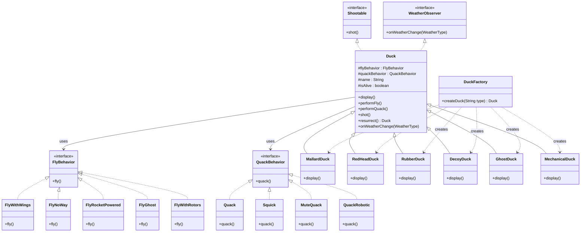

```mermaid
classDiagram
    %% --- Unified Movement Strategy ---
    class FlyBehavior {
        <<interface>>
        +fly()
    }
    class FlyWithWings { +fly() }
    class FlyNoWay { +fly() }
    class FlyRocketPowered { +fly() }
    class FlyGhost { +fly() }
    class FlyWithRotors { +fly() }
    
    FlyBehavior <|.. FlyWithWings
    FlyBehavior <|.. FlyNoWay
    FlyBehavior <|.. FlyRocketPowered
    FlyBehavior <|.. FlyGhost
    FlyBehavior <|.. FlyWithRotors

    %% --- Quack Strategy ---
    class QuackBehavior { 
        <<interface>> 
        +quack() 
    }
    class Quack { +quack() }
    class Squick { +quack() }
    class MuteQuack { +quack() }
    class QuackRobotic { +quack() }

    QuackBehavior <|.. Quack
    QuackBehavior <|.. Squick
    QuackBehavior <|.. MuteQuack
    QuackBehavior <|.. QuackRobotic

    %% --- Shootable Interface ---
    class Shootable {
        <<interface>>
        +shot()
    }
    
    %% --- Weather Observer Interface ---
    class WeatherObserver {
        <<interface>>
        +onWeatherChange(WeatherType)
    }

    %% --- Duck Hierarchy ---
    class Duck {
        #flyBehavior : FlyBehavior
        #quackBehavior : QuackBehavior
        #name : String
        #isAlive : boolean
        +display()
        +performFly()
        +performQuack()
        +shot()
        +resurrect() Duck
        +onWeatherChange(WeatherType)
    }

    Shootable <|.. Duck
    WeatherObserver <|.. Duck

    class MallardDuck { +display() }
    class RedHeadDuck { +display() }
    class RubberDuck { +display() }
    class DecoyDuck { +display() }
    class GhostDuck { +display() }
    class MechanicalDuck { +display() }

    Duck <|-- MallardDuck
    Duck <|-- RedHeadDuck
    Duck <|-- RubberDuck
    Duck <|-- DecoyDuck
    Duck <|-- GhostDuck
    Duck <|-- MechanicalDuck

    Duck --> FlyBehavior : uses
    Duck --> QuackBehavior : uses

    %% --- Factory Pattern ---
    class DuckFactory {
        +createDuck(String type) Duck
    }

    DuckFactory ..> MallardDuck : creates
    DuckFactory ..> RedHeadDuck : creates
    DuckFactory ..> RubberDuck : creates
    DuckFactory ..> DecoyDuck : creates
    DuckFactory ..> GhostDuck : creates
    DuckFactory ..> MechanicalDuck : creates
```
