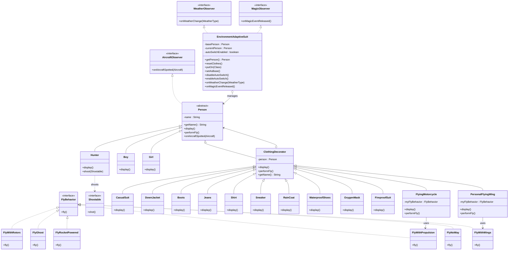

```mermaid
classDiagram
    %% --- Strategy Interfaces ---
    class FlyBehavior {
        <<interface>>
        +fly()
    }
    class FlyNoWay { +fly() }
    class FlyWithWings { +fly() }
    class FlyWithPropulsion { +fly() }
    class FlyRocketPowered { +fly() }
    class FlyGhost { +fly() }
    class FlyWithRotors { +fly() }

    FlyBehavior <|.. FlyNoWay
    FlyBehavior <|.. FlyWithWings
    FlyBehavior <|.. FlyWithPropulsion
    FlyBehavior <|.. FlyRocketPowered
    FlyBehavior <|.. FlyGhost
    FlyBehavior <|.. FlyWithRotors

    %% --- External Interfaces ---
    class WeatherObserver { 
        <<interface>> 
        +onWeatherChange(WeatherType) 
    }
    class AircraftObserver { 
        <<interface>> 
        +onAircraftSpotted(Aircraft) 
    }
    class Shootable { 
        <<interface>> 
        +shot() 
    }
    class MagicObserver {
        <<interface>>
        +onMagicEventReleased()
    }

    %% --- Component ---
    class Person {
        <<abstract>>
        -name : String
        +getName() String
        +display()
        +performFly()
        +onAircraftSpotted(Aircraft)
    }
    
    AircraftObserver <|.. Person

    %% --- Concrete Components ---
    class Hunter {
        +display()
        +shoot(Shootable)
    }
    class Boy { +display() }
    class Girl { +display() }

    Person <|-- Hunter
    Person <|-- Boy
    Person <|-- Girl

    %% --- Decorator ---
    class ClothingDecorator {
        -person : Person
        +display()
        +performFly()
        +getName() String
    }
    
    Person <|-- ClothingDecorator
    ClothingDecorator o--> Person

    %% --- Concrete Decorators (Clothing) ---
    class CasualSuit { +display() }
    class DownJacket { +display() }
    class Boots { +display() }
    class Jeans { +display() }
    class Shirt { +display() }
    class Sneaker { +display() }
    class RainCoat { +display() }
    class WaterproofShoes { +display() }
    class OxygenMask { +display() }
    class FireproofSuit { +display() }

    ClothingDecorator <|-- CasualSuit
    ClothingDecorator <|-- DownJacket
    ClothingDecorator <|-- Boots
    ClothingDecorator <|-- Jeans
    ClothingDecorator <|-- Shirt
    ClothingDecorator <|-- Sneaker
    ClothingDecorator <|-- RainCoat
    ClothingDecorator <|-- WaterproofShoes
    ClothingDecorator <|-- OxygenMask
    ClothingDecorator <|-- FireproofSuit

    %% --- Flight Equipment Decorators ---
    class PersonalFlyingWing { 
        -myFlyBehavior : FlyBehavior
        +display() 
        +performFly()
    }
    class FlyingMotorcycle {
        -myFlyBehavior : FlyBehavior
        +display()
        +performFly()
    }

    ClothingDecorator <|-- PersonalFlyingWing
    ClothingDecorator <|-- FlyingMotorcycle
    
    %% Decorators use Strategies
    PersonalFlyingWing --> FlyWithWings : uses
    FlyingMotorcycle --> FlyWithPropulsion : uses

    %% --- Environment Adaptive Suit ---
    class EnvironmentAdaptiveSuit {
        -basePerson : Person
        -currentPerson : Person
        -autoSwitchEnabled : boolean
        +getPerson() Person
        +resetClothes()
        +putOn(Class)
        +setAsBase()
        +disableAutoSwitch()
        +enableAutoSwitch()
        +onWeatherChange(WeatherType)
        +onMagicEventReleased()
    }
    
    EnvironmentAdaptiveSuit o--> Person : manages
    WeatherObserver <|.. EnvironmentAdaptiveSuit
    MagicObserver <|.. EnvironmentAdaptiveSuit
    
    Hunter ..> Shootable : shoots
```
