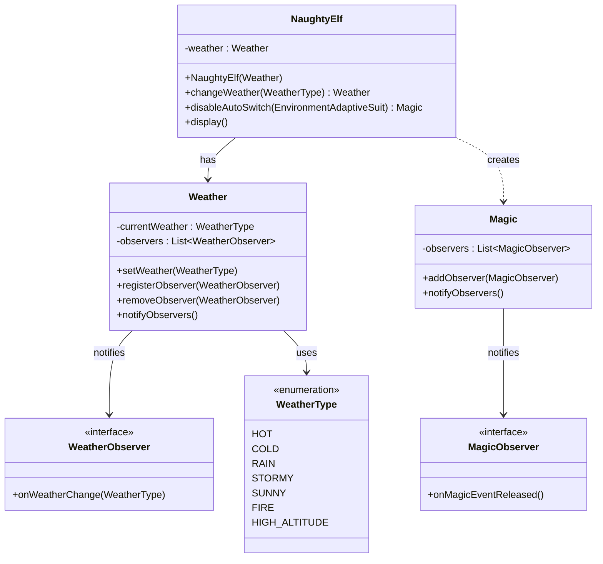

```mermaid
classDiagram
    %% --- Observer Pattern (Weather) ---
    class WeatherObserver {
        <<interface>>
        +onWeatherChange(WeatherType)
    }

    %% --- Weather Subject ---
    class Weather {
        -currentWeather : WeatherType
        -observers : List~WeatherObserver~
        +setWeather(WeatherType)
        +registerObserver(WeatherObserver)
        +removeObserver(WeatherObserver)
        +notifyObservers()
    }

    %% --- Weather Enumeration ---
    class WeatherType {
        <<enumeration>>
        HOT
        COLD
        RAIN
        STORMY
        SUNNY
        FIRE
        HIGH_ALTITUDE
    }

    class NaughtyElf {
        -weather : Weather
        +NaughtyElf(Weather)
        +changeWeather(WeatherType) Weather
        +disableAutoSwitch(EnvironmentAdaptiveSuit) Magic
        +display()
    }

    class Magic {
        -observers : List~MagicObserver~
        +addObserver(MagicObserver)
        +notifyObservers()
    }

    class MagicObserver {
        <<interface>>
        +onMagicEventReleased()
    }

    Weather --> WeatherObserver : notifies
    Weather --> WeatherType : uses
    NaughtyElf --> Weather : has
    NaughtyElf ..> Magic : creates
    Magic --> MagicObserver : notifies
```
