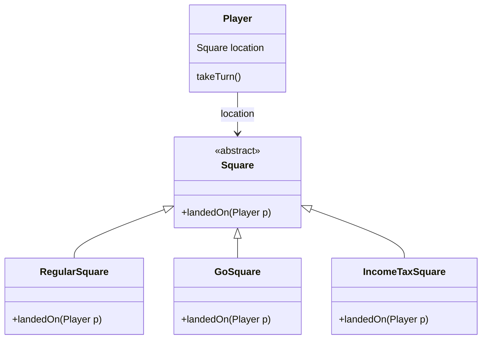
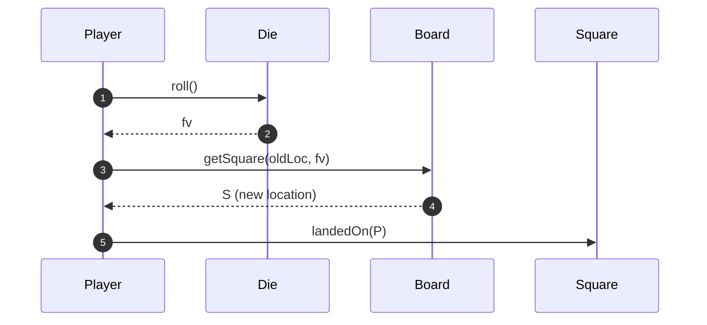
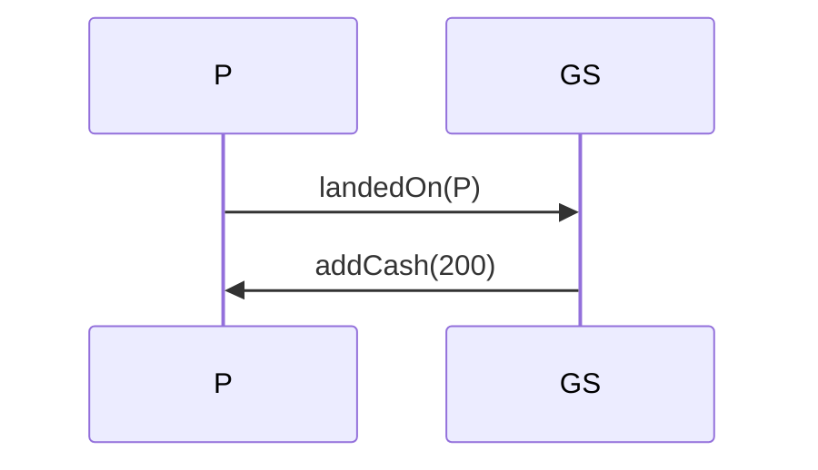

# 🟥 Monopoly 多态设计（简洁版笔记）

## 1. 设计问题

不同类型的棋盘格子（Square）有不同的行为：

- GoSquare：给玩家 $200
- IncomeTaxSquare：收税
- RegularSquare：什么都不做

如果用 switch 判断类型，会导致：

```java
switch(square.type) {
    case GO: player.addCash(200); break;
    case TAX: player.payTax(); break;
    case REGULAR: /* nothing */ break;
}
```

- 高耦合
- 难扩展（新增格子要修改很多地方）

因此采用 **Polymorphism（多态）**。

# 🟥 2. 静态设计（类图）

关键点：
- Square 是抽象类
- landedOn() 是抽象方法
- 子类根据自己行为重写 landedOn
- Player 仅负责调用 landedOn，不判断类型




# 🟥 3. 核心代码示例

### 抽象类 Square

```java
abstract class Square {
    abstract void landedOn(Player p);
}
```

### 子类行为多态实现

```java
class GoSquare extends Square {
    void landedOn(Player p) {
        p.addCash(200);
    }
}

class IncomeTaxSquare extends Square {
    void landedOn(Player p) {
        p.payTax();
    }
}

class RegularSquare extends Square {
    void landedOn(Player p) {
        // NO-OP
    }
}
```

### Player.takeTurn()

```java
class Player {
    Square location;

    void takeTurn() {
        int fv = die.roll();
        location = board.getSquare(location, fv);
        location.landedOn(this);  // 多态
    }
}
```


# 🟥 4. 动态设计（时序图）




对于 GoSquare：



---

# 🟥 5. GRASP 原则对应关系（总结）

|原则|在本例中的体现|
|---|---|
|**Polymorphism**|landedOn 在不同 Square 子类中多态实现|
|**Expert**|Player 是现金专家 → addCash/payTax 放在 Player 中|
|**Low Coupling**|Player 不需要知道 Square 的具体类型，只调用 landedOn|
|**Controller**|Player.takeTurn 负责整个流程|
