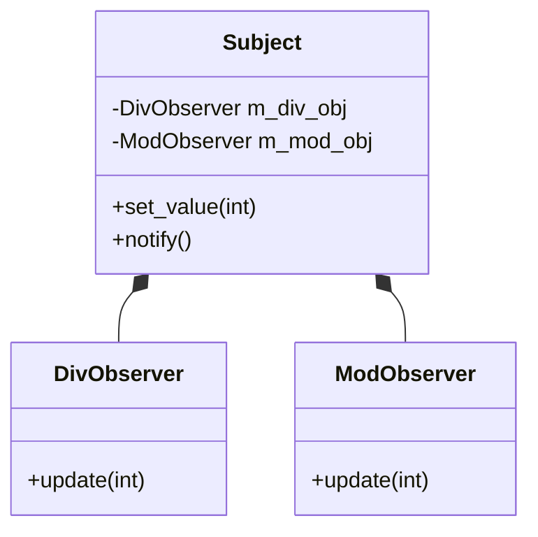
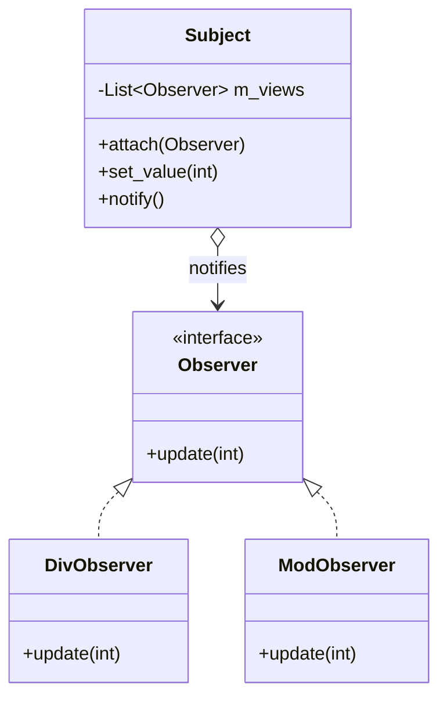

# 观察者模式 (Observer Pattern) 改写示例

## 1. 原始代码 (紧耦合)

在原始设计中，`Subject` 类直接依赖于具体的观察者类 `DivObserver` 和 `ModObserver`。这意味着如果需要添加新的观察者（例如乘法观察者），就必须修改 `Subject` 类的源代码，违反了**开闭原则 (Open-Closed Principle)**。

```cpp
class DivObserver { 
    int  m_div; 
public: 
    DivObserver( int div ) { m_div = div; } 
    void update( int val ) { 
       cout << val << " div " << m_div << " is " 
            << val / m_div << '\n'; 
 }  }; 
 
 class ModObserver { 
    int  m_mod; 
public: 
    ModObserver( int mod ) { m_mod = mod; } 
    void update( int val ) { 
       cout << val << " mod " << m_mod << " is " 
            << val % m_mod << '\n'; 
 }  }; 
 
 class Subject { 
    int  m_value; 
    DivObserver  m_div_obj; // 紧耦合
    ModObserver  m_mod_obj; // 紧耦合
public: 
    Subject() : m_div_obj(4), m_mod_obj(3) { } 
    void set_value( int value ) { 
       m_value = value; 
       notify(); 
    } 
    void notify() { 
       m_div_obj.update( m_value ); 
       m_mod_obj.update( m_value ); 
 }  }; 
 
 int main( void ) { 
    Subject  subj; 
    subj.set_value( 14 ); 
 } 
```

## 2. 改造后代码 (Observer 模式)

使用 Observer 模式，我们定义一个通用的接口 `Observer`。`Subject` 只需要维护一个 `Observer` 指针的列表，而不需要知道具体的观察者类型。

### 核心改进
1.  **定义接口**: 创建 `Observer` 抽象类，包含纯虚函数 `update()`。
2.  **实现接口**: `DivObserver` 和 `ModObserver` 继承自 `Observer`。
3.  **松耦合**: `Subject` 使用 `std::vector<Observer*>` 存储观察者，不再持有具体类的实例。
4.  **动态注册**: 提供了 `attach()` 方法，允许在运行时动态添加观察者。

```cpp
#include <iostream>
#include <vector>
#include <algorithm>

using namespace std;

// 1. 抽象观察者 (Interface)
class Observer {
public:
    virtual void update(int value) = 0;
    virtual ~Observer() {} // 虚析构函数，防止内存泄漏
};

// 2. 具体观察者: 除法 (Concrete Observer)
class DivObserver : public Observer {
    int m_div;
public:
    DivObserver(int div) : m_div(div) {}
    void update(int val) override {
        if (m_div != 0)
            cout << val << " div " << m_div << " is " << val / m_div << endl;
    }
};

// 3. 具体观察者: 取模 (Concrete Observer)
class ModObserver : public Observer {
    int m_mod;
public:
    ModObserver(int mod) : m_mod(mod) {}
    void update(int val) override {
        if (m_mod != 0)
            cout << val << " mod " << m_mod << " is " << val % m_mod << endl;
    }
};

// 4. 主题 (Subject)
class Subject {
    int m_value;
    vector<Observer*> m_views; // 依赖抽象，不依赖具体
public:
    void attach(Observer* obs) {
        m_views.push_back(obs);
    }
    
    void set_value(int value) {
        m_value = value;
        notify();
    }
    
    void notify() {
        for (size_t i = 0; i < m_views.size(); ++i) {
            m_views[i]->update(m_value);
        }
    }
};

// 5. 客户端 (Client)
int main() {
    Subject subj;
    
    // 创建观察者
    DivObserver divObs(4);
    ModObserver modObs(3);

    // 注册观察者
    subj.attach(&divObs);
    subj.attach(&modObs);

    // 改变状态，触发通知
    subj.set_value(14);
    
    return 0;
}
```

### 输出结果
```
14 div 4 is 3
14 mod 3 is 2
```

## 3. 类图对比

### 改造前


### 改造后

