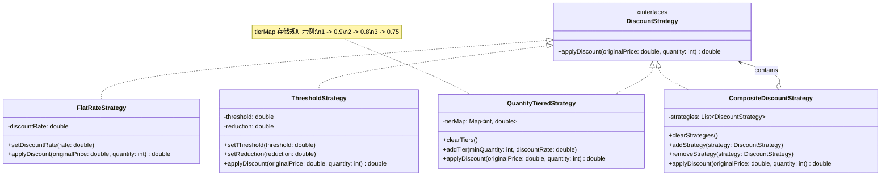

# 价格策略设计 (Strategy Pattern)

本设计使用 **策略模式 (Strategy Pattern)** 来实现灵活的打折方案，并结合 **组合模式 (Composite Pattern)** 以支持多种折扣的叠加使用。同时，所有策略类都提供了参数设置方法（Setter），支持在运行时动态调整折扣规则（例如将“满1000减300”调整为“满1000减600”）。

## 1. 设计思路

- **DiscountStrategy (Interface)**: 定义统一的计算价格接口。
- **具体策略类 (支持动态参数)**:
    1. **FlatRateStrategy (全场折扣)**: 提供 `setDiscountRate` 方法，可随时调整折扣率（如从 0.88 改为 0.9）。
    2. **ThresholdStrategy (满减策略)**: 提供 `setThreshold` 和 `setReduction` 方法，可灵活调整门槛和减免金额。
    3. **QuantityTieredStrategy (阶梯数量折扣)**: 提供 `setTierMap` 或 `clearTiers/addTier` 方法，允许完全重置或修改阶梯规则。
- **CompositeDiscountStrategy (组合策略)**: 维护策略列表，提供 `clearStrategies` 和 `setStrategies` 方法，支持运行时动态更换、移除或重新排列整个折扣组合。

## 2. 类图设计 (Mermaid)

## 3. 逻辑说明

- **动态参数调整 (Setter)**:
    - 所有的具体策略类现在都暴露了 `Setter` 方法。
    - **场景举例**: 如果业务变更，需要将“满1000减300”改为“满1000减600”，无需创建新类，只需调用 `thresholdStrategy.setReduction(600)` 即可立即生效。

- **动态策略组合**:
    - `CompositeDiscountStrategy` 增加了 `clearStrategies()` 和 `removeStrategy()`。
    - 这允许在运行时完全改变促销方案的结构。例如，可以清空当前所有策略，然后只添加一个“全场5折”的策略，或者调整策略的结算顺序。
