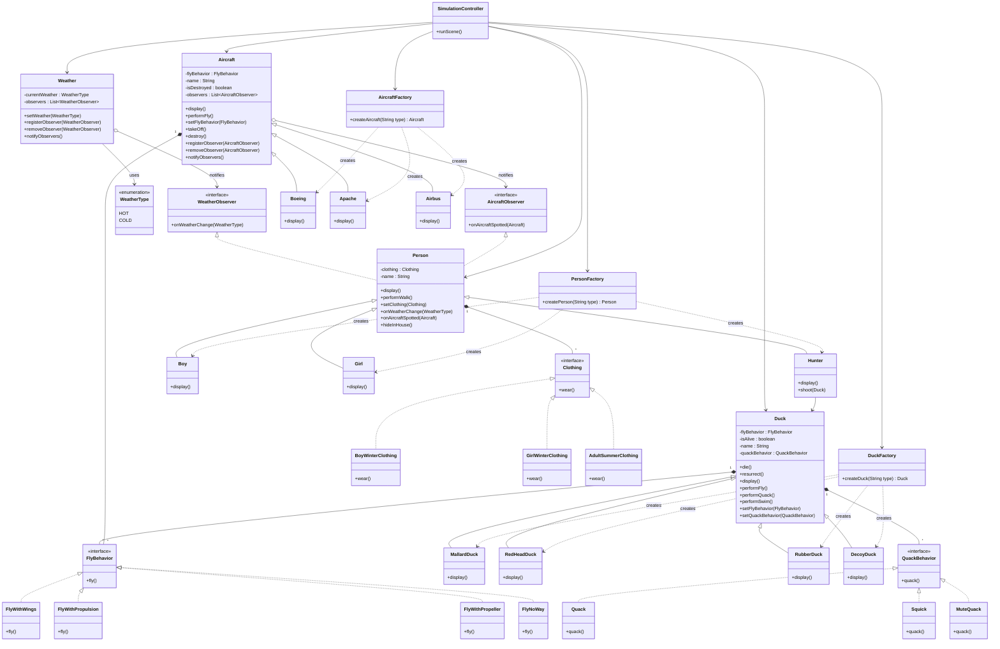

```mermaid
classDiagram
    %% --- GRASP: Controller ---
    class SimulationController {
        +runScene()
    }

    %% --- Observer Pattern (Weather) ---
    class WeatherObserver {
        <<interface>>
        +onWeatherChange(WeatherType)
    }

    %% --- Weather Subject ---
    class Weather {
        -currentWeather : WeatherType
        -observers : List~WeatherObserver~
        +setWeather(WeatherType)
        +registerObserver(WeatherObserver)
        +removeObserver(WeatherObserver)
        +notifyObservers()
    }

    %% --- Weather Enumeration ---
    class WeatherType {
        <<enumeration>>
        HOT
        COLD
    }

    %% --- Observer Pattern (Aircraft) ---
    class AircraftObserver {
        <<interface>>
        +onAircraftSpotted(Aircraft)
    }

    %% --- Unified Movement Strategy ---
    class FlyBehavior {
        <<interface>>
        +fly()
    }

    class FlyWithWings { +fly() }
    class FlyWithPropulsion { +fly() }
    class FlyWithPropeller { +fly() }
    class FlyNoWay { +fly() }

    FlyBehavior <|.. FlyWithWings
    FlyBehavior <|.. FlyWithPropulsion
    FlyBehavior <|.. FlyWithPropeller
    FlyBehavior <|.. FlyNoWay

    %% --- Duck Hierarchy ---
    class Duck {
        -flyBehavior : FlyBehavior
        -isAlive : boolean
        -name : String
        -quackBehavior : QuackBehavior
        +die()
        +resurrect()
        +display()
        +performFly()
        +performQuack()
        +performSwim()
        +setFlyBehavior(FlyBehavior)
        +setQuackBehavior(QuackBehavior)
    }

    class MallardDuck { +display() }
    class RedHeadDuck { +display() }
    class RubberDuck { +display() }
    class DecoyDuck { +display() }

    Duck <|-- MallardDuck
    Duck <|-- RedHeadDuck
    Duck <|-- RubberDuck
    Duck <|-- DecoyDuck

    Duck "1" *-- "*" FlyBehavior
    Duck "1" *-- "*" QuackBehavior

    %% --- Quack Strategy ---
    class QuackBehavior { 
        <<interface>> 
        +quack() 
    }
    class Quack { +quack() }
    class Squick { +quack() }
    class MuteQuack { +quack() }

    QuackBehavior <|.. Quack
    QuackBehavior <|.. Squick
    QuackBehavior <|.. MuteQuack

    %% --- Person Hierarchy ---
    class Person {
        -clothing : Clothing
        -name : String
        +display()
        +performWalk()
        +setClothing(Clothing)
        +onWeatherChange(WeatherType)
        +onAircraftSpotted(Aircraft)
        +hideInHouse()
    }
    class Hunter {
        +display()
        +shoot(Duck)
    }
    class Boy {
        +display()
    }
    class Girl {
        +display()
    }

    Person <|-- Hunter
    Person <|-- Boy
    Person <|-- Girl
    
    %% Person implements WeatherObserver and AircraftObserver
    WeatherObserver <|.. Person
    AircraftObserver <|.. Person

    %% --- Clothing Hierarchy ---
    class Clothing { 
        <<interface>> 
        +wear() 
    }
    class BoyWinterClothing { +wear() }
    class GirlWinterClothing { +wear() }
    class AdultSummerClothing { +wear() }

    Person "1" *-- "*" Clothing
    Clothing <|.. BoyWinterClothing
    Clothing <|.. GirlWinterClothing
    Clothing <|.. AdultSummerClothing

    %% --- Aircraft Hierarchy ---
    class Aircraft {
        -flyBehavior : FlyBehavior
        -name : String
        -isDestroyed : boolean
        -observers : List~AircraftObserver~
        +display()
        +performFly()
        +setFlyBehavior(FlyBehavior)
        +takeOff()
        +destroy()
        +registerObserver(AircraftObserver)
        +removeObserver(AircraftObserver)
        +notifyObservers()
    }
    class Boeing { +display() }
    class Apache { +display() }
    class Airbus { +display() }

    Aircraft <|-- Boeing
    Aircraft <|-- Apache
    Aircraft <|-- Airbus
    Aircraft "1" *-- "*" FlyBehavior

    %% --- Factory Pattern ---
    class DuckFactory {
        +createDuck(String type) Duck
    }

    DuckFactory ..> MallardDuck : creates
    DuckFactory ..> RedHeadDuck : creates
    DuckFactory ..> RubberDuck : creates
    DuckFactory ..> DecoyDuck : creates

    class AircraftFactory {
        +createAircraft(String type) Aircraft
    }
    AircraftFactory ..> Boeing : creates
    AircraftFactory ..> Apache : creates
    AircraftFactory ..> Airbus : creates

    class PersonFactory {
        +createPerson(String type) Person
    }
    PersonFactory ..> Hunter : creates
    PersonFactory ..> Boy : creates
    PersonFactory ..> Girl : creates

    %% --- Relationships ---
    SimulationController --> DuckFactory
    SimulationController --> AircraftFactory
    SimulationController --> PersonFactory
    SimulationController --> Weather
    SimulationController --> Duck
    SimulationController --> Person
    SimulationController --> Aircraft
    Hunter --> Duck
    
    %% Observer Relationship
    Weather o--> WeatherObserver : notifies
    Weather --> WeatherType : uses
    Aircraft o--> AircraftObserver : notifies
```

