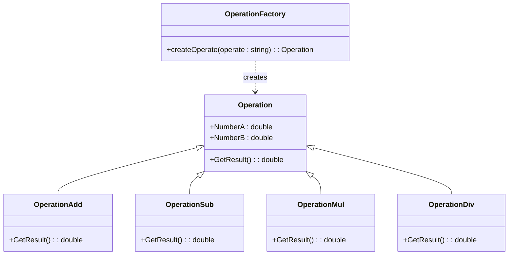
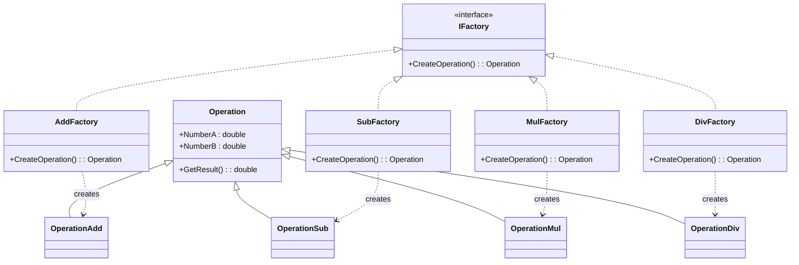

# 简单工厂模式 - 计算器示例 (Simple Factory Pattern)

本示例展示了如何使用 **简单工厂模式 (Simple Factory)** 实现一个可扩展的计算器。

## 1. 设计思路
- **Operation (运算基类)**: 定义两个操作数 (`NumberA`, `NumberB`) 和一个虚方法 `GetResult()`。
- **具体运算类**: (`OperationAdd`, `OperationSub`, etc.) 继承基类并重写 `GetResult()` 实现具体逻辑。
- **OperationFactory (工厂类)**: 根据传入的运算符（如 "+", "-"），负责实例化并返回具体的运算对象。
- **客户端**: 只需调用工厂方法，无需关心具体类的创建过程。

## 2. 类图 (Mermaid)



## 3. 代码实现 (C#)

### 3.1. 运算基类

```csharp
public class Operation
{
    private double _numberA = 0;
    private double _numberB = 0;

    public double NumberA
    {
        get { return _numberA; }
        set { _numberA = value; }
    }

    public double NumberB
    {
        get { return _numberB; }
        set { _numberB = value; }
    }

    public virtual double GetResult()
    {
        double result = 0;
        return result;
    }
}
```

### 3.2. 具体运算类

```csharp
// 加法类
class OperationAdd : Operation
{
    public override double GetResult()
    {
        double result = 0;
        result = NumberA + NumberB;
        return result;
    }
}

// 减法类
class OperationSub : Operation
{
    public override double GetResult()
    {
        double result = 0;
        result = NumberA - NumberB;
        return result;
    }
}

// 乘法类
class OperationMul : Operation
{
    public override double GetResult()
    {
        double result = 0;
        result = NumberA * NumberB;
        return result;
    }
}

// 除法类
class OperationDiv : Operation
{
    public override double GetResult()
    {
        double result = 0;
        if (NumberB == 0)
            throw new Exception("除数不能为 0。");
        result = NumberA / NumberB;
        return result;
    }
}
```

### 3.3. 简单工厂类

```csharp
public class OperationFactory
{
    public static Operation createOperate(string operate)
    {
        Operation oper = null;
        switch (operate)
        {
            case "+":
                oper = new OperationAdd();
                break;
            case "-":
                oper = new OperationSub();
                break;
            case "*":
                oper = new OperationMul();
                break;
            case "/":
                oper = new OperationDiv();
                break;
        }
        return oper;
    }
}
```

### 3.4. 客户端代码

```csharp
Operation oper;
oper = OperationFactory.createOperate("+");
oper.NumberA = 1;
oper.NumberB = 2;
double result = oper.GetResult();
// result is 3
```

---

# 工厂方法模式 - 计算器示例 (Factory Method Pattern)

## 1. 设计思路
- **工厂接口 (IFactory)**: 定义一个创建运算对象的接口 `CreateOperation()`。
- **具体工厂类**: (`AddFactory`, `SubFactory`, etc.) 实现工厂接口，每个工厂只负责创建一种具体的运算对象。
- **客户端**: 决定实例化哪一个具体工厂，然后通过该工厂创建运算对象。

## 2. 类图 (Mermaid)



## 3. 代码实现 (C#)

### 3.1. 工厂接口

```csharp
interface IFactory
{
    Operation CreateOperation();
}
```

### 3.2. 具体工厂类

```csharp
// 加法工厂
class AddFactory : IFactory
{
    public Operation CreateOperation()
    {
        return new OperationAdd();
    }
}

// 减法工厂
class SubFactory : IFactory
{
    public Operation CreateOperation()
    {
        return new OperationSub();
    }
}

// 乘法工厂
class MulFactory : IFactory
{
    public Operation CreateOperation()
    {
        return new OperationMul();
    }
}

// 除法工厂
class DivFactory : IFactory
{
    public Operation CreateOperation()
    {
        return new OperationDiv();
    }
}
```

### 3.3. 客户端代码

```csharp
IFactory operFactory = new AddFactory(); // 客户端决定使用哪个工厂
Operation oper = operFactory.CreateOperation();
oper.NumberA = 1;
oper.NumberB = 2;
double result = oper.GetResult();
// result is 3
```

---

# 简单工厂 vs. 工厂方法 (基于 OCP 对比)

| 特性                    | 简单工厂 (Simple Factory)                                           | 工厂方法 (Factory Method)                                                                           |
| :---------------------- | :------------------------------------------------------------------ | :-------------------------------------------------------------------------------------------------- |
| **实现方式**            | 一个具体的工厂类，使用 `switch-case` 判断创建逻辑。                 | 定义工厂接口，由具体子工厂类负责创建。                                                              |
| **新增产品**            | 需要修改工厂类的 `switch` 代码。                                    | 需要增加一个新的具体工厂类（如 `PowFactory`）。                                                     |
| **OCP (开放-封闭原则)** | **违反**。扩展功能需要修改现有代码 (Closed for modification 失败)。 | **符合**。扩展功能只需添加新类，不修改现有代码 (Open for extension, Closed for modification 成功)。 |
| **复杂性**              | 代码简单，类少。                                                    | 类数量翻倍（类爆炸），代码结构复杂。                                                                |
| **适用场景**            | 产品较少且不经常变化的情况。                                        | 产品经常变化，且需要保持高扩展性的情况。                                                            |
