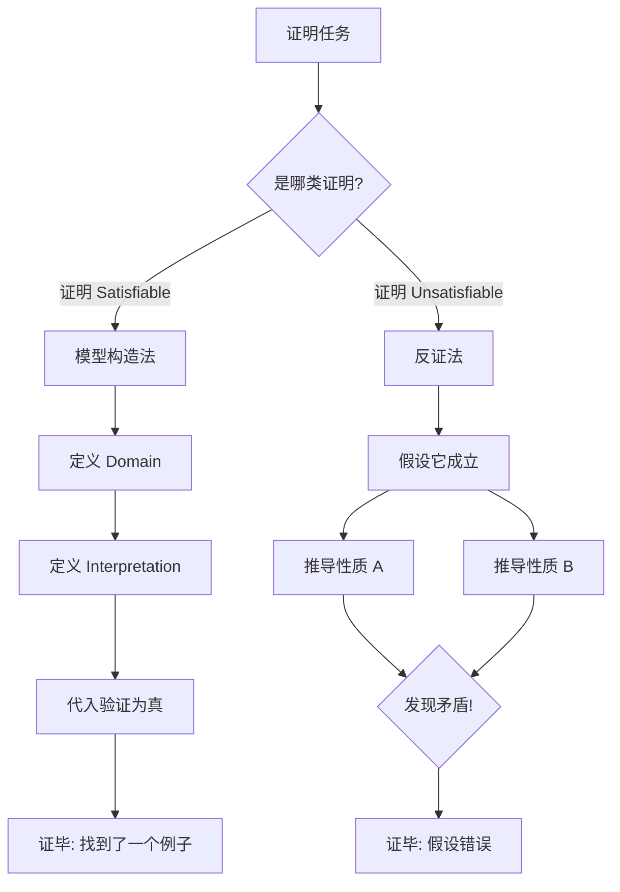

> **核心任务**：如何严格证明一个逻辑句子是“可满足的”或“不可满足的”？

## 1. 证明“可满足” (Proving Satisfiability)

要证明一个句子 $\varphi$ 是可满足的，你只需要**构造一个具体的模型 (Structure)**，并证明该句子在这个模型中为真。

### 案例分析：$\forall x \exists y R(x,y) \land \neg \forall u \exists v R(v,u)$
**直觉**：这句话看似矛盾（前半句说“人人都有人爱”，后半句说“并非人人都有人爱”），但因为变量位置不同（$R(x,y)$ vs $R(v,u)$），其实是可行的。

**构造证明**：
我们构造一个 $\{R\}$-structure $\mathcal{M}$：
- **论域 (Domain)**: $D = \{1, 2\}$
- **关系 (Relation)**: $R^{\mathcal{M}} = \{(1,1), (2,1)\}$

**验证步骤**：
1.  **验证前半句** $\forall x \exists y R(x,y)$：
    - 当 $x=1$ 时，取 $y=1$，有 $(1,1) \in R^{\mathcal{M}}$（成立）。
    - 当 $x=2$ 时，取 $y=1$，有 $(2,1) \in R^{\mathcal{M}}$（成立）。
    - **结论**：前半句在 $\mathcal{M}$ 中为真。
2.  **验证后半句** $\neg \forall u \exists v R(v,u)$：
    - 这等价于证明 $\forall u \exists v R(v,u)$ 为假。
    - 也就是要找一个 $u$，使得没有任何 $v$ 能 $R$ 到它（即没有入度）。
    - 取 $u=2$。
    - 检查所有 $v \in \{1,2\}$：
        - $(1,2) \in R^{\mathcal{M}}$？否。
        - $(2,2) \in R^{\mathcal{M}}$？否。
    - **结论**：$u=2$ 没人爱。所以“人人都有人爱”是假的。后半句（否定式）为真。

**最终结论**：找到了这样一个模型 $\mathcal{M}$，所以原句子是**可满足的**。

---

## 2. 证明“不可满足” (Proving Unsatisfiability)

要证明一个句子 $\varphi$ 是不可满足的，必须使用**反证法 (Proof by Contradiction)**，证明无论什么样的模型都无法让它成立。

### 案例分析：$\forall x P(x) \land \exists x \neg P(x)$
**直觉**：“所有人都是好人”和“存在一个坏人”是绝对冲突的。

**严谨证明**：
1.  **假设**该句子是可满足的。即存在一个结构 $\mathcal{M}$，使得 $\mathcal{M} \models \forall x P(x) \land \exists x \neg P(x)$。
2.  这推导出两个事实：
    - (A) $\mathcal{M} \models \forall x P(x)$
    - (B) $\mathcal{M} \models \exists x \neg P(x)$
3.  根据 (B)，必然存在一个元素 $d \in D$，使得 $d \notin P^{\mathcal{M}}$（即 $d$ 不满足 $P$）。
4.  但是根据 (A)，对于**任意** $x \in D$，都有 $x \in P^{\mathcal{M}}$。既然是“任意”，那 $d$ 自然也不例外，所以 $d \in P^{\mathcal{M}}$。
5.  **矛盾**：我们得出了 $d \notin P^{\mathcal{M}}$ 和 $d \in P^{\mathcal{M}}$ 同时成立。
6.  **结论**：假设不成立。该句子是**不可满足的**。

---

## 3. 证明结构图解

