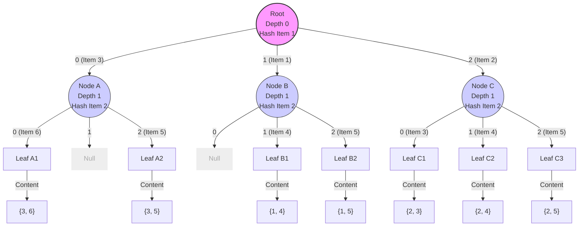

# Hash 树支持度计算实例

在关联规则挖掘中，当数据库很大且候选项集（Candidate Itemsets）数量巨大时，直接将每个事务与所有候选项集进行比对（Subset Checking）是非常耗时的。

**Hash 树（Hash Tree）** 是一种用于加速这一过程的数据结构。它通过将候选项集组织成树状结构，使得我们在处理一条事务时，只需要检查该事务中包含的项可能对应的那些候选项集，从而大幅减少比较次数。

## 1. 实例设定

### 1.1 参数设定
- **项集 (Items)**: 1, 2, 3, 4, 5, 6
- **候选 2-项集 ($C_2$)**:
    1. `{1, 4}`
    2. `{1, 5}`
    3. `{2, 3}`
    4. `{2, 4}`
    5. `{2, 5}`
    6. `{3, 5}`
    7. `{3, 6}`
- **Hash 函数**: $h(x) = x \pmod 3$
    - 结果为 0, 1, 2 三个分支。
- **最大叶节点容量 (Max Leaf Size)**: **1**
    - *注：为了完整展示树的分裂结构，我们将容量设为 1，即每个叶节点只能容纳 1 个项集，一旦超过就必须分裂。*

### 1.2 Hash 计算预览
为了构建树，我们先看每个项的 Hash 值：
- $h(1) = 1, h(4) = 1$
- $h(2) = 2, h(5) = 2$
- $h(3) = 0, h(6) = 0$

## 2. Hash 树构建过程

我们将 $C_2$ 中的项集逐个插入树中。
树的**根节点 (Root)** 根据项集中**第 1 个项**的 Hash 值进行分支。
下一层节点根据项集中**第 2 个项**的 Hash 值进行分支。

### 插入与分裂分析

1.  **{1, 4}**: 第 1 项 1 ($h=1$) -> 这里的叶子目前为空，放入。
2.  **{1, 5}**: 第 1 项 1 ($h=1$) -> 这里的叶子已有 `{1, 4}`。容量满，**分裂**。
    - 变为内部节点 **Node B**。
    - `{1, 4}` 第 2 项 4 ($h=1$) -> Node B 的分支 1。
    - `{1, 5}` 第 2 项 5 ($h=2$) -> Node B 的分支 2。
3.  **{2, 3}**: 第 1 项 2 ($h=2$) -> 放入叶子。
4.  **{2, 4}**: 第 1 项 2 ($h=2$) -> 叶子已有 `{2, 3}`。容量满，**分裂**。
    - 变为内部节点 **Node C**。
    - `{2, 3}` 第 2 项 3 ($h=0$) -> Node C 的分支 0。
    - `{2, 4}` 第 2 项 4 ($h=1$) -> Node C 的分支 1。
5.  **{2, 5}**: 第 1 项 2 ($h=2$) -> 进入 Node C。
    - 第 2 项 5 ($h=2$) -> Node C 的分支 2。
6.  **{3, 5}**: 第 1 项 3 ($h=0$) -> 放入叶子。
7.  **{3, 6}**: 第 1 项 3 ($h=0$) -> 叶子已有 `{3, 5}`。容量满，**分裂**。
    - 变为内部节点 **Node A**。
    - `{3, 5}` 第 2 项 5 ($h=2$) -> Node A 的分支 2。
    - `{3, 6}` 第 2 项 6 ($h=0$) -> Node A 的分支 0。

### 最终 Hash 树结构图

## 3. 支持度计算过程 (Subset Function)

假设来了一个事务 **$T = \{1, 2, 3, 5, 6\}$**。我们需要找出 $T$ 中包含哪些候选 2-项集。
算法逻辑：对 $T$ 中的每个项（作为起始项），根据 Hash 值在树中向下遍历，直到叶节点或 Null。

### 步骤详解

#### 1. 处理项 1 ($h(1)=1$)
- 从 **Root** 沿 **分支 1** 进入 **Node B**。
- **Node B** 依据第 2 个项进行 Hash。
- 我们检查 $T$ 中在 1 之后的项：$\{2, 3, 5, 6\}$。
    - **项 2** ($h(2)=2$): Node B 有分支 2 吗？-> **有 (Leaf B2)**。
        - 检查内容 `{1, 5}`。均在 $T$ 中 -> **计数+1**。
    - **项 3** ($h(3)=0$): Node B 有分支 0 吗？-> 无 (Null)。
    - **项 5** ($h(5)=2$): Node B 有分支 2 吗？-> **有 (Leaf B2)**。
        - 再次指向 `{1, 5}` (通常已标记，不重复计数)。
    - **项 6** ($h(6)=0$): Node B 有分支 0 吗？-> 无。
    - *注：项 4 不在 T 中，虽然 Node B 有分支 1 (`{1,4}`)，但我们不会去访问它。*

#### 2. 处理项 2 ($h(2)=2$)
- 从 **Root** 沿 **分支 2** 进入 **Node C**。
- 我们检查 $T$ 中在 2 之后的项：$\{3, 5, 6\}$。
    - **项 3** ($h(3)=0$): Node C 有分支 0 吗？-> **有 (Leaf C1)**。
        - 检查 `{2, 3}` -> **计数+1**。
    - **项 5** ($h(5)=2$): Node C 有分支 2 吗？-> **有 (Leaf C3)**。
        - 检查 `{2, 5}` -> **计数+1**。
    - **项 6** ($h(6)=0$): Node C 有分支 0 吗？-> 再次指向 `{2, 3}`。

#### 3. 处理项 3 ($h(3)=0$)
- 从 **Root** 沿 **分支 0** 进入 **Node A**。
- 我们检查 $T$ 中在 3 之后的项：$\{5, 6\}$。
    - **项 5** ($h(5)=2$): Node A 有分支 2 吗？-> **有 (Leaf A2)**。
        - 检查 `{3, 5}` -> **计数+1**。
    - **项 6** ($h(6)=0$): Node A 有分支 0 吗？-> **有 (Leaf A1)**。
        - 检查 `{3, 6}` -> **计数+1**。

#### 4. 处理项 5, 6
- 后面没有足够的项构成 2-项集，停止。

### 结果
成功匹配到的候选集：
1. `{1, 5}`
2. `{2, 3}`
3. `{2, 5}`
4. `{3, 5}`
5. `{3, 6}`

共 5 个，与暴力穷举结果一致，但我们完全避开了 `{1, 4}` 和 `{2, 4}` 的无效比较。
