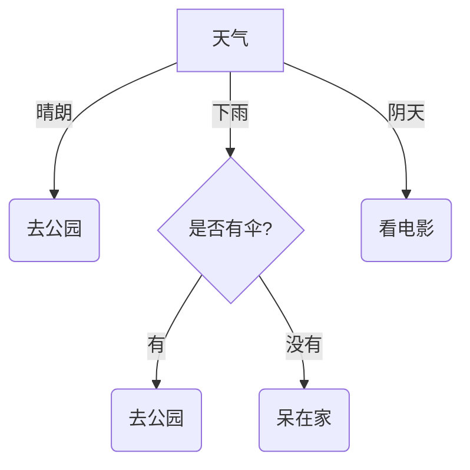

## 1. 概述
决策树（Decision Tree）是一种基本的分类与回归方法。它是一种树形结构，其中每个内部节点（internal node）表示一个属性上的判断，每个分支（branch）代表一个判断结果的输出，最后每个叶节点（leaf node）代表一种分类结果。

决策树学习的目标是根据给定的训练数据集构建一个决策树模型，使它能够对实例进行正确的分类。

## 2. 决策树的结构
- **根节点 (Root Node)**：包含样本全集。
- **内部节点 (Internal Node)**：对应于属性测试。
- **叶节点 (Leaf Node)**：对应于决策结果（类别或数值）。

## 3. 决策树的构建过程
决策树的构建通常是一个递归地选择最优特征，并根据该特征对训练数据进行分割的过程。主要步骤如下：
1.  **特征选择**：从特征集合中选择一个最优特征。
2.  **决策树生成**：根据选择的特征，将数据集分割成子集。如果子集已经属于同一类，则构建叶节点；否则，递归调用。
3.  **剪枝**：为了避免过拟合，对生成的树进行剪枝。

## 4. 特征选择指标
特征选择是决定决策树性能的关键。常用的指标有信息增益、信息增益比和基尼指数。

### 4.1 信息熵 (Information Entropy)
熵是度量样本集合纯度最常用的指标。对于包含 $n$ 个类别的样本集合 $D$，假设第 $k$ 类样本所占比例为 $p_k$，则 $D$ 的信息熵定义为：
$$
Ent(D) = - \sum_{k=1}^{n} p_k \log_2 p_k
$$
$Ent(D)$ 越小，则 $D$ 的纯度越高。

### 4.2 信息增益 (Information Gain) - ID3算法
信息增益表示得知特征 $A$ 的信息而使得类 $D$ 的信息不确定性减少的程度。
假设特征 $A$ 有 $V$ 个可能的取值 $\{a^1, a^2, ..., a^V\}$，若使用 $A$ 对样本集 $D$ 进行划分，则会产生 $V$ 个分支节点。
$$
Gain(D, A) = Ent(D) - \sum_{v=1}^{V} \frac{|D^v|}{|D|} Ent(D^v)
$$
**ID3算法**的核心是在决策树各个节点上应用信息增益准则选择特征，递归地构建决策树。
*缺点*：信息增益对可取值数目较多的属性有所偏好。

### 4.3 信息增益率 (Gain Ratio) - C4.5算法
为了克服信息增益偏好多值属性的缺点，C4.5算法采用信息增益率。
$$
Gain\_ratio(D, A) = \frac{Gain(D, A)}{IV(A)}
$$
其中 $IV(A)$ 是属性 $A$ 的固有值（Intrinsic Value）：
$$
IV(A) = - \sum_{v=1}^{V} \frac{|D^v|}{|D|} \log_2 \frac{|D^v|}{|D|}
$$
**注意**：增益率准则对可取值数目较少的属性有所偏好，因此 C4.5 算法并不是直接选择增益率最大的候选划分属性，而是使用了一个启发式：先从候选划分属性中找出信息增益高于平均水平的属性，再从中选择增益率最高的。

### 4.4 基尼指数 (Gini Index) - CART算法
CART (Classification and Regression Tree) 使用基尼指数来选择划分属性。
$$
Gini(D) = \sum_{k=1}^{n} \sum_{k' \neq k} p_k p_{k'} = 1 - \sum_{k=1}^{n} p_k^2
$$
$Gini(D)$ 反映了从数据集 $D$ 中随机抽取两个样本，其类别标记不一致的概率。$Gini(D)$ 越小，纯度越高。
- 当类分布均衡时，Gini值达到最大值 $(1 - 1/n)$；
- 相反当只有一个类时，Gini值达到最小值 0。
属性 $A$ 的基尼指数定义为：
$$
Gini\_index(D, A) = \sum_{v=1}^{V} \frac{|D^v|}{|D|} Gini(D^v)
$$
CART 选择使划分后基尼指数最小的属性作为最优划分属性。

### 4.5 分类误差 (Classification Error)
分类误差是另一种衡量集合纯度的指标。定义为：
$$
Error(D) = 1 - \max_{k} (p_k)
$$
即 $1$ 减去占多数类的比例。该指标对纯度的变化不如熵或基尼指数敏感，因此在决策树生长过程中较少使用，但在剪枝过程中有时会被使用。

### 4.6 计算实例
为了对比上述指标，假设我们有一个包含 10 个样本的简单数据集 $D$，其中有 5 个正例 (+) 和 5 个负例 (-)。
**初始状态**：
*   $p_+ = 0.5, p_- = 0.5$
*   **信息熵**：$Ent(D) = -(0.5 \log_2 0.5 + 0.5 \log_2 0.5) = 1$
*   **基尼指数**：$Gini(D) = 1 - (0.5^2 + 0.5^2) = 0.5$
*   **分类误差**：$Error(D) = 1 - 0.5 = 0.5$

假设特征 $A$ 将数据集划分为两个子集 $D_1$ 和 $D_2$：
*   $D_1$ (4 个样本): 4 个 (+), 0 个 (-) -> **纯度高**
*   $D_2$ (6 个样本): 1 个 (+), 5 个 (-) -> **纯度较低**

**计算过程演示**：

**1. 信息增益 (Information Gain)**
*   $Ent(D_1) = -(1 \log_2 1 + 0) = 0$
*   $Ent(D_2) = -(1/6 \log_2 1/6 + 5/6 \log_2 5/6) \approx 0.65$
*   $Gain(D, A) = Ent(D) - (\frac{4}{10} \times 0 + \frac{6}{10} \times 0.65) = 1 - 0.39 = 0.61$

**2. 信息增益率 (Gain Ratio)**
*   $IV(A) = -(\frac{4}{10} \log_2 \frac{4}{10} + \frac{6}{10} \log_2 \frac{6}{10}) \approx 0.971$
*   $Gain\_ratio(D, A) = \frac{0.61}{0.971} \approx 0.628$

**3. 基尼指数 (Gini Index)**
*   $Gini(D_1) = 1 - (1^2 + 0^2) = 0$
*   $Gini(D_2) = 1 - ((1/6)^2 + (5/6)^2) = 1 - (1/36 + 25/36) \approx 0.278$
*   $Gini\_index(D, A) = \frac{4}{10} \times 0 + \frac{6}{10} \times 0.278 \approx 0.167$

## 5. 剪枝处理 (Pruning)
决策树容易发生**过拟合（Overfitting）**，即在训练集上表现很好，但在测试集上表现很差。剪枝是解决过拟合的主要手段。

### 5.1 预剪枝 (Pre-pruning)
在决策树生成过程中，对每个节点在划分前先进行估计，若当前节点的划分不能带来决策树泛化性能提升，或满足以下停止生长条件，则停止划分并将当前节点标记为叶节点。

**常见的限制性结束条件：**
1.  **树高上限**：当决策树达到预设的深度上限时停止生长。
2.  **样本数阈值**：当节点的样本数量少于预设阈值时停止生长。
3.  **增益阈值**：当划分带来的不纯度增益（如信息增益）低于预设阈值时停止生长。
4.  **特征一致性**：当节点内所有实例具有相同的特征向量时停止生长（即使类别不同），这能有效处理数据冲突。

*   **优点**：降低过拟合风险，减少训练时间。
*   **缺点**：选取一个恰当的阈值非常困难，过早的剪枝可能带来欠拟合风险。

### 5.2 后剪枝 (Post-pruning)
先从训练集生成一棵完整的决策树，然后自底向上地对非叶节点进行考察，若将该节点对应的子树替换为叶节点能带来决策树泛化性能提升，则将该子树替换为叶节点。
*   **优点**：欠拟合风险很小，泛化性能通常优于预剪枝。
*   **缺点**：训练时间开销大。

#### 常见后剪枝策略对比

| 算法                      | 剪枝方式 | 是否需要独立剪枝集 | 误差估计                  | 剪枝程度      |
| :------------------------ | :------- | :----------------- | :------------------------ | :------------ |
| **减少错误剪枝 (REP)**    | 自底向上 | 需要               | 剪枝集上的误差估计 $O(n)$ | 过剪枝        |
| **悲观错误剪枝 (PEP)**    | 自顶向下 | 需要               | 误差率连续校正 $O(n)$     | 过剪枝/欠剪枝 |
| **代价-复杂度剪枝 (CCP)** | 自底向上 | 不需要             | 标准误差 $O(n^2)$         | 过剪枝        |
| **基于错误剪枝 (EBP)**    | 自底向上 | 不需要             | 概率分布的置信区间        | 欠剪枝        |
| **临界值剪枝 (CVP)**      | 自底向上 | 不需要             | 卡方检验                  | 欠剪枝        |
| **最小误差剪枝 (MEP)**    | 自底向上 | 需要               | m-概率估计 $O(n)$         | 欠剪枝        |

## 6. 常见算法对比

| 算法     | 支持任务  | 特征选择指标                      | 树结构 | 缺失值处理 | 剪枝策略                        |
| :------- | :-------- | :-------------------------------- | :----- | :--------- | :------------------------------ |
| **ID3**  | 分类      | 信息增益                          | 多叉树 | 不支持     | 无 (容易过拟合)                 |
| **C4.5** | 分类      | 信息增益率                        | 多叉树 | 支持       | PEP (Pessimistic Error Pruning) |
| **CART** | 分类/回归 | 基尼指数 (分类) / 平方误差 (回归) | 二叉树 | 支持       | CCP (Cost Complexity Pruning)   |

## 7. 决策树归纳特点与优缺点

### 7.1 特点
1.  **非参数方法**：构建分类模型不需要先验假设，不假定类或属性服从一定的概率分布。
2.  **计算代价低**：即使训练集巨大，也可快速建立模型；未知样本分类速度非常快。
3.  **适合探测性知识发现**：不需要任何领域知识或参数设置。
4.  **决策边界**：对单个属性运用测试条件，决策边界为平行于坐标轴的直线，将属性空间划分为不相交的区域。若使用构造归纳（Constructive Induction，即属性的算术或逻辑组合），可得到斜决策树，提高区分性但可能产生冗余。

### 7.2 优点
1.  **可解释性强**：树形结构直观易懂，生成的规则容易被理解（特别是小型决策树）。
2.  **数据预处理简单**：不需要归一化或标准化，对缺失值也有较好的容忍度。
3.  **处理能力强**：既可以处理离散值也可以处理连续值；对于简单数据集准确率高。
4.  **鲁棒性**：对噪声干扰具有相当好的鲁棒性（尤其是采用避免过拟合的方法后）。
5.  **处理冗余属性**：冗余属性不会对决策树的准确率造成不利影响（强相关属性会被视作冗余，选择一个用作划分，忽略另一个）。

### 7.3 缺点与挑战
1.  **容易过拟合**：如果树生成得过深，容易学习到噪声；缺乏代表性样本也会导致过拟合。
2.  **不稳定性**：数据中的微小变化可能导致生成的树结构完全不同（可以通过集成学习如随机森林来解决）。
3.  **局部最优**：基于贪心算法，不一定能找到全局最优的决策树。
4.  **数据碎片问题 (Data Fragmentation)**：随着决策树的生长，叶结点记录数可能太少，导致无法对代表的类做出具有统计意义的判决。
5.  **子树重复**：相同的子树结构可能在决策树中重复多次，使模型过于复杂。
6.  **特定问题局限**：某些特定的布尔问题（如异或问题）不适合用标准决策树表示。

**总结**：决策树分类算法的关键，在于如何构造出精度高、规模小的决策树模型。
