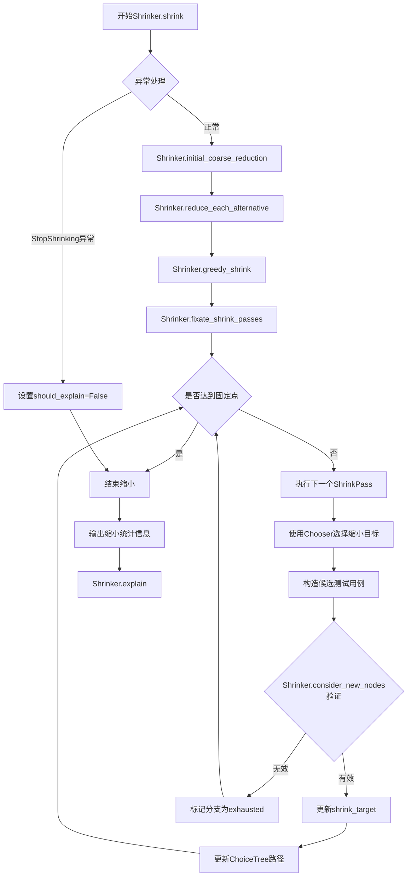

# Hypothesis Shrink Module Analysis

## 1. 特定名词解释

### 1.1 ChoiceTree
ChoiceTree是一个记录缩小过程中选择序列的数据结构，用于跟踪缩小路径并避免重复探索。它由TreeNode节点组成，每个节点记录了选择的可能性和已探索的分支。

**核心功能**：
- 记录缩小过程中的决策路径
- 避免重复探索已尝试过的缩小策略
- 支持前缀选择和随机选择两种探索顺序
- 通过exhausted属性标记是否已探索所有可能的缩小路径

**关键实现**：
```python
class ChoiceTree:
    def __init__(self) -> None:
        self.root = TreeNode()
    
    @property
    def exhausted(self) -> bool:
        return self.root.exhausted
    
    def step(self, selection_order, f):
        # 创建Chooser并执行缩小策略
```

### 1.2 Span
Span是一个跟踪测试运行中选择的层次结构的类，用于标记逻辑上相关的选择序列区域。

**核心功能**：
- 标记测试用例生成过程中的选择层次结构
- 为缩小器提供结构化操作的信息
- 支持策略级别的选择跟踪（如列表生成的元素选择）

**实现特点**：
- Span对象仅包含索引和所有者引用，实际数据存储在Spans类中
- 采用紧凑存储设计，减少内存占用
- 支持相等性比较和字符串表示

### 1.3 Shrinker
Shrinker是Hypothesis缩小模块的核心协调类，负责执行完整的测试用例缩小过程。

**核心功能**：
- 管理缩小目标（shrink_target）
- 执行两阶段缩小过程（初步粗约减和贪婪约减）
- 协调各种缩小策略（ShrinkPass）
- 跟踪缩小统计信息（调用次数、缩小次数等）

**关键方法**：
- `shrink()`：完整缩小过程的入口点
- `initial_coarse_reduction()`：初步大规模缩小
- `greedy_shrink()`：迭代应用缩小策略直到达到局部最优

### 1.4 Chooser
Chooser是缩小策略中用于选择操作目标的工具，基于ChoiceTree的探索顺序进行导航。

**核心功能**：
- 根据选择顺序从可用值中选择缩小目标
- 避免选择已耗尽的分支
- 记录选择路径并更新ChoiceTree
- 支持条件过滤选择

**关键方法**：
- `choose(values, condition)`：选择满足条件的缩小目标
- `finish()`：记录决策并返回用于下次选择的前缀

### 1.5 ShrinkPass
ShrinkPass封装了具体的缩小策略，包含策略函数、名称和统计信息。

**核心功能**：
- 封装单个缩小策略的逻辑
- 记录策略执行统计（调用次数、缩小成功次数等）
- 支持策略的优先级和排序

**实现特点**：
- 每个ShrinkPass包含一个函数，接收Chooser对象作为参数
- 可以通过名称和统计信息进行监控和调试

## 2. 源码阅读与逻辑拆解

### 2.1 核心模块整体流程

Hypothesis的缩小模块采用两阶段缩小策略，从初始测试用例开始，逐步将其缩减到最小化形式，同时保持故障再现能力。

**输入**：
- 初始测试用例数据（ConjectureData或ConjectureResult对象）
- 故障验证谓词（predicate）
- 转换规则（allow_transition）

**处理**：
1. **初步粗约减（Initial Coarse Reduction）**：执行大规模的初步缩减，删除明显多余的选择
2. **贪婪约减（Greedy Shrink）**：迭代应用各种缩小策略，直到达到局部最优

**输出**：
- 最小化的测试用例数据（shrink_target）
- 缩小统计信息（调用次数、缩小次数、删除的选择数量等）

### 2.2 模块执行流程图



### 2.3 关键函数调用关系

1. **Shrinker.shrink()**：
   - 调用`initial_coarse_reduction()`进行初步粗约减
   - 调用`greedy_shrink()`进行贪婪约减
   - 处理异常并输出统计信息

2. **Shrinker.initial_coarse_reduction()**：
   - 调用`reduce_each_alternative()`对每个可选方案进行初步缩减
   - 执行可能会显著改变测试用例结构的大规模缩小

3. **Shrinker.greedy_shrink()**：
   - 调用`fixate_shrink_passes()`迭代应用缩小策略
   - 维护shrink_passes列表，包含各种缩小策略

4. **Shrinker.fixate_shrink_passes()**：
   - 循环执行每个ShrinkPass直到达到固定点
   - 调用`remove_discarded()`清理无效数据
   - 跟踪每个缩小策略的执行情况

5. **ShrinkPass执行流程**：
   - 创建Chooser对象，使用ChoiceTree跟踪选择路径
   - 选择缩小目标（节点、值等）
   - 构造候选测试用例
   - 调用`consider_new_nodes()`验证候选是否保持故障
   - 更新shrink_target或标记分支为exhausted

### 2.4 数据流转路径

1. **输入数据**：
   - 初始测试用例数据存储在`shrink_target`属性中
   - 选择序列存储在`shrink_target.choices`中
   - 节点信息存储在`shrink_target.nodes`中
   - 层次结构信息存储在`spans`属性中

2. **处理过程中的数据流转**：
   - 通过`consider_new_nodes()`函数验证候选测试用例
   - 有效候选会更新`shrink_target`和相关派生值
   - ChoiceTree记录选择路径，避免重复探索
   - 统计信息（调用次数、缩小次数等）实时更新

3. **输出数据**：
   - 最小化的测试用例存储在`shrink_target`中
   - 缩小统计信息通过`debug()`方法输出

## 3. 前沿技术关联

### 3.1 自适应搜索策略
Hypothesis的缩小模块采用了自适应搜索策略，能够根据缩小过程的进展动态调整策略强度。例如，`_node_program`方法使用二分搜索来加速批量节点删除，将O(m)复杂度降低到O(log(m))。

### 3.2 启发式搜索与贪婪算法
缩小过程采用贪婪算法，通过迭代应用局部最优策略来逼近全局最优解。这种方法在实践中非常有效，能够在合理时间内找到高质量的最小化测试用例。

### 3.3 树形数据结构与路径跟踪
ChoiceTree的实现借鉴了树形搜索算法，通过记录探索路径避免重复工作，提高了搜索效率。这种方法类似于人工智能中的分支限界搜索技术。

### 3.4 分层结构与模块化设计
缩小模块采用了高度模块化的设计，将不同的缩小策略封装为独立的ShrinkPass类。这种设计便于扩展和维护，符合现代软件工程的最佳实践。

### 3.5 内存优化技术
Span类采用了紧凑存储设计，通过索引引用实际数据，显著减少了内存占用。这种优化对于处理大型测试用例尤为重要。

### 3.6 元启发式算法思想
缩小过程中采用的随机选择顺序和前缀选择顺序体现了元启发式算法的思想，通过平衡探索和利用来找到更好的解决方案。
