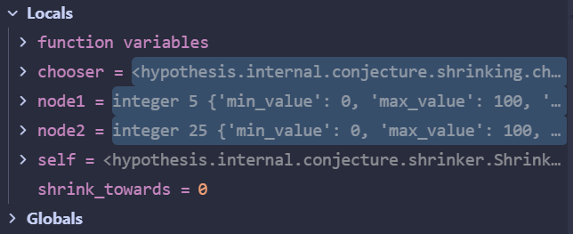
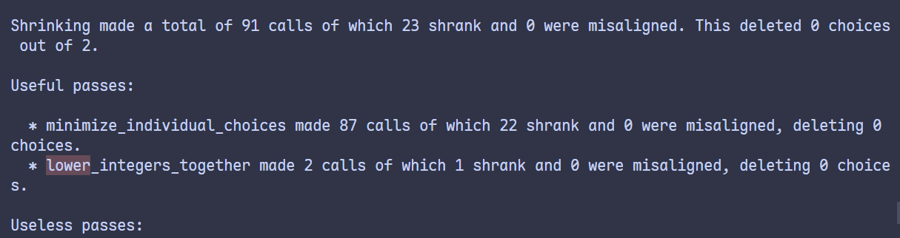

# lower_integers_together 调试案例

该pass针对一些特定情况下的输入进行约简：
两个需要同时削减以维持特定关系的整数对（例如a-b=c），在对其中一个值进行shrink时，也必须要同时对另一个值进行相应的调整。

## 调式设计

设计调试代码：

```python
from hypothesis import given, settings, Verbosity, Phase
from hypothesis import strategies as st

@given(st.integers(min_value=0, max_value=100),
       st.integers(min_value=0, max_value=100))
@settings(
    verbosity=Verbosity.debug,
    max_examples=100,
    phases=[Phase.generate, Phase.shrink],
    database=None,
)
def test(a, b):
    """ b - a >= 10 且 b < 5 * a + 1 才会失败"""
    if b - a >= 20 and b < 5 * a + 1:
        assert False

if __name__ == "__main__":
    test()
```

在本例中，如果只削减b，则可能导致无法满足`b-a>=20`的关系，
如果只削减a，则可能导致无法满足`b<5*a+1`的关系。
因此需要shrinker去同时削减a和b，以满足这两个关系。

在函数末尾添加一个无作用的pass语句，打上断点进行观察：

```python
def lower_integers_together(self, chooser):
    node1 = chooser.choose(
        self.nodes, lambda n: n.type == "integer" and not n.trivial
    )
    node2 = self.nodes[
        chooser.choose(
            range(node1.index + 1, min(len(self.nodes), node1.index + 3 + 1)),
            lambda i: self.nodes[i].type == "integer"
            and not self.nodes[i].was_forced,
        )
    ]
    shrink_towards = node1.constraints["shrink_towards"]
    def consider(n):
        return self.consider_new_nodes(
            self.nodes[: node1.index]
            + (node1.copy(with_value=node1.value - n),)
            + self.nodes[node1.index + 1 : node2.index]
            + (node2.copy(with_value=node2.value - n),)
            + self.nodes[node2.index + 1 :]
        )
    find_integer(lambda n: consider(shrink_towards - n))
    find_integer(lambda n: consider(n - shrink_towards))
    pass # 打上断点进行观察
```

## 运行





整体主要约简过程

```txt
第一个成功的输入值：(31, 84)
↓ minimize_individual_choices [降低 b]
(31, 51)  ← b 从 84 通过二分搜索降到 51
↓ minimize_individual_choices [降低 a]
(9, 45)   ← a 从 31 通过二分搜索降到 9（同时 b 自动从 51 调整到 45）
↓ minimize_individual_choices [降低 b]
(9, 29)   ← b 从 45 降到 29
↓ minimize_individual_choices [降低 a]
(6, 28)   ← a 从 9 降到 6（b 自动从 29 调整到 28）
↓ minimize_individual_choices [降低 b]
(6, 26)   ← b 从 28 降到 26
↓ minimize_individual_choices 尝试失败
无法单独降低 a 或 b
↓ lower_integers_together
(5, 25)   ← 同时降低 a 和 b
```

从调试中的变量值，以及最后的统计报告显示，`lower_integers_together` 在其他pass对输入进行了大幅度约简后，仍然能够从中进行额外的优化步骤，成功地在保持输入值之间的关系的情况下进行了进一步的约简（输入值`[26,6]`被约简为`[25,5]`）