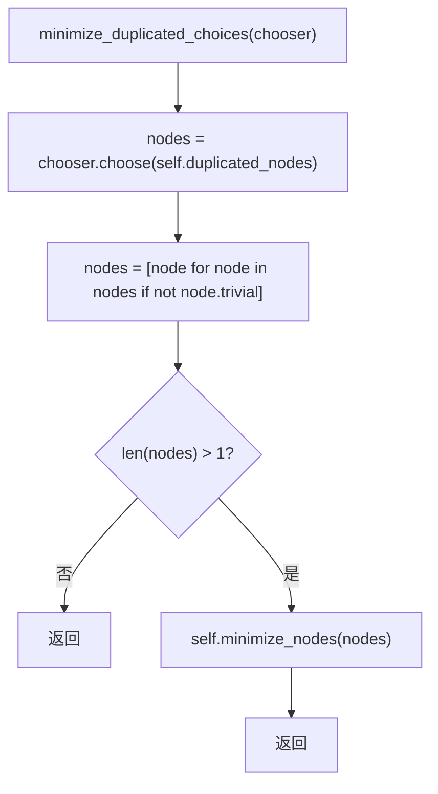
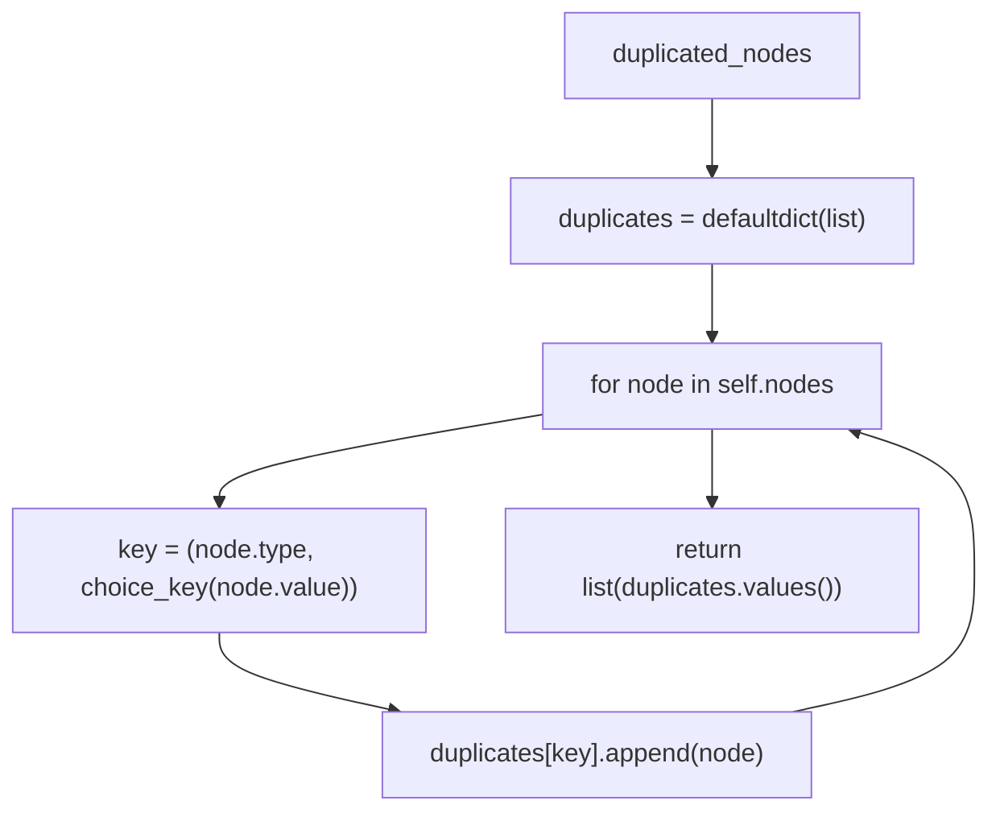
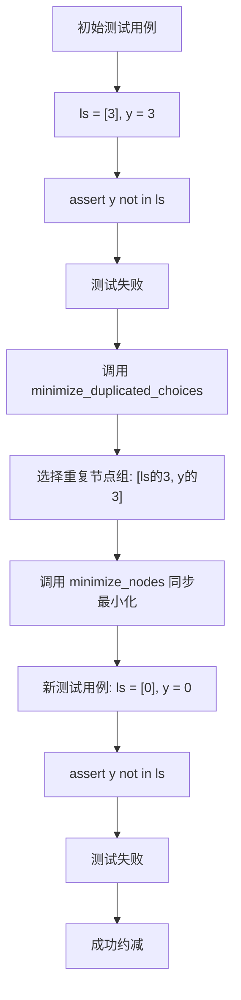

## 1. 技术原理复盘

### 1.1 模块目标与要解决的问题

`minimize_duplicated_choices` 是 Hypothesis 输入约减框架中用于同步最小化多个重复选择节点值的核心机制，目标是解决那些无法独立最小化但可以同时最小化的重复值问题。核心问题是某些测试用例中存在多个相互依赖的重复值，单独修改其中一个会导致测试通过，而同时修改所有重复值才能保持测试失败并实现有效约减。

### 1.2 输入与输出

输入是当前 Shrinker 的 `shrink_target`，其核心内容是 `nodes` 作为 ChoiceNode 序列，以及通过 `duplicated_nodes` 属性提取的分组重复节点。

输出是更新后的 `shrink_target`，表现为同步最小化后的重复选择节点值，仍满足谓词并保持 `INTERESTING`。

### 1.3 基本流程与架构

整体从 `minimize_duplicated_choices` 方法开始，首先通过 `chooser.choose` 从 `self.duplicated_nodes` 中选择一组重复节点，然后过滤掉其中的平凡节点（trivial nodes）。如果过滤后仍有多个非平凡节点，则调用 `minimize_nodes` 方法同步最小化这些节点的值。

`duplicated_nodes` 是一个派生属性，它将所有节点按照 (type, value) 分组，形成重复节点列表的集合，为 `minimize_duplicated_choices` 提供候选重复节点组。

## 2. 源码阅读与逻辑拆解

### 2.1 输入 → 处理 → 输出的完整逻辑

输入阶段通过 `self.duplicated_nodes` 派生属性获取分组的重复节点，每个分组包含相同类型和值的节点列表。

处理阶段首先通过 `chooser.choose` 随机选择一个重复节点分组，然后过滤掉其中的平凡节点（trivial nodes）。如果过滤后分组中的节点数量大于1，则调用 `minimize_nodes` 方法同步最小化这些节点的值。

输出阶段由 `minimize_nodes` 方法触发执行与比较，通过 `incorporate_test_data` 把更小且满足谓词的候选更新为新的 `shrink_target`。

### 2.2 执行流程图

#### 2.2.1 `minimize_duplicated_choices` 主流程

#### 2.2.2 `duplicated_nodes` 派生属性逻辑

#### 2.2.3 典型应用场景示例

