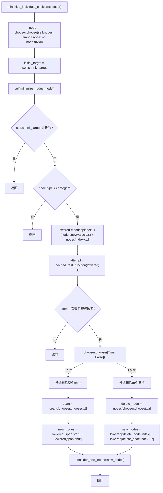
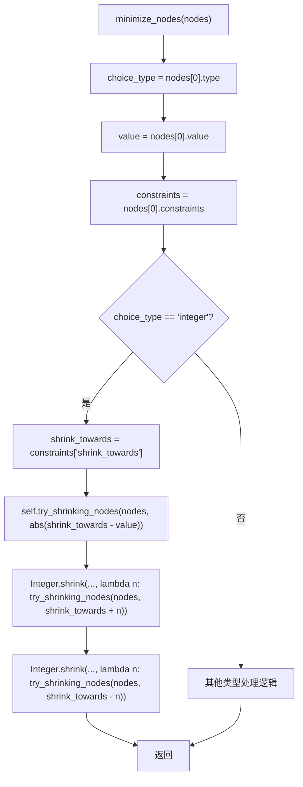

## 1. 技术原理复盘

### 1.1 模块目标与要解决的问题

`minimize_individual_choices` 是 Hypothesis 输入约减框架中用于最小化单个选择节点值的核心机制，目标是确保每个选择节点（如整数、浮点数、字符串等）都取到满足测试失败条件的最小值。核心问题是如何在保持测试失败的前提下，将每个选择节点的值最小化，避免不必要的大值出现在最终的测试用例中。

### 1.2 输入与输出

输入是当前 Shrinker 的 `shrink_target`，其核心内容是 `nodes` 作为 ChoiceNode 序列和 `spans` 作为结构片段区间信息。

输出是更新后的 `shrink_target`，表现为部分或全部选择节点值被最小化的 ChoiceNode 序列，仍满足谓词并保持 `INTERESTING`。

### 1.3 基本流程与架构

整体从 `minimize_individual_choices` 方法开始，首先通过 `chooser.choose` 选择一个非平凡节点，然后尝试使用 `minimize_nodes` 方法将该节点的值最小化。如果直接最小化失败，且该节点是整数类型，则进入特殊处理逻辑：尝试降低该整数值并检查是否改变了测试用例的规模。如果确实改变了规模，则尝试删除节点之后的部分内容，以解决因节点值与测试用例规模相关而导致的最小化失败问题。

## 2. 源码阅读与逻辑拆解

### 2.1 输入 → 处理 → 输出的完整逻辑

输入阶段以 `shrink_target.nodes` 为主线数据，`minimize_individual_choices` 方法首先通过 `chooser.choose` 从非平凡节点中随机选择一个节点作为最小化目标。

处理阶段分为两个主要步骤：
1. 直接最小化：调用 `minimize_nodes` 方法尝试将选中节点的值最小化。如果成功，则更新 `shrink_target` 并返回。
2. 规模依赖处理：如果直接最小化失败，且节点是整数类型，则尝试降低该整数值并检查是否改变了测试用例规模。如果确实改变了规模，则尝试删除节点之后的整个span或单个节点，以解决规模依赖问题。

输出阶段由 `minimize_nodes` 和 `consider_new_nodes` 方法触发执行与比较，通过 `incorporate_test_data` 把更小且满足谓词的候选更新为新的 `shrink_target`。

### 2.2 执行流程图

#### 2.2.1 `minimize_individual_choices` 主流程

#### 2.2.2 `minimize_nodes` 核心逻辑

