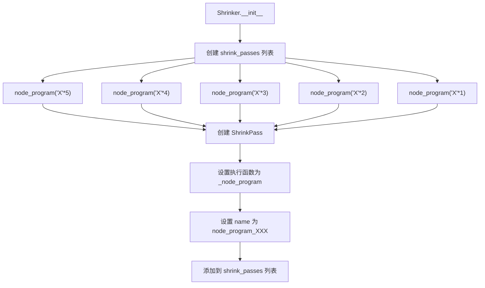
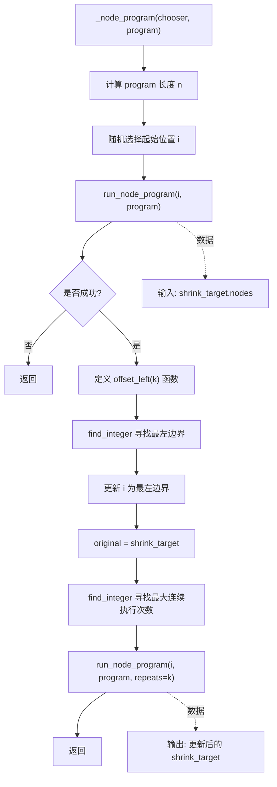
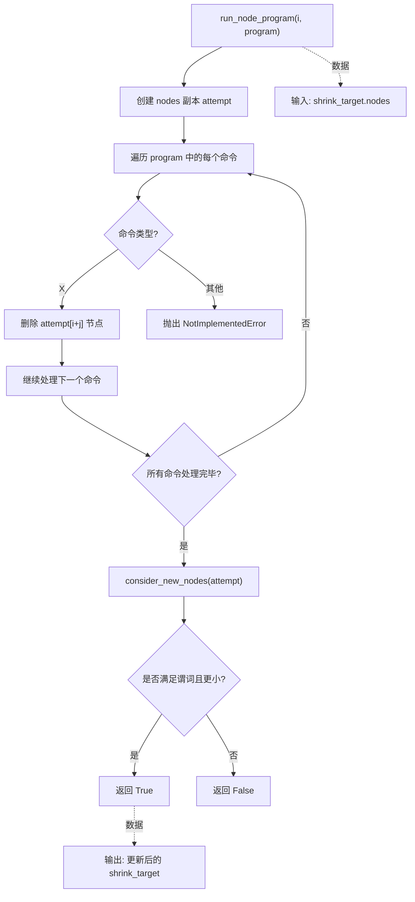
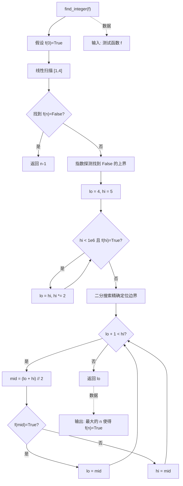

## 1. 技术原理复盘

### 1.1 模块目标与要解决的问题

`node_program("X"*k)` 系列 pass 属于 Shrinker 的核心收缩策略，目标是通过批量删除节点来快速减少测试用例的长度。核心问题是：单个节点的删除虽然安全，但效率较低，而批量删除可以显著提高收缩效率，但需要解决如何确定批量操作的范围和次数的问题。

`_node_program` 实现了自适应逻辑，通过二分查找确定可以连续应用节点程序的最大次数，将复杂度从 O(k) 降低到 O(log(k))，解决了批量操作的效率问题。

### 1.2 输入与输出

输入是当前 Shrinker 的 `shrink_target`，其核心内容是 `nodes` 作为 ChoiceNode 序列。

输出是更新后的 `shrink_target`，表现为更短的 ChoiceNode 序列，仍满足谓词并保持 `INTERESTING`。

### 1.3 基本流程与架构

整体从 `greedy_shrink` 阶段进入，`node_program("X"*k)` 系列 pass 作为 `shrink_passes` 列表的前几个成员被优先执行。每个 `node_program("X"*k)` 都会创建一个 ShrinkPass，其执行函数是 `_node_program`，并传入相应的 "X" 序列作为 program。

`_node_program` 的核心流程是：
1. 随机选择一个起始位置
2. 尝试在该位置执行节点程序
3. 如果成功，向左移动到该区域的起始位置
4. 然后尝试连续多次执行节点程序

通过这种方式，可以高效地批量删除节点，快速减少测试用例的长度。

## 2. 源码阅读与逻辑拆解

### 2.1 输入 → 处理 → 输出的完整逻辑

输入阶段以 `shrink_target.nodes` 为主线数据，`_node_program` 首先获取 program 的长度 n，然后通过 `chooser.choose` 随机选择一个起始位置 i，确保从 i 开始有足够的节点可以应用 program。

处理阶段分为三个步骤：
1. **单次尝试**：先在随机选择的位置 i 尝试执行节点程序，如果失败则直接返回
2. **向左扩展**：如果单次尝试成功，使用 `find_integer` 向左移动，找到可以执行节点程序的最左边界
3. **批量执行**：在找到的最左边界，再次使用 `find_integer` 尝试连续多次执行节点程序，确定最大的执行次数

输出阶段由 `run_node_program` 内部调用 `consider_new_nodes` 触发执行与比较，通过 `incorporate_test_data` 把更小且满足谓词的候选更新为新的 `shrink_target`。

### 2.2 执行流程图

#### 2.2.1 `node_program` 系列 pass 的创建



#### 2.2.2 `_node_program` 的自适应逻辑



#### 2.2.3 `run_node_program` 的执行逻辑



#### 2.2.4 `find_integer` 的二分查找逻辑



### 2.3 关键实现细节

#### 2.3.1 批量删除的顺序

`node_program("X"*k)` 系列 pass 按照 k 从大到小的顺序执行：
```python
self.shrink_passes: list[ShrinkPass] = [
    ShrinkPass(self.try_trivial_spans),
    self.node_program("X" * 5),  # 先尝试删除5个连续节点
    self.node_program("X" * 4),  # 然后尝试删除4个连续节点
    self.node_program("X" * 3),  # 依此类推
    self.node_program("X" * 2),
    self.node_program("X" * 1),
    # ... 其他 pass
]
```

这种顺序设计可以快速减少测试用例的长度，因为较大的批量删除通常能带来更大的收缩效果。

#### 2.3.2 自适应逻辑的效率

`_node_program` 使用 `find_integer` 函数实现自适应逻辑，将复杂度从 O(k) 降低到 O(log(k))：
```python
def find_integer(f: Callable[[int], bool]) -> int:
    # 假设 f(0)=True，找到最大的 n 使得 f(n)=True 且 f(n+1)=False
    # 算法:
    # 1. 线性扫描 [1,4] —— 小结果时避免浪费
    # 2. 指数探测找到 False 的上界
    # 3. 二分搜索精确定位边界
    # 复杂度: O(log n)
    # ...
```

通过这种方式，即使需要连续删除很多节点，也只需要少数几次测试调用。

#### 2.3.3 与 ChoiceTree 的集成

`node_program` 系列 pass 与 `ChoiceTree` 紧密集成，通过 `chooser.choose` 选择起始位置，避免重复尝试相同的位置：
```python
i = chooser.choose(range(len(self.nodes) - n + 1))
```

`ChoiceTree` 记录了选择序列，确保每个可能的起始位置都被尝试过，直到整个搜索空间被耗尽。
