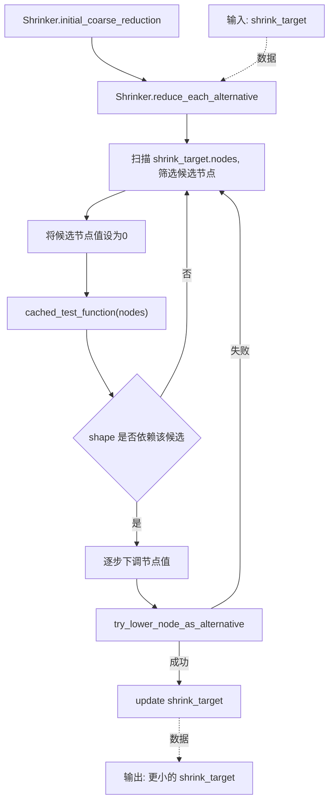
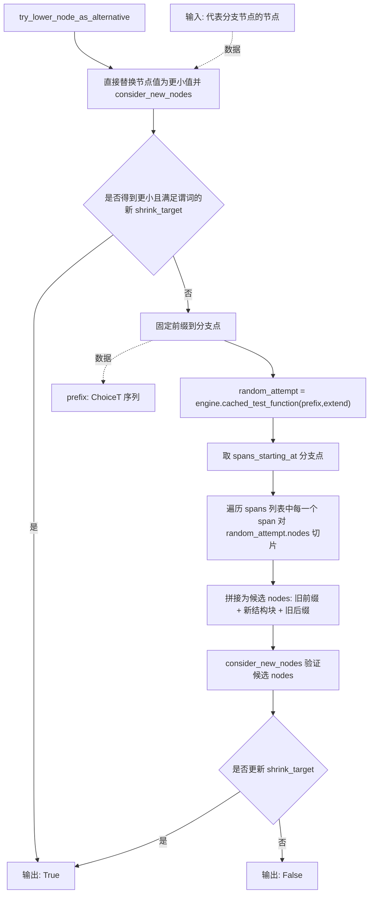
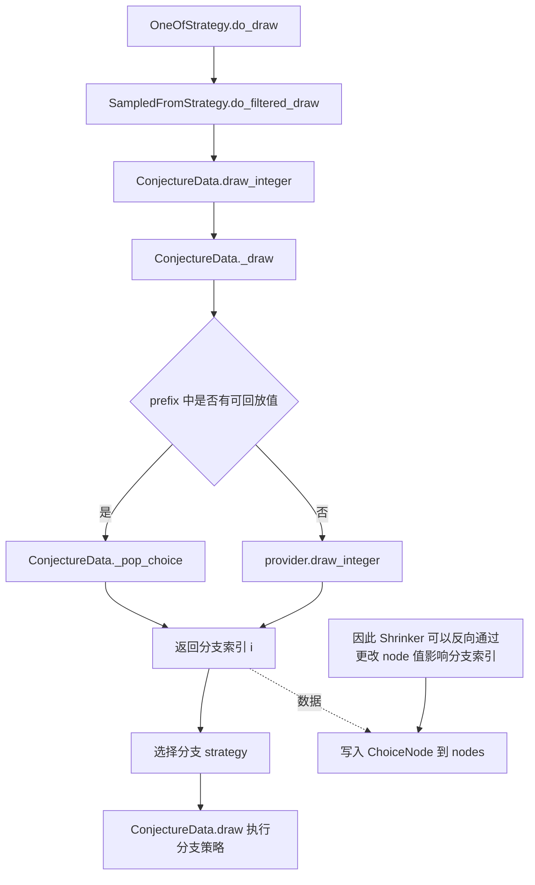

## 1. 技术原理复盘

### 1.1 模块目标与要解决的问题

`initial_coarse_reduction` 属于 Shrinker 的预处理阶段，目标是在进入主要 shrink passes 之前，先做一次可能会临时变差但有助于后续收敛的结构调整。核心问题是 `one_of` 一类分支选择会把执行路径带到更靠后的分支，而常规的按 shortlex 逐节点变小并不总能把路径推回更靠前的分支。

### 1.2 输入与输出

输入是当前 Shrinker 的 `shrink_target`，其核心内容是 `nodes` 作为 ChoiceNode 序列和 `spans` 作为结构片段区间信息。

输出是更新后的 `shrink_target`，表现为更小的 ChoiceNode 序列，仍满足谓词并保持 `INTERESTING`。

### 1.3 基本流程与架构

整体从 `initial_coarse_reduction` 进入，`initial_coarse_reduction` 当前只执行 `reduce_each_alternative`，其核心流程是扫描 choice 序列，找出疑似 `one_of` 分支索引的整型 choice，对该 choice 做一次探测性变更来判断 shape 是否依赖它，若依赖则尝试把该分支索引逐步下调。

当直接下调无法成立时，流程切换为修复模式：固定到分支点的前缀，再随机生成后续 choices，并使用 span 区间对齐把新路径中与分支点相关的结构块替换回旧序列，从而在适配 shape 变化的同时尽量保留旧样例的其余部分，提升保持 `INTERESTING` 与继续 shrink 的概率。

## 2. 源码阅读与逻辑拆解

### 2.1 输入 → 处理 → 输出的完整逻辑

输入阶段以 `shrink_target.nodes` 为主线数据，`reduce_each_alternative` 顺序扫描这些 ChoiceNode。每遇到一个满足启发式条件的整型 choice，就把它当作潜在分支索引候选，并通过一次把该值改为 `0` 的试跑来判断 shape 是否真的依赖它。shape 的判定标准是两类变化：重跑后的 nodes 数量变化，或同一位置的节点类型变化与约束变化导致旧值不再被允许。

处理阶段在确认 shape 依赖后，尝试将该候选从当前值向更小值下调。每次下调都先尝试直接替换并验证是否能得到更小且满足谓词的新样例。若直接替换失败，转入修复策略：固定到分支点的前缀，让引擎在新分支下补全后续 choices，并利用 spans 提供的结构区间信息，把新样例中从分支点开始的一段结构块切片出来替换旧样例对应结构块，再次验证该拼接结果是否可接受。

输出阶段由 `consider_new_nodes` 触发执行与比较，通过 `incorporate_test_data` 把更小且满足谓词的候选更新为新的 `shrink_target`。若全部尝试均失败，则保持原 `shrink_target` 不变并继续扫描后续节点。

### 2.2 执行流程图

#### 2.2.1 `initial_coarse_reduction` 

#### 2.2.2 `try_lower_node_as_alternative` 的修复流程

#### 2.2.3 `one_of` 分支索引如何落到 choice 序列

