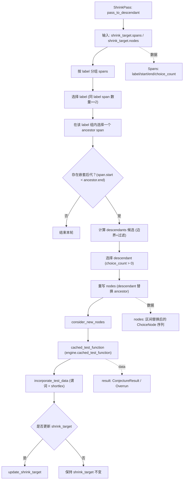

## 1. 技术原理复盘

### 1.1 模块目标与要解决的问题

`pass_to_descendant` 的目标是针对递归策略生成的树形/嵌套结构，在 `Span` 的尺度上做一次“结构级缩小”：将某个较大的 `span`（祖先片段）替换为其内部的某个更小 `span`（后代片段），使样例更接近“用子树替换整棵树”，从而更快把 `shrink_target` 推向 shortlex 更小的解。

要解决的问题是：仅靠逐个 choice 的局部缩小，往往难以跨层级移除递归结构；而 span 记录了生成过程中的语义片段边界，使得“祖先→后代”的整体替换成为可能。

### 1.2 输入与输出

输入是当前 `shrink_target` 的 `nodes` 与 `spans`（`Span` 提供 `[start, end)` 区间与 `label` 聚类信息）。输出是对 `shrink_target` 的潜在更新：若替换后的运行结果仍满足谓词且 shortlex 更优，则通过 `consider_new_nodes`→`cached_test_function`→`incorporate_test_data` 更新为新的 `ConjectureResult`；否则保持不变。

### 1.3 基本流程与架构

该 pass 的结构可以概括为：先按 `label` 将 spans 分组（`spans_by_label`），再在同组内寻找“嵌套于祖先片段内部”的后代候选，最后用后代片段替换祖先片段并进行一次验证尝试。由于该 pass 时间复杂度较高, 为了避免重复枚举带来的成本，后代候选集合会按 `(label, i)` 缓存，并在 `shrink_target` 更新后失效。

## 2. 源码阅读与逻辑拆解

### 2.1 输入 → 处理 → 输出的完整逻辑

输入阶段以 `shrink_target.spans` 为结构索引，并以 `shrink_target.nodes` 作为被重写的数据主体。处理阶段首先选择一个“同标签出现至少两次”的 `label`，保证存在可对比的多个片段；随后选择一个祖先片段，并快速判断其后是否可能存在仍落在祖先区间内的同标签片段，若不存在则本轮结束。若存在，则在祖先区间内收集后代候选（后代的 `start` 必须落在祖先内部，且 `choice_count` 必须严格小于祖先以确保倾向于缩小），再从中选取一个非空后代片段。输出阶段将 `nodes` 的祖先区间整体替换为后代区间，构造候选 `nodes` 序列并交给 `consider_new_nodes` 执行一次测试；若结果通过谓词与 shortlex 检查，则更新 `shrink_target`，否则不更新。

### 2.2 执行流程图

