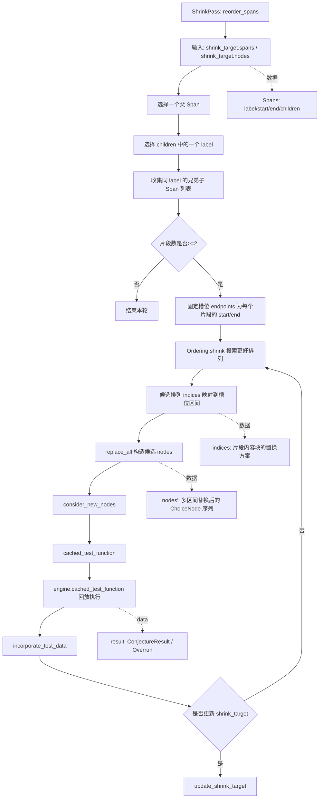

## 1. 技术原理复盘

### 1.1 模块目标与要解决的问题

`reorder_spans` 的目标是在 `Span` 的尺度上做一次“结构级重排”，允许把同一父 `Span` 下、具有相同 `label` 的兄弟子 `Span` 重新排列，以得到 shortlex 更小且仍然满足谓词的失败样例。

要解决的问题是：当失败用例存在对称结构时，仅靠逐节点降低 choice 的局部策略可能得到多个等价的最小失败例，且最小化结果会依赖生成时的参数顺序。通过重排兄弟片段，可以把“更简单的片段”稳定地推到更靠前的位置，从而消除这种不稳定性。

### 1.2 输入与输出

输入是当前 `shrink_target` 的 `nodes` 与 `spans`，其中 `Span` 提供 `[start, end)` 区间、`label` 与 `children` 结构信息。输出是对 `shrink_target` 的潜在更新：若重排后的执行结果仍满足谓词且在 shortlex 排序上更小，则通过 `consider_new_nodes`→`cached_test_function`→`incorporate_test_data` 更新 `shrink_target`；否则保持不变。

### 1.3 基本流程与架构

该 pass 的核心思想是把“兄弟子 `Span` 的排列”视为一个可优化对象，并把“可接受性”交给引擎回放验证。流程上先选择一个父 `Span`，再在其 `children` 中选择一个 `label`，把该 `label` 的所有兄弟子 `Span` 作为可重排的片段集合。随后将“每个片段原本占用的区间端点”视为固定槽位，并把“要放入槽位的片段内容”按候选排列映射到这些槽位中，从而生成候选 `nodes` 序列。

由于枚举全排列代价过高，`reorder_spans` 使用 `Ordering.shrink` 在排列空间中自适应搜索更好的顺序，而不是穷举。该搜索以每个片段自身的 `sort_key` 作为排序依据，倾向于把更简单的片段排到更靠前的位置。每次得到一个候选排列，都会用 `replace_all` 按多个区间替换生成新 `nodes`，并通过 `consider_new_nodes` 调用引擎回放；只有当结果仍能复现失败且全局 shortlex 变小，才会更新 `shrink_target`。若所有可探索分支都无法带来改进，该 pass 在局部最小处停止。

## 2. 源码阅读与逻辑拆解

### 2.1 输入 → 处理 → 输出的完整逻辑

输入阶段以 `shrink_target.spans` 提供的树结构为索引，以 `shrink_target.nodes` 作为被重写的数据主体。处理阶段先选择一个父 `Span`，再在其 `children` 中选择一个 `label`，并收集所有同 `label` 的兄弟子 `Span`；当可重排片段数量不足时，本轮直接结束。随后固定这些片段各自的原始区间作为槽位，并把“片段内容块的置换”交给 `Ordering.shrink` 搜索：`Ordering.shrink` 持续提出候选排列，将其映射为“在每个槽位区间放入哪个片段的内容块”，再通过 `replace_all` 一次性构造候选 `nodes` 序列。

输出阶段由 `consider_new_nodes` 触发执行与比较：`cached_test_function` 会先做 shortlex 剪枝与约束合法性检查，再调用 `engine.cached_test_function` 回放候选 choice 序列并得到结果；若结果满足谓词且 shortlex 更优，则由 `incorporate_test_data` 更新 `shrink_target`，并使后续 shrink passes 在新的结构上继续工作。若候选排列导致约束不允许、测试不再失败或 shortlex 变差，则拒绝该候选并继续搜索其它排列。

### 2.2 执行流程图

