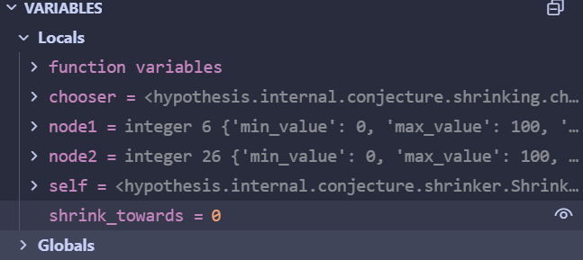

## 环境搭建
hypothesis工具自带调试模式，可通过类似下图的设置配置环境
![[assets/环境配置.png]]

## 调试验证
### Case 1:pass_to_descendant
该pass针对递归策略生成的嵌套结构，用更小的儿子结构替换父亲结构。
于是设计递归数组测试样例，该策略生成样本的结构如“\[\[], 0]", "\[0]”，在元素总和超过20时会发生错误
![[assets/递归列表策略.png]]

并在 pass_to_descendant() 最后位置设置断点，只观察成功完整执行的情况
![[assets/节点替换代码.png]]
（注：930行：若寻找的子结构对应的span不符合规则，则弃置。在调试过程中，有大量测试输入在这一步退出，表明 pass_to_descendant() 的搜索效率其实不高。）
![[assets/环境搭建工具自带调试模式.png]]

当hypothesis运行到样例"\[\[], \[41, \[]]]"时，pass_to_descendant 约简成功
![[assets/约简成功示例.png]]

观察此时的变量状态，主要观察3个变量
- ancestor： 选定的父结构对应的 span
- descendant： 合法的子结构对应的 span
- self.nodes：样例"\[\[], \[41, \[]]]"对应的 choiceSequence
其中
08节点表示：是否还有下一个元素（此处指列表）
09节点表示：元素的类型（0表示整数，1表示列表）
10节点表示：是否还有下一个元素
11节点表示：是否还有下一个元素

![[assets/调试节点状态.png]]
![[assets/替换状态.png]]

将主要涉及的 span 和 choiceNode 绘制出来。图中方形节点表示 Span， 圆形节点表示 ChoiceNode。
![[assets/环境搭建工具自带调试模式_1.png]]

pass_to_descendant在代码930行所做的，就是将18号 span 覆盖的08，09，10，11号节点替换为22号 span 覆盖的10，11号节点。
从语义上解释，原本08-11节点代表“41后还有元素，这个元素是新的列表，空（列表首）后没有新的元素， \[] 后没有新的元素”，会生成“, \[]]”
，10-11代表“41后没有新的元素，\[41]后没有新的元素”，会生成"]]"。 **尽管替换了ChoiceSequence的结构，但是ChoiceNode的语义仍然生效。**

替换后的总ChoiceSequence翻译为"\[\[], \[41]]"，也位于测试函数的错误区间，且由于\[41]比\[41,\[]]更小，shrink_target会被更新为"\[\[], \[41]]"
代码的运行结果与预期相符
![[assets/递归测试错误输出.png]]

### Case 2:lower_integers_together

该pass针对一些特定情况下的输入进行约简：两个需要同时削减以维持特定关系的整数对（例如a-b=c），在对其中一个值进行shrink时，也必须要同时对另一个值进行相应的调整。

#### 调式设计

设计调试代码：
![[assets/同时降低调试代码.png]]

在本例中，如果只削减b，则可能导致无法满足`b-a>=20`的关系，如果只削减a，则可能导致无法满足`b<5*a+1`的关系。因此需要shrinker去同时削减a和b，以满足这两个关系。

在函数末尾添加一个无作用的pass语句，打上断点进行观察：
![[assets/调试断点代码.png]]

#### 运行
整体主要约简过程

第一个成功的输入值：(31, 84)
↓ minimize_individual_choices [降低 b]
(31, 51)  ← b 从 84 通过二分搜索降到 51
↓ minimize_individual_choices [降低 a]
(9, 45)   ← a 从 31 通过二分搜索降到 9（同时 b 自动从 51 调整到 45）
↓ minimize_individual_choices [降低 b]
(9, 29)   ← b 从 45 降到 29
↓ minimize_individual_choices [降低 a]
(6, 28)   ← a 从 9 降到 6（b 自动从 29 调整到 28）
↓ minimize_individual_choices [降低 b]
(6, 26)   ← b 从 28 降到 26
↓ minimize_individual_choices 尝试失败
无法单独降低 a 或 b
↓ lower_integers_together
(5, 25)   ← 同时降低 a 和 b

从调试中的变量值，以及最后的统计报告显示，`lower_integers_together` 在其他pass对输入进行了大幅度约简后，仍然能够从中进行额外的优化步骤，成功地在保持输入值之间的关系的情况下进行了进一步的约简（输入值`[26,6]`被约简为`[25,5]`）

### Case 3:node_program
#### 调试代码
![[assets/节点程序调试代码.png]]
在本例中，shrinker需要删除列表末尾的多余元素（索引3及之后的元素），但不能删除前3个关键元素，因为它们的和必须保持>50。

#### 运行结果部分截图

在`_node_program`函数末尾添加断点：
![[assets/断点观察.png]]

在`run_node_program`方法中也添加断点：
![[assets/节点程序方法断点.png]]

#### 约简过程示例详解

初始失败输入：[12, 23, 45, 67, 89, 34, 56, 78, 90] (长度9)
↓ minimize_individual_choices (降低元素值)
[3, 8, 17, 0, 0, 0, 0, 0, 0] (值被最小化)
↓ node_program "XXXXX" (删除末尾5个节点)
[3, 8, 17, 0] (长度4，但前3个元素之和=28 ≤ 50，不满足条件)
↓ node_program "XXX" (删除索引3-5的节点)
[3, 8, 17, 0, 0, 0, 0] (长度7，前3个元素之和=28，不满足)
↓ node_program "XX" (删除索引3-4的节点)
[3, 8, 17, 0, 0, 0, 0, 0] (长度8，前3个元素之和=28，不满足)
↓ node_program "XXX" (再次尝试，调整位置)
[12, 23, 45, 0, 0, 0] (长度6，前3个元素之和=80 > 50，满足！)
↓ 最终约简结果
[12, 23, 45] (长度3，但需要在min_size=5约束下)
↓ node_program 与 minimize_individual_choices 协作
[0, 0, 51, 0, 0] (最终：长度=5, 前3个元素之和=51 > 50)

