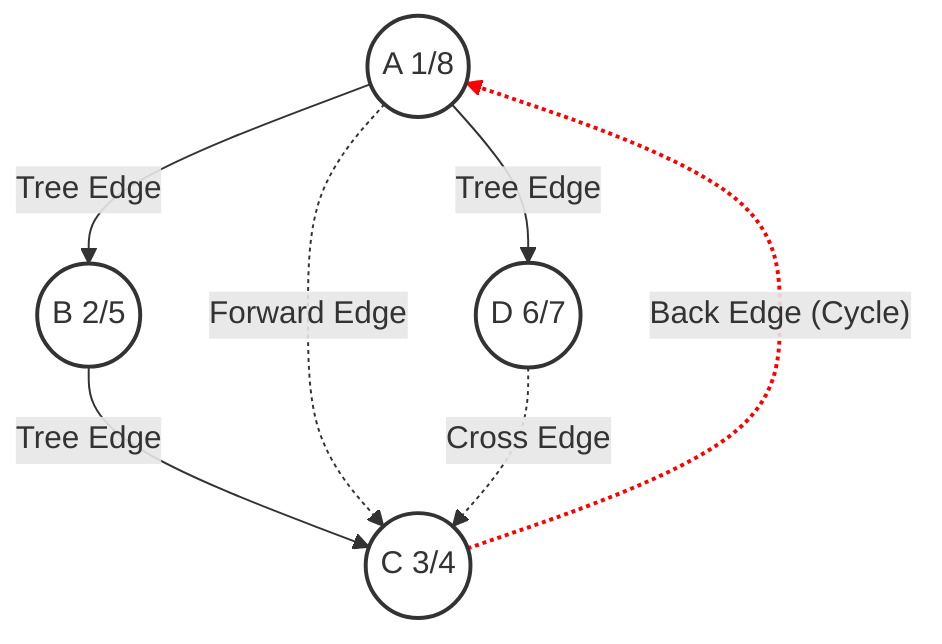

## 1. 概述
- **目标**: 给定图 $G=(V, E)$（有向或无向），系统地探索每一个顶点和每一条边。
- **结果**: 通过搜索过程，通常会在图上构建出一棵树（如果图是连通的）或森林（如果图不连通）。
  - 选择一个顶点作为根 (root)。
  - 选择特定的边构成树。

图的遍历主要有两种基本算法：**广度优先搜索 (BFS)** 和 **深度优先搜索 (DFS)**。

| 特性        | BFS             | DFS                |
| :-------- | :-------------- | :----------------- |
| **数据结构**  | 队列 (Queue)      | 栈 (Stack) / 递归     |
| **路径性质**  | 寻找最短路径 (无权图)    | 不一定是最短路径           |
| **应用**    | 最短路径、连通性检测、层级遍历 | 拓扑排序、环检测、连通分量、迷宫生成 |
| **时间复杂度** | $O(V + E)$      | $O(V + E)$         |

## 2. 广度优先搜索 (BFS - Breadth-First Search)
BFS 类似于树的层序遍历。它从起始顶点开始，先访问所有邻接节点，然后再访问邻接节点的邻接节点。

- **过程**:
  1. 将起始顶点入队，标记为已访问。
  2. 若队列非空，取出队首顶点 $u$。
  3. 遍历 $u$ 的所有未访问邻接点 $v$，将 $v$ 入队并标记为已访问。
  4. 重复步骤 2-3，直到队列为空。
- **性质**:
  - 在无权图中，BFS 可以找到从起点到其他所有顶点的**最短路径**（边数最少）。
  - 生成的树称为 **BFS 树**。
- **时间复杂度**: $O(V + E)$ (使用邻接表)。

## 3. 深度优先搜索 (DFS - Depth-First Search)
DFS 类似于树的先序遍历。它尽可能深地搜索图的分支。

### 3.1 节点属性 (Node Properties)
为了精细控制遍历和分析图结构，DFS 为每个节点维护三个属性：
1.  **颜色 (color)**: 标记节点状态。
    *   **⚪ 白色 (White)**: 未被访问 (Unvisited)。
    *   **🩶 灰色 (Gray)**: 被发现但未完成 (Discovered/Visiting)。节点在递归栈中，子孙还在被访问。
    *   **⚫ 黑色 (Black)**: 已完成 (Finished)。邻接表已全部扫描。
2.  **发现时间 (d, discovery time)**: 节点第一次由白变灰的时间戳。
3.  **完成时间 (f, finishing time)**: 节点邻接表扫描完，由灰变黑的时间戳。
    *   **区间 $[u.d, u.f]$**: 表示节点 $u$ 在递归栈中的生命周期。

### 3.2 边的分类
1.  **树边 (Tree Edge)**: 访问 $v$ 时，$v$ 是白色。
2.  **后向边 (Back Edge)**: $v$ 是灰色（$v$ 是 $u$ 的祖先）。
	- 意味着图中存在环。
3.  **前向边 (Forward Edge)**: $v$ 是黑色，且 $v$ 是 $u$ 的后代。
	- 意味着有一条“捷径”可以跳过中间的节点直接到达后代。
4.  **横向边 (Cross Edge)**: $v$ 是黑色，且 $u, v$ 无祖先/后代关系。

祖先指**DFS生成树上的更上层节点**

> **注意**: 
> - **无向图**中，DFS 只会产生**树边**和**后向边**（不会有前向边和横向边）。

### 3.3 关键定理 (Theorems)
1.  **括号定理 (Parenthesis Theorem)**:
    - 任意两个节点 $u, v$ 的时间区间 $[u.d, u.f]$ 和 $[v.d, v.f]$ 要么完全包含，要么完全分离。
    - **嵌套关系**: $v$ 是 $u$ 的后代 $\iff u.d < v.d < v.f < u.f$。
2.  **白色路径定理 (White-path Theorem)**:
    - 在 DFS 森林中，$v$ 是 $u$ 的后代 $\iff$ 在 $u.d$ 时刻，存在一条从 $u$ 到 $v$ 的路径，且路径上所有点全是白色。

### 3.4 DFS 可视化与代码实现

#### DFS 树与四种边的示例
下图展示了一个有向图的 DFS 过程。
- **节点格式**: `Name (d/f)`，表示发现时间和完成时间。
- **实线**: 树边 (Tree Edge)。
- **虚线**: 非树边 (Back/Forward/Cross)。



#### 标准 DFS 算法实现 (C++)

```cpp
#include <iostream>
#include <vector>
#include <list>

using namespace std;

// 定义颜色常量
enum Color { WHITE, GRAY, BLACK };

class Graph {
    int V; // 顶点数
    vector<list<int>> adj; // 邻接表
    
    // DFS 属性
    vector<Color> color; // 颜色: 访问状态
    vector<int> d, f;    // d: 发现时间, f: 完成时间
    vector<int> pi;      // pi: 父节点 (Predecessor)
    int time;            // 全局时间计数器

    // 核心递归函数 DFS-Visit
    void DFS_Visit(int u) {
        time++;
        d[u] = time;      // 记录发现时间
        color[u] = GRAY;  // 标记为灰色 (正在访问)
        
        cout << "Discover " << u << " (Time: " << time << ")" << endl;

        for (int v : adj[u]) { //!!! edge_explore的时间开销
            if (color[v] == WHITE) {
                // 1. 树边 (Tree Edge): 遇到未访问节点
                pi[v] = u;
                cout << "  [Tree Edge] " << u << " -> " << v << endl;
                DFS_Visit(v);
            } else if (color[v] == GRAY) {
                // 2. 后向边 (Back Edge): 遇到灰色节点 (祖先) -> 说明有环
                cout << "  [Back Edge] " << u << " -> " << v << " (Cycle detected!)" << endl;
            } else if (color[v] == BLACK) {
                // 遇到黑色节点: 可能是前向边或横向边
                if (d[u] < d[v]) {
                    // 3. 前向边 (Forward Edge): u 先于 v 被发现 -> v 是 u 的后代
                    cout << "  [Forward Edge] " << u << " -> " << v << endl;
                } else {
                    // 4. 横向边 (Cross Edge): u 晚于 v 被发现 -> 无祖先关系
                    cout << "  [Cross Edge] " << u << " -> " << v << endl;
                }
            }
        }

        color[u] = BLACK; // 标记为黑色 (完成访问)
        time++;
        f[u] = time;      // 记录完成时间
        cout << "Finish " << u << " (Time: " << time << ")" << endl;
    }

public:
    Graph(int V) : V(V) {
        adj.resize(V);
    }

    // 添加有向边
    void addEdge(int u, int v) {
        adj[u].push_back(v); 
    }

    // 主 DFS 函数
    void DFS() {
        // 初始化所有节点属性
        color.assign(V, WHITE);
        d.assign(V, 0);
        f.assign(V, 0);
        pi.assign(V, -1);
        time = 0;

        cout << "--- Start DFS ---" << endl;
        // 遍历所有节点，处理非连通图的情况
        for (int u = 0; u < V; u++) {
            if (color[u] == WHITE) {
                DFS_Visit(u);
            }
        }
        cout << "--- End DFS ---" << endl;
    }
};

int main() {
    // 构造示例图 (与上方 Mermaid 图一致)
    // 0:A, 1:B, 2:C, 3:D
    Graph g(4);
    
    g.addEdge(0, 1); // A -> B (Tree)
    g.addEdge(1, 2); // B -> C (Tree)
    g.addEdge(2, 0); // C -> A (Back)
    g.addEdge(0, 2); // A -> C (Forward)
    g.addEdge(0, 3); // A -> D (Tree)
    g.addEdge(3, 2); // D -> C (Cross)

    g.DFS();

    return 0;
}
```
