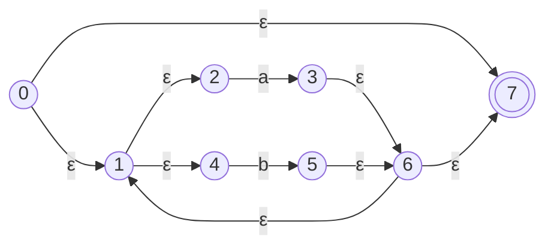
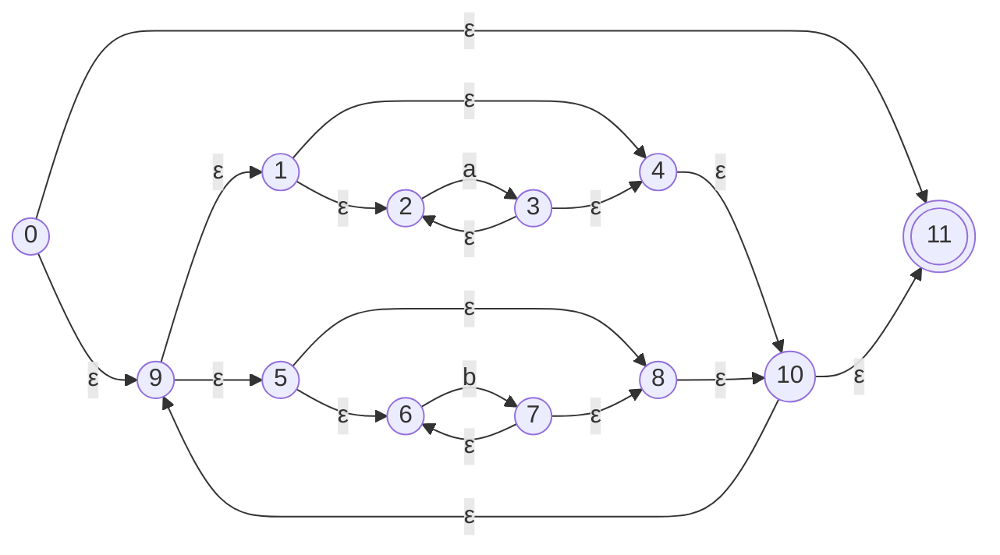
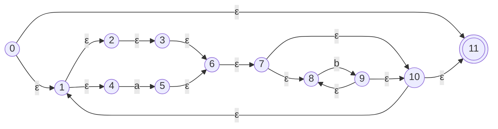
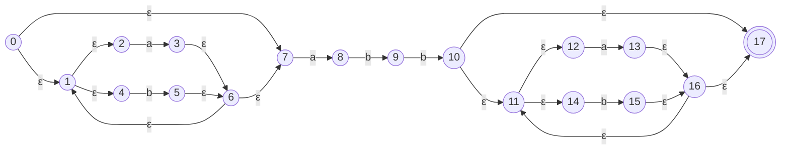
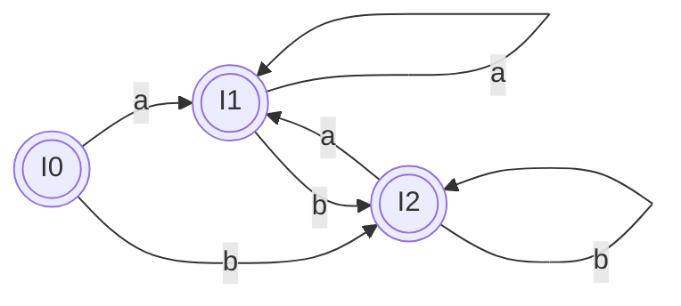
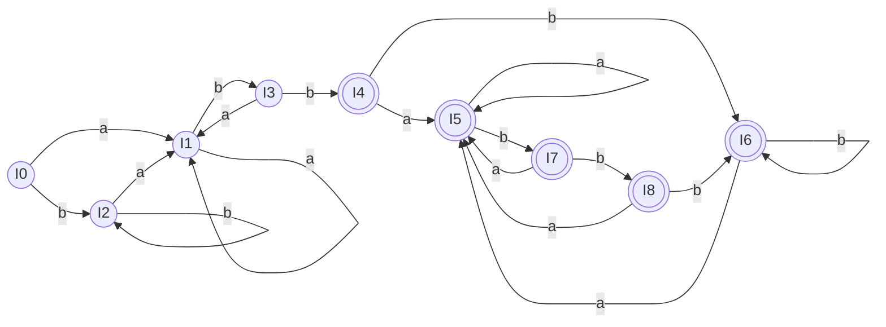

## 一、使用 Thompson 构造法为下列正规式构造 NFA，写出每个 NFA 处理符号串 `ababbab` 过程中的状态转换序列

### a) $(a|b)^*$

**1. NFA 状态图：**

**2. 处理符号串 `ababbab` 过程中的状态转换序列：**
- `a` : 0 $\to$ 1 $\to$ 2 $\to$ 3 $\to$ 6
- `b` : 6 $\to$ 1 $\to$ 4 $\to$ 5 $\to$ 6
- `a` : 6 $\to$ 1 $\to$ 2 $\to$ 3 $\to$ 6
- `b` : 6 $\to$ 1 $\to$ 4 $\to$ 5 $\to$ 6
- `b` : 6 $\to$ 1 $\to$ 4 $\to$ 5 $\to$ 6
- `a` : 6 $\to$ 1 $\to$ 2 $\to$ 3 $\to$ 6
- `b` : 6 $\to$ 1 $\to$ 4 $\to$ 5 $\to$ 6 $\to$ 7
**完整序列：** 0, 1, 2, 3, 6, 1, 4, 5, 6, 1, 2, 3, 6, 1, 4, 5, 6, 1, 4, 5, 6, 1, 2, 3, 6, 1, 4, 5, 6, 7

---

### b) $(a^*|b^*)^*$

**1. NFA 状态图：**

**2. 处理符号串 `ababbab` 过程中的状态转换序列：**
- `a` : 0 $\to$ 9 $\to$ 1 $\to$ 2 $\to$ 3 $\to$ 4 $\to$ 10
- `b` : 10 $\to$ 9 $\to$ 5 $\to$ 6 $\to$ 7 $\to$ 8 $\to$ 10
- `a` : 10 $\to$ 9 $\to$ 1 $\to$ 2 $\to$ 3 $\to$ 4 $\to$ 10
- `bb`: 10 $\to$ 9 $\to$ 5 $\to$ 6 $\to$ 7 $\to$ 6 $\to$ 7 $\to$ 8 $\to$ 10
- `a` : 10 $\to$ 9 $\to$ 1 $\to$ 2 $\to$ 3 $\to$ 4 $\to$ 10
- `b` : 10 $\to$ 9 $\to$ 5 $\to$ 6 $\to$ 7 $\to$ 8 $\to$ 10 $\to$ 11
**完整序列：** 0, 9, 1, 2, 3, 4, 10, 9, 5, 6, 7, 8, 10, 9, 1, 2, 3, 4, 10, 9, 5, 6, 7, 6, 7, 8, 10, 9, 1, 2, 3, 4, 10, 9, 5, 6, 7, 8, 10, 11

---

### c) $((\epsilon|a)b^*)^*$

**1. NFA 状态图：**

**2. 处理符号串 `ababbab` 过程中的状态转换序列：**
- `ab` : 0 $\to$ 1 $\to$ 4 $\to$ 5 $\to$ 6 $\to$ 7 $\to$ 8 $\to$ 9 $\to$ 10
- `abb`: 10 $\to$ 1 $\to$ 4 $\to$ 5 $\to$ 6 $\to$ 7 $\to$ 8 $\to$ 9 $\to$ 8 $\to$ 9 $\to$ 10
- `ab` : 10 $\to$ 1 $\to$ 4 $\to$ 5 $\to$ 6 $\to$ 7 $\to$ 8 $\to$ 9 $\to$ 10 $\to$ 11
**完整序列：** 0, 1, 4, 5, 6, 7, 8, 9, 10, 1, 4, 5, 6, 7, 8, 9, 8, 9, 10, 1, 4, 5, 6, 7, 8, 9, 10, 11

---

### d) $(a|b)^*abb(a|b)^*$

**1. NFA 状态图：**

**2. 处理符号串 `ababbab` 过程中的状态转换序列：**
- `ab`: 0 $\to$ 1 $\to$ 2 $\to$ 3 $\to$ 6 $\to$ 1 $\to$ 4 $\to$ 5 $\to$ 6 $\to$ 7
-  `abb`: 7 $\to$ 8 $\to$ 9 $\to$ 10
-  `ab`: 10 $\to$ 11 $\to$ 12 $\to$ 13 $\to$ 16 $\to$ 11 $\to$ 14 $\to$ 15 $\to$ 16 $\to$ 17
**完整序列：** 0, 1, 2, 3, 6, 1, 4, 5, 6, 7, 8, 9, 10, 11, 12, 13, 16, 11, 14, 15, 16, 17

---

## 二、利用子集构造法将第一题得到的 NFA 转换为 DFA，同样写出分析符号串 “ababbab” 过程中的状态转换。

> 注意：(a)、(b)、(c) 三个正规式的等价语言都是 $(a|b)^*$，因此它们通过子集构造法得到的 DFA 在本质上是一样的。这里分别列出对应的状态子集。

### a) $(a|b)^*$ 
0为开始状态, 7为接收状态

**1. 子集构造法求状态集合：**
- $I_0 = \epsilon\text{-closure}(\{0\}) = \{0, 1, 2, 4, 7\}$
- $I_1 = \epsilon\text{-closure}(\text{move}(I_0, a)) = \epsilon\text{-closure}(\{3\}) = \{1, 2, 3, 4, 6, 7\}$ 
- $I_2 = \epsilon\text{-closure}(\text{move}(I_0, b)) = \epsilon\text{-closure}(\{5\}) = \{1, 2, 4, 5, 6, 7\}$ 
- $\text{move}(I_1, a) \to I_1$
- $\text{move}(I_1, b) \to I_2$
- $\text{move}(I_2, a) \to I_1$
- $\text{move}(I_2, b) \to I_2$
没有新的状态产生, 算法终止

**2. DFA 状态图：**

**3. 符号串 `ababbab` 过程中的状态转换：**
- `a`: $I_0 \to I_1$
- `b`: $I_1 \to I_2$
- `a`: $I_2 \to I_1$
- `b`: $I_1 \to I_2$
- `b`: $I_2 \to I_2$
- `a`: $I_2 \to I_1$
- `b`: $I_1 \to I_2$
**完整序列：** $I_0, I_1, I_2, I_1, I_2, I_2, I_1, I_2$

---

### b) $(a^*|b^*)^*$ 
0为开始状态, 11为接收状态

**1. 子集构造法求状态集合：**
- $I_0 = \epsilon\text{-closure}(\{0\}) = \{0, 1, 2, 4, 5, 6, 8, 9, 10, 11\}$
- $I_1 = \epsilon\text{-closure}(\text{move}(I_0, a)) = \epsilon\text{-closure}(\{3\}) = \{1, 2, 3, 4, 5, 6, 8, 9, 10, 11\}$ 
- $I_2 = \epsilon\text{-closure}(\text{move}(I_0, b)) = \epsilon\text{-closure}(\{7\}) = \{1, 2, 4, 5, 6, 7, 8, 9, 10, 11\}$ 
- $\text{move}(I_1, a) \to I_1$
- $\text{move}(I_1, b) \to I_2$
- $\text{move}(I_2, a) \to I_1$
- $\text{move}(I_2, b) \to I_2$
没有新的状态产生, 算法终止

**2. DFA 状态图：**

**3. 符号串 `ababbab` 过程中的状态转换：**
DFA与a)中一致, 状态转换也一致: $I_0, I_1, I_2, I_1, I_2, I_2, I_1, I_2$

---

### c) $((\epsilon|a)b^*)^*$ 转换为 DFA
0为开始状态, 11为接收状态

**1. 子集构造法求状态集合：**
- $I_0 = \epsilon\text{-closure}(\{0\}) = \{0, 1, 2, 3, 4, 6, 7, 8, 10, 11\}$ 
- $I_1 = \epsilon\text{-closure}(\text{move}(I_0, a)) = \epsilon\text{-closure}(\{5\}) = \{1, 2, 3, 4, 5, 6, 7, 8, 10, 11\}$ 
- $I_2 = \epsilon\text{-closure}(\text{move}(I_0, b)) = \epsilon\text{-closure}(\{9\}) = \{1, 2, 3, 4, 6, 7, 8, 9, 10, 11\}$ 
- $\text{move}(I_1, a) \to I_1$
- $\text{move}(I_1, b) \to I_2$
- $\text{move}(I_2, a) \to I_1$
- $\text{move}(I_2, b) \to I_2$
没有新的状态产生, 算法终止

**2. DFA 状态图：**

**3. 符号串 `ababbab` 过程中的状态转换：**
DFA与a)中一致, 状态转换也一致:  $I_0, I_1, I_2, I_1, I_2, I_2, I_1, I_2$

---

### d) $(a|b)^*abb(a|b)^*$ 转换为 DFA
0是开始状态, 17是接收状态

**1. 子集构造法求状态集合：**
- $I_0 = \{0, 1, 2, 4, 7\}$
- $I_1 = \epsilon\text{-closure}(\text{move}(I_0, a)) = \{1, 2, 3, 4, 6, 7, 8\}$
- $I_2 = \epsilon\text{-closure}(\text{move}(I_0, b)) = \{1, 2, 4, 5, 6, 7\}$
- $\text{move}(I_1, a) = I_1$
- $I_3 = \epsilon\text{-closure}(\text{move}(I_1, b)) = \{1, 2, 4, 5, 6, 7, 9\}$
- $\text{move}(I_2, a) = I_1$
- $\text{move}(I_2, b) = I_2$
- $\text{move}(I_3, a) = I_1$
- $I_4 = \epsilon\text{-closure}(\text{move}(I_3, b)) = \{1, 2, 4, 5, 6, 7, 10, 11, 12, 14, 17\}$ 
- $I_5 = \epsilon\text{-closure}(\text{move}(I_4, a)) = \{1, 2, 3, 4, 6, 7, 8, 11, 12, 13, 14, 16, 17\}$ 
- $I_6 = \epsilon\text{-closure}(\text{move}(I_4, b)) = \{1, 2, 4, 5, 6, 7, 11, 12, 14, 15, 16, 17\}$ 
- $\text{move}(I_5, a) = I_5$
- $I_7 = \epsilon\text{-closure}(\text{move}(I_5, b)) = \{1, 2, 4, 5, 6, 7, 9, 11, 12, 14, 15, 16, 17\}$ 
- $\text{move}(I_6, a) = I_5$
- $\text{move}(I_6, b) = I_6$
- $\text{move}(I_7, a) = I_5$
- $I_8 = \epsilon\text{-closure}(\text{move}(I_7, b)) = \{1, 2, 4, 5, 6, 7, 10, 11, 12, 14, 15, 16, 17\}$ 
- $\text{move}(I_8, a) = I_5$
- $\text{move}(I_8, b) = I_6$
没有新的状态产生, 算法终止

**2. DFA 状态图：**

**3. 符号串 `ababbab` 过程中的状态转换：**
- `a`: $I_0 \to I_1$
- `b`: $I_1 \to I_3$
- `a`: $I_3 \to I_1$
- `b`: $I_1 \to I_3$
- `b`: $I_3 \to I_4$ 
- `a`: $I_4 \to I_5$
- `b`: $I_5 \to I_7$
**完整序列：** $I_0, I_1, I_3, I_1, I_3, I_4, I_5, I_7$