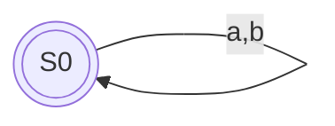
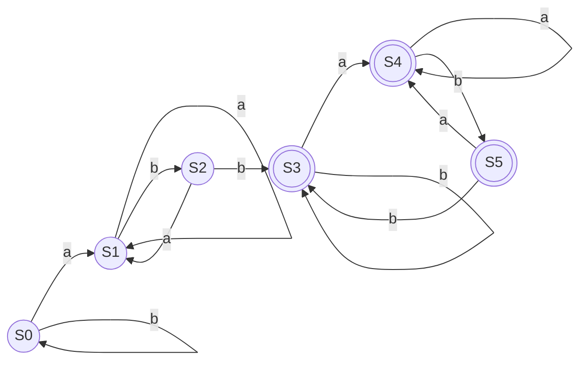
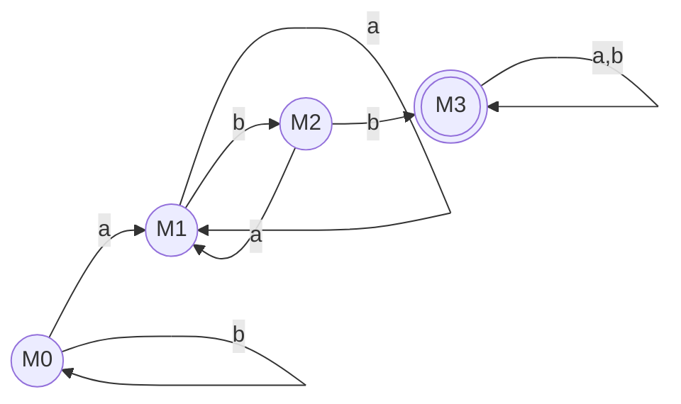

## 一、直接构造法构造这四个正则表达式的 DFA，并且最小化 DFA。

> **前言与重要观察**：
> (a)、(b)、(c) 三个正则表达式所表示的等价语言都是全体由 $a$ 和 $b$ 组成的字符串，即 $(a|b)^*$。
> 因此，通过直接构造法得到的 DFA 必然是一个最简单的单状态循环自动机，其最小化结果也依然是它本身。下面将分别给出它们的扩充表达式、位置编号和 followpos，以证明它们殊途同归。
### a) $(a|b)^*$

**1. 扩充表达式与位置编号：**
$(a_1 | b_2)^* \#_3$

**2. 计算 followpos：**
- $followpos(1) = \{1, 2, 3\}$ 
- $followpos(2) = \{1, 2, 3\}$
- $followpos(3) = \emptyset$

**3. 构造 DFA 状态：**
- 初始状态为 $S_0 = firstpos(root) = \{1, 2, 3\}$
	- $move(S_0, a)=followpos(1) = \{1, 2, 3\} = S_0$
	- $move(S_0, b)=followpos(2) = \{1, 2, 3\} = S_0$
  
**4. DFA 状态图：**
已经是最小DFA

---

### b) $(a^*|b^*)^*$

**1. 扩充表达式与位置编号：**
$({a_1}^* | {b_2}^*)^* \#_3$

**2. 计算 followpos：**
- $followpos(1) = \{1, 2, 3\}$
- $followpos(2) = \{1, 2, 3\}$
- $followpos(3) = \emptyset$

**3. 构造 DFA 状态：**
- 初始状态为 $S_0 = firstpos(root) = \{1, 2, 3\}$
	- $move(S_0, a)=followpos(1) = \{1, 2, 3\} = S_0$
	- $move(S_0, b)=followpos(2) = \{1, 2, 3\} = S_0$

**4. DFA 状态图：**
已经是最小DFA

---

### c) $((\epsilon|a)b^*)^*$

**1. 扩充表达式与位置编号：**
$((\epsilon | a_1) {b_2}^*)^* \#_3$

**2. 计算 followpos：**
- $followpos(1) = \{1, 2, 3\}$
- $followpos(2) = \{1, 2, 3\}$
- $followpos(3) = \emptyset$

**3. 构造 DFA 状态：**
- 初始状态为 $S_0 = firstpos(root) = \{1, 2, 3\}$
	- $move(S_0, a)=followpos(1) = \{1, 2, 3\} = S_0$
	- $move(S_0, b)=followpos(2) = \{1, 2, 3\} = S_0$

**4. DFA 状态图：**
已经是最小DFA

---

### d) $(a|b)^*abb(a|b)^*$

**1. 扩充表达式与位置编号：**
$(a_1 | b_2)^* a_3 b_4 b_5 (a_6 | b_7)^* \#_8$

**2. 计算 followpos：**
- $followpos(1) = \{1, 2, 3\}$
- $followpos(2) = \{1, 2, 3\}$
- $followpos(3) = \{4\}$
- $followpos(4) = \{5\}$
- $followpos(5) = \{6, 7, 8\}$
- $followpos(6) = \{6, 7, 8\}$
- $followpos(7) = \{6, 7, 8\}$
- $followpos(8) = \emptyset$

**3. 直接构造 DFA 状态集合：**
- 初始状态为 $S_0 = firstpos(root) = \{1, 2, 3\}$
- **$S_0 = \{1, 2, 3\}$**
  - $move(S_0, a) = followpos(1) \cup followpos(3) = \{1, 2, 3\} \cup \{4\} = \{1, 2, 3, 4\} = S_1$
  - $move(S_0, b) = followpos(2) = \{1, 2, 3\} = S_0$
- **$S_1 = \{1, 2, 3, 4\}$**
  - $move(S_1, a) = followpos(1) \cup followpos(3) = \{1, 2, 3, 4\} = S_1$
  - $move(S_1, b) = followpos(2) \cup followpos(4) = \{1, 2, 3\} \cup \{5\} = \{1, 2, 3, 5\} = S_2$
- **$S_2 = \{1, 2, 3, 5\}$**
  - $move(S_2, a) = followpos(1) \cup followpos(3) = \{1, 2, 3, 4\} = S_1$
  - $move(S_2, b) = followpos(2) \cup followpos(5) = \{1, 2, 3\} \cup \{6, 7, 8\} = \{1, 2, 3, 6, 7, 8\} = S_3$
- **$S_3 = \{1, 2, 3, 6, 7, 8\}$**
  - $move(S_3, a) = followpos(1) \cup followpos(3) \cup followpos(6) = \{1, 2, 3, 4, 6, 7, 8\} = S_4$
  - $move(S_3, b) = followpos(2) \cup followpos(7) = \{1, 2, 3, 6, 7, 8\} = S_3$
- **$S_4 = \{1, 2, 3, 4, 6, 7, 8\}$**
  - $move(S_4, a) = followpos(1) \cup followpos(3) \cup followpos(6) = \{1, 2, 3, 4, 6, 7, 8\} = S_4$
  - $move(S_4, b) = followpos(2) \cup followpos(4) \cup followpos(7) = \{1, 2, 3, 5, 6, 7, 8\} = S_5$
- **$S_5 = \{1, 2, 3, 5, 6, 7, 8\}$**
  - $move(S_5, a) = followpos(1) \cup followpos(3) \cup followpos(6) = \{1, 2, 3, 4, 6, 7, 8\} = S_4$
  - $move(S_5, b) = followpos(2) \cup followpos(5) \cup followpos(7) = \{1, 2, 3, 6, 7, 8\} = S_3$

**原始 DFA 状态转移图：**

**4. 使用 Hopcroft 算法最小化 DFA：**

- **初始划分**：
  $\Pi_0 = \{ N=\{S_0, S_1, S_2\}, A=\{S_3, S_4, S_5\} \}$
- **检查$A$**：
  - $move(S_3,a) = S_4 \in A$, $move(S_3,b) = S_3 \in A$
  - $move(S_4,a) = S_4 \in A$, $move(S_4,b) = S_5 \in A$
  - $move(S_5,a) = S_4 \in A$, $move(S_5,b) = S_3 \in A$
  - 无论输入 a 还是 b，集合 $A$ 中的状态都只会跳转到 $A$ 内部。因此 $A$ 是不可区分的，无需分裂
- **检查$N$**：
  - $move(S_0,a)=S_1 \in N$, $move(S_0,b) = S_0 \in N$
  - $move(S_1,a) = S_1 \in N$, $move(S_1,b) = S_2 \in N$
  - $move(S_2,a) = S_1 \in N$, $move(S_2,b) = S_3 \in A$
  - $S_2$ 的行为与 $S_0, S_1$ 不同，因此 $N$ 分裂为 $\{S_0, S_1\}$ 和 $\{S_2\}$
- **检查 $\{S_0, S_1\}$**：
 - $move(S_0,a)=S_1 \in \{S_0, S_1\}$, $move(S_0,b) = S_0 \in \{S_0, S_1\}$
 - $move(S_1,a) = S_1 \in \{S_0, S_1\}$, $move(S_1,b) = S_2 \in \{S_2\}$
 - 因此进一步分裂为 $\{S_0\}$ 和 $\{S_1\}$。
- **最终等价类划分**：
  $\Pi = \{ \{S_0\}, \{S_1\}, \{S_2\}, \{S_3, S_4, S_5\} \}$

**5. 最小化 DFA 状态图：**
设 $M_0 = \{S_0\}$, $M_1 = \{S_1\}$, $M_2 = \{S_2\}$, $M_3 = \{S_3, S_4, S_5\}$。

