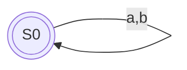
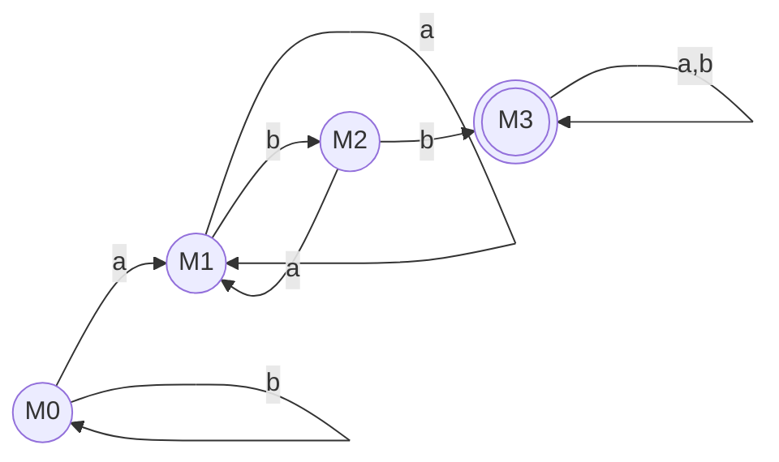

# 第三章 作业：直接构造法与最小化 DFA

## 一、直接构造法构造这四个正则表达式的 DFA，并且最小化 DFA。

> **前言与重要观察**：
> (a)、(b)、(c) 三个正则表达式所表示的等价语言都是全体由 $a$ 和 $b$ 组成的字符串，即 $(a|b)^*$。
> 因此，通过直接构造法得到的 DFA 必然是一个最简单的单状态循环自动机，其最小化结果也依然是它本身。下面将分别给出它们的扩充表达式、位置编号和 followpos，以证明它们殊途同归。

---

### a) $(a|b)^*$

**1. 扩充表达式与位置编号：**
$(a_1 | b_2)^* \#_3$

**2. 计算 followpos：**
- $followpos(1) = \{1, 2, 3\}$ （闭包循环回到开头，以及跳出闭包连接到 $\#$）
- $followpos(2) = \{1, 2, 3\}$ （同上）
- $followpos(3) = \emptyset$

**3. 构造 DFA 状态：**
- $firstpos(root) = \{1, 2, 3\}$。设初始状态为 $S_0 = \{1, 2, 3\}$（包含 3，所以是接受状态）。
- 对于 $S_0$：
  - 遇到 $a$：$followpos(1) = \{1, 2, 3\} = S_0$
  - 遇到 $b$：$followpos(2) = \{1, 2, 3\} = S_0$
  
**4. DFA 状态图（已是最简）：**

---

### b) $(a^*|b^*)^*$

**1. 扩充表达式与位置编号：**
$({a_1}^* | {b_2}^*)^* \#_3$

**2. 计算 followpos：**
- $a_1$ 是闭包，且外层也是闭包。匹配完 $a_1$ 后，可以继续匹配内层的 $a_1$，也可以匹配外层循环的 $a_1$ 或 $b_2$，或者跳出匹配 $\#_3$。
- $followpos(1) = \{1, 2, 3\}$
- $followpos(2) = \{1, 2, 3\}$
- $followpos(3) = \emptyset$

**3. 构造 DFA 状态：**
- $firstpos(root) = \{1, 2, 3\}$。初始状态 $S_0 = \{1, 2, 3\}$（接受状态）。
- 状态转移与 (a) 完全相同，均回到 $S_0$。

**4. DFA 状态图（已是最简）：**

---

### c) $((\epsilon|a)b^*)^*$

**1. 扩充表达式与位置编号：**
$((\epsilon | a_1) {b_2}^*)^* \#_3$

**2. 计算 followpos：**
- $a_1$ 后面紧跟 $b_2^*$，所以可以接 $b_2$；整个组在闭包内，所以也可以接组开头的 $a_1$；或者跳出接 $\#_3$。
- $followpos(1) = \{1, 2, 3\}$
- $b_2$ 是闭包，匹配完可以接 $b_2$，也可以接外层循环开头的 $a_1$，或者跳出接 $\#_3$。
- $followpos(2) = \{1, 2, 3\}$
- $followpos(3) = \emptyset$

**3. 构造 DFA 状态：**
- $firstpos(root) = \{1, 2, 3\}$。初始状态 $S_0 = \{1, 2, 3\}$（接受状态）。
- 状态转移与 (a) 完全相同，均回到 $S_0$。

**4. DFA 状态图（已是最简）：**

---

### d) $(a|b)^*abb(a|b)^*$

**1. 扩充表达式与位置编号：**
$(a_1 | b_2)^* a_3 b_4 b_5 (a_6 | b_7)^* \#_8$

**2. 计算 followpos：**
- $followpos(1) = \{1, 2, 3\}$ （闭包内循环，或接后面的 $a_3$）
- $followpos(2) = \{1, 2, 3\}$ （同上）
- $followpos(3) = \{4\}$ （紧接 $b_4$）
- $followpos(4) = \{5\}$ （紧接 $b_5$）
- $followpos(5) = \{6, 7, 8\}$ （接后面闭包的开头，或直接跳过闭包接 $\#_8$）
- $followpos(6) = \{6, 7, 8\}$ （闭包内循环，或接 $\#_8$）
- $followpos(7) = \{6, 7, 8\}$ （同上）
- $followpos(8) = \emptyset$

**3. 直接构造 DFA 状态集合：**
由于 $(a_1|b_2)^*$ 可为空，根节点的 $firstpos = \{1, 2, 3\}$。
- **$S_0 = \{1, 2, 3\}$** （非接受状态）
  - $move(S_0, a) = followpos(1) \cup followpos(3) = \{1, 2, 3\} \cup \{4\} = \{1, 2, 3, 4\} = S_1$
  - $move(S_0, b) = followpos(2) = \{1, 2, 3\} = S_0$
- **$S_1 = \{1, 2, 3, 4\}$** （非接受状态）
  - $move(S_1, a) = followpos(1) \cup followpos(3) = \{1, 2, 3, 4\} = S_1$
  - $move(S_1, b) = followpos(2) \cup followpos(4) = \{1, 2, 3\} \cup \{5\} = \{1, 2, 3, 5\} = S_2$
- **$S_2 = \{1, 2, 3, 5\}$** （非接受状态）
  - $move(S_2, a) = followpos(1) \cup followpos(3) = \{1, 2, 3, 4\} = S_1$
  - $move(S_2, b) = followpos(2) \cup followpos(5) = \{1, 2, 3\} \cup \{6, 7, 8\} = \{1, 2, 3, 6, 7, 8\} = S_3$
- **$S_3 = \{1, 2, 3, 6, 7, 8\}$** （**接受状态**，含 8）
  - $move(S_3, a) = followpos(1) \cup followpos(3) \cup followpos(6) = \{1, 2, 3, 4, 6, 7, 8\} = S_4$
  - $move(S_3, b) = followpos(2) \cup followpos(7) = \{1, 2, 3, 6, 7, 8\} = S_3$
- **$S_4 = \{1, 2, 3, 4, 6, 7, 8\}$** （**接受状态**，含 8）
  - $move(S_4, a) = followpos(1) \cup followpos(3) \cup followpos(6) = \{1, 2, 3, 4, 6, 7, 8\} = S_4$
  - $move(S_4, b) = followpos(2) \cup followpos(4) \cup followpos(7) = \{1, 2, 3, 5, 6, 7, 8\} = S_5$
- **$S_5 = \{1, 2, 3, 5, 6, 7, 8\}$** （**接受状态**，含 8）
  - $move(S_5, a) = followpos(1) \cup followpos(3) \cup followpos(6) = \{1, 2, 3, 4, 6, 7, 8\} = S_4$
  - $move(S_5, b) = followpos(2) \cup followpos(5) \cup followpos(7) = \{1, 2, 3, 6, 7, 8\} = S_3$

构造出的原始 DFA 状态转移：

| 状态  | a     | b     | 是否接受 |
| ----- | ----- | ----- | -------- |
| $S_0$ | $S_1$ | $S_0$ | 否       |
| $S_1$ | $S_1$ | $S_2$ | 否       |
| $S_2$ | $S_1$ | $S_3$ | 否       |
| $S_3$ | $S_4$ | $S_3$ | 是       |
| $S_4$ | $S_4$ | $S_5$ | 是       |
| $S_5$ | $S_4$ | $S_3$ | 是       |

**4. 使用 Hopcroft 算法最小化 DFA：**

- **初始划分**：
  $\Pi_0 = \{ N=\{S_0, S_1, S_2\}, A=\{S_3, S_4, S_5\} \}$
- **检查接受集 $A$**：
  - $S_3$ 遇 a 到 $S_4(A)$，遇 b 到 $S_3(A)$
  - $S_4$ 遇 a 到 $S_4(A)$，遇 b 到 $S_5(A)$
  - $S_5$ 遇 a 到 $S_4(A)$，遇 b 到 $S_3(A)$
  - 无论输入 a 还是 b，集合 $A$ 中的状态都只会跳转到 $A$ 内部。因此 $A$ 是不可区分的，无需分裂，合并为一个状态 $A$。
- **检查非接受集 $N$**：
  - $S_0$ 遇 b 到 $S_0(N)$，$S_1$ 遇 b 到 $S_2(N)$
  - $S_2$ 遇 b 到 $S_3(A)$
  - $S_2$ 的行为与 $S_0, S_1$ 不同，因此 $N$ 分裂为 $\{S_0, S_1\}$ 和 $\{S_2\}$。
  - 继续检查 $\{S_0, S_1\}$：$S_0$ 遇 b 到 $S_0$（在当前集合），而 $S_1$ 遇 b 到 $S_2$（在其它集合）。因此进一步分裂为 $\{S_0\}$ 和 $\{S_1\}$。
- **最终等价类划分**：
  $\Pi = \{ \{S_0\}, \{S_1\}, \{S_2\}, \{S_3, S_4, S_5\} \}$

**5. 最小化 DFA 状态图：**
设 $M_0 = \{S_0\}$, $M_1 = \{S_1\}$, $M_2 = \{S_2\}$, $M_3 = \{S_3, S_4, S_5\}$。

> **解析**：最小化后的 DFA 完美地表达了“只要匹配到了 `abb`（到达 $M_3$），此后无论输入什么都永远保持接受状态”这一核心逻辑。