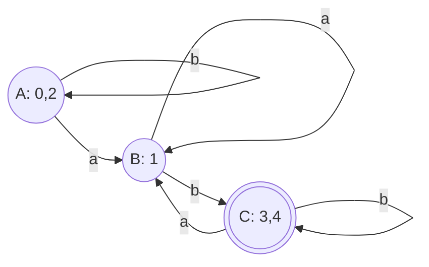

## 1. 简介
**最小化 DFA (DFA Minimization)** 是编译原理词法分析流程的最后一步。通过 [[子集构造法]] 生成的 DFA 虽然可以唯一确定输入字符的跳转，但往往会产生许多冗余或等价的状态。
为了减少 [[词法分析器|词法分析器]] 在运行时的内存开销和状态表大小，需要将 DFA 转换为状态数最少的等价 DFA。最常用的算法是 **Hopcroft 算法（基于等价类的划分法）**。

## 2. 核心思想
Hopcroft 算法的核心思想是：**“状态等价”与“状态可区分”**。
- **状态等价**：如果从状态 $A$ 和状态 $B$ 出发，无论输入什么字符串，最终要么都能到达接受状态，要么都到达非接受状态，那么 $A$ 和 $B$ 就是等价的。等价的状态可以合并为一个状态。
- **状态可区分**：如果存在某个输入字符串，使得从状态 $A$ 出发到达接受状态，而从状态 $B$ 出发到达非接受状态（或反之），那么 $A$ 和 $B$ 就是可区分的，不能合并。

算法采用**不断细化（分裂）集合**的策略：一开始假设所有状态都一样，然后根据它们的转移行为，把表现不同的状态拆分到不同的集合中，直到不能再拆分为止。

## 3. 算法步骤 (划分法)

### 3.1 初始划分
将 DFA 的所有状态集合 $S$ 划分为两个初始等价类（互不相交的子集）：
- **非接受状态集** $N$
- **接受状态集** $A$
即：划分 $\Pi = \{N, A\}$。

### 3.2 迭代分裂 (Refinement)
对当前的划分 $\Pi$ 中的每一个子集 $G$，以及字母表中的每一个输入字符 $c$ 进行检查：
1. 观察集合 $G$ 中所有状态在输入字符 $c$ 后的跳转去向。
2. 如果集合 $G$ 中的状态在输入 $c$ 后，跳转到了**不同的等价类**中，说明集合 $G$ 内部的状态是“可区分”的。
3. 此时，需要将集合 $G$ 按照它们的跳转去向**分裂**成几个更小的子集。
4. 将分裂后的新子集替换掉原来的 $G$，形成新的划分 $\Pi'$。

### 3.3 终止条件
重复执行上述迭代分裂过程。当对所有的子集和所有的输入字符，都**无法再引起任何分裂**时，算法终止。

### 3.4 构造新的最小化 DFA
1. 此时划分 $\Pi$ 中的**每一个等价类（子集）**，就代表最小化 DFA 中的**一个单一状态**。
2. **新开始状态**：包含原 DFA 开始状态的那个等价类。
3. **新接受状态**：包含原 DFA 接受状态的等价类（这些等价类一定全是由原接受状态构成的）。
4. **新转移边**：在不同等价类之间建立转移边。

## 4. 实例演示

假设有一个 DFA，字母表为 $\{a, b\}$，状态集合为 $\{0, 1, 2, 3, 4\}$。
- 开始状态：0
- 接受状态：3, 4

转移表如下：

| 状态 | a   | b   |
| ---- | --- | --- |
| 0    | 1   | 2   |
| 1    | 1   | 3   |
| 2    | 1   | 2   |
| 3    | 1   | 4   |
| 4    | 1   | 4   |

### 推导过程：

**第 1 步：初始划分**
将状态划分为非接受状态和接受状态两组。
- $\Pi_0 = \{ \{0, 1, 2\}, \{3, 4\} \}$

**第 2 步：考察输入，尝试分裂**
我们检查 $\Pi_0$ 中的集合。
- **考察 $\{3, 4\}$**：
  - 输入 `a`：3 去 1，4 去 1。（都去了 $\{0, 1, 2\}$ 集合，表现一致）
  - 输入 `b`：3 去 4，4 去 4。（都去了 $\{3, 4\}$ 集合，表现一致）
  - 结论：$\{3, 4\}$ 无法分裂，是等价的。

- **考察 $\{0, 1, 2\}$**：
  - 输入 `a`：0 去 1，1 去 1，2 去 1。（都去了 $\{0, 1, 2\}$ 集合，表现一致）
  - 输入 `b`：0 去 2（在 $\{0, 1, 2\}$ 中），1 去 3（在 $\{3, 4\}$ 中），2 去 2（在 $\{0, 1, 2\}$ 中）。
  - 结论：状态 1 的去向与其他两者**不同**，因此 $\{0, 1, 2\}$ 必须分裂为 $\{0, 2\}$ 和 $\{1\}$。

得到新的划分：$\Pi_1 = \{ \{0, 2\}, \{1\}, \{3, 4\} \}$

**第 3 步：继续考察新划分**
- **考察 $\{0, 2\}$**：
  - 输入 `a`：0 去 1，2 去 1。（都去了 $\{1\}$ 集合，表现一致）
  - 输入 `b`：0 去 2，2 去 2。（都去了 $\{0, 2\}$ 集合，表现一致）
  - 结论：$\{0, 2\}$ 无法再分裂。
- 单个状态的集合 $\{1\}$ 和已验证的 $\{3, 4\}$ 也无需再分裂。

**第 4 步：得出最终结果**
由于无法再继续分裂，最终的等价类为：
- $A = \{0, 2\}$ （新的开始状态）
- $B = \{1\}$
- $C = \{3, 4\}$ （新的接受状态）

**最小化后的 DFA 转移图：**

## 5. 总结流程
[[正规式|正规式 (RE)]] → [[Thompson构造法]] → NFA → [[子集构造法]] → DFA → **Hopcroft算法** → 最小化 DFA → [[词法分析器|词法分析器代码]]
