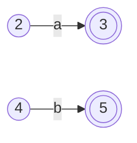
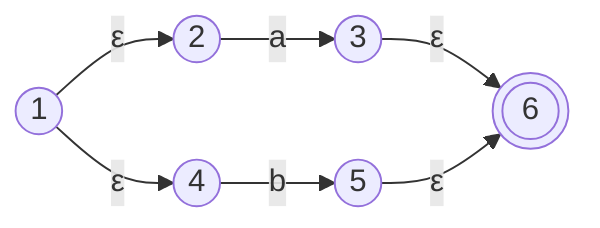
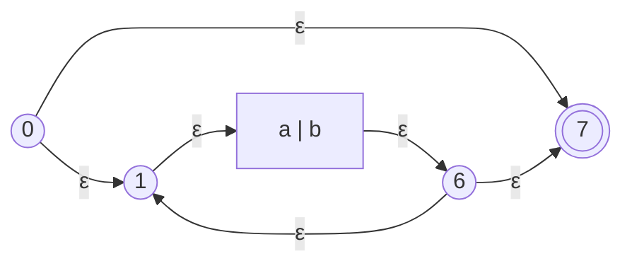
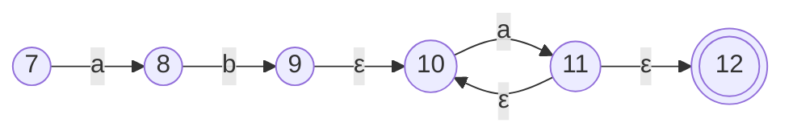
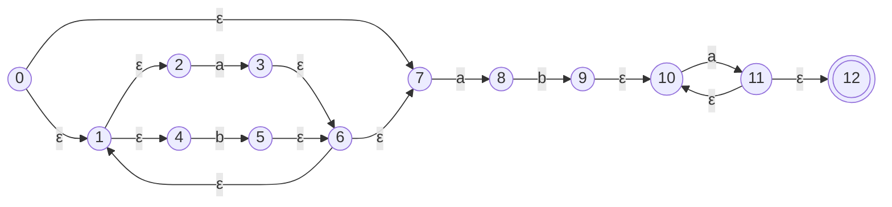

## 1. 简介
**Thompson 构造法**（Thompson's Construction）是编译原理词法分析中的一个经典算法。它的主要作用是将 [[正规式|正则表达式 (Regular Expression, RE)]] 转换为等价的非确定性有限状态自动机 (NFA)。
这个算法是由 Ken Thompson 在 1968 年发明的，广泛应用于各种词法分析器生成工具（如 Lex、Flex）中。

## 2. 核心思想
Thompson 构造法采用**自底向上 (Bottom-up)** 的归纳方法：
1. 先为正则表达式中最基本的单元（如单个字符或空串 $\epsilon$）构造基础的 NFA。
2. 然后根据正则表达式的运算符（并置、选择、闭包），通过引入 $\epsilon$-转换（$\epsilon$-transitions），将这些基础的 NFA 组合成更复杂的 NFA。
3. 最终得到一个与原正则表达式完全等价的完整 NFA。

## 3. 构造规则

### 3.1 基本情况 (Base Cases)
- **空串 $\epsilon$**：
  构造一个具有两个状态的 NFA：一个开始状态，一个接受状态，中间由一条标有 $\epsilon$ 的边连接。
  ```mermaid
  graph LR
      Start((Start)) -- ε --> Accept(((Accept)))
  ```

- **单个字符 $a$**：
  构造一个具有两个状态的 NFA：一个开始状态，一个接受状态，中间由一条标有字符 $a$ 的边连接。
  ```mermaid
  graph LR
      Start((Start)) -- a --> Accept(((Accept)))
  ```

### 3.2 归纳情况 (Inductive Cases)
假设已经有正则表达式 $A$ 和 $B$ 的 NFA，分别记作 $N(A)$ 和 $N(B)$。

- **并置/连接 (Concatenation, $AB$)**：
  将 $N(A)$ 的接受状态与 $N(B)$ 的开始状态合并（或者用一条 $\epsilon$-转换连接）。
  新 NFA 的开始状态是 $N(A)$ 的开始状态，接受状态是 $N(B)$ 的接受状态。
  ```mermaid
  graph LR
      StartA((Start A)) -->|...| Mid((Accept A / Start B))
      Mid -->|...| AcceptB(((Accept B)))
  ```

- **选择/并集 (Alternation/Union, $A|B$)**：
  新建一个总的开始状态和一个总的接受状态。
  - 新开始状态通过 $\epsilon$-转换分别指向 $N(A)$ 和 $N(B)$ 的开始状态。
  - $N(A)$ 和 $N(B)$ 的接受状态通过 $\epsilon$-转换都指向新接受状态。
  ```mermaid
  graph LR
      Start((Start)) -- ε --> NA[N A]
      Start -- ε --> NB[N B]
      NA -- ε --> Accept(((Accept)))
      NB -- ε --> Accept
  ```

- **闭包/星号 (Kleene Star, $A^*$)**：
  新建一个总的开始状态和一个总的接受状态。
  - 新开始状态通过 $\epsilon$-转换指向 $N(A)$ 的开始状态，同时也通过 $\epsilon$-转换直接指向新接受状态（表示可以匹配 0 次）。
  - $N(A)$ 的接受状态通过 $\epsilon$-转换指向新接受状态，同时也通过 $\epsilon$-转换**回退**到 $N(A)$ 的开始状态（表示可以循环匹配多次）。
  ```mermaid
  graph LR
      Start((Start)) -- ε --> StartA((Start A))
      StartA -->|...| AcceptA((Accept A))
      AcceptA -- ε --> StartA
      AcceptA -- ε --> Accept(((Accept)))
      Start -- ε --> Accept
  ```

- **正闭包/加号 (Positive Closure, $A^+$)**：
  新建一个总的开始状态和一个总的接受状态。
  - 新开始状态通过 $\epsilon$-转换指向 $N(A)$ 的开始状态。
  - $N(A)$ 的接受状态通过 $\epsilon$-转换指向新接受状态，同时也通过 $\epsilon$-转换**回退**到 $N(A)$ 的开始状态。
  - 与 $A^*$ 唯一的区别是：**没有**从总开始状态直接跳到总接受状态的 $\epsilon$-转换，确保必须至少匹配一次。
  ```mermaid
  graph LR
      Start((Start)) -- ε --> StartA((Start A))
      StartA -->|...| AcceptA((Accept A))
      AcceptA -- ε --> StartA
      AcceptA -- ε --> Accept(((Accept)))
  ```

## 4. 算法的关键特性
通过 Thompson 构造法生成的 NFA 具有以下几个重要的标准特性：
1. **单一出入口**：生成的 NFA 有且仅有一个开始状态和一个接受状态。
2. **无入度/无出度限制**：没有任何转换边进入开始状态；没有任何转换边离开接受状态。
3. **出度限制**：每个状态最多只有两条出边（且如果是两条，必定都是 $\epsilon$-转换）；如果是一个符号转换，则出边最多只有一条。
4. **状态数量有界**：如果正则表达式的长度（包括符号和操作符）为 $r$，那么构造出的 NFA 状态数最多为 $2r$。这保证了转换的空间和时间复杂度是线性的。

## 5. 总结流程
[[正规式|正规式 (RE)]] → **Thompson构造法** → NFA → [[子集构造法]] → DFA → [[Hopcroft 算法]] → 最小化 DFA → [[词法分析器|词法分析器代码]]

## 6. 实例演示：将 `(a|b)*aba+` 转换为 NFA

根据图片中的正规式 `(a|b)*aba+`，可以按照 Thompson 构造法一步步进行拆解和组合：

### 步骤 1：构造基本单元 `a` 和 `b`
为单个字符 `a` 和 `b` 分别构造最基础的 NFA。


### 步骤 2：构造选择运算 `a|b`
新建开始状态 1 和接受状态 6，通过 $\epsilon$-转换将它们并联起来。


### 步骤 3：构造闭包运算 `(a|b)*`
在 `a|b` 的基础上，新建总的开始状态 0 和总的接受状态 7。
- 添加 `(0) -ε-> (1)` 和 `(6) -ε-> (7)`
- 添加回退边 `(6) -ε-> (1)`（用于重复匹配）
- 添加跳过边 `(0) -ε-> (7)`（用于匹配 0 次）


### 步骤 4：构造连接与正闭包运算 `aba+`
将 `(a|b)*` 的结果与字符 `a`、`b`、`a+` 依次首尾相接。这里采用合并状态的方式，直接将前一个 NFA 的接受状态作为下一个部分的开始状态。
针对最后的 `a+`，我们按照正闭包的规则构造：有一个开始节点 9，连接到 a 的基础节点 10->11，再到接受节点 12，且 11 有一条回到 10 的 $\epsilon$ 回退边。


### 最终的完整 NFA 状态图
