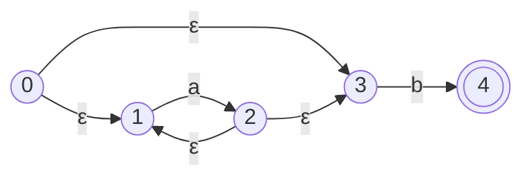
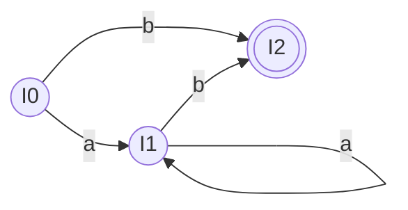

**子集构造法 (Subset Construction)** 是编译原理中词法分析阶段的另一个核心算法。它的主要作用是将 [[Thompson构造法]] 生成的 NFA（非确定性有限状态自动机）转换为等价的 DFA（确定性有限状态自动机）。
由于 NFA 存在 $\epsilon$-转换（空转换）以及同一输入符号可能导致多个状态转移的情况，直接用程序模拟 NFA 的运行效率较低且复杂。通过子集构造法，可以生成一个没有 $\epsilon$-转换、且对任何输入符号都有唯一确定转移的 DFA，从而极大地提高 [[词法分析器|词法分析器]] 匹配字符串的速度。

## 2. 核心思想
子集构造法的核心思想是：**DFA 的每一个状态，实际上对应着 NFA 中的一个状态集合（子集）。**
在 NFA 中，当我们读入一个字符时，由于存在多条路径或 $\epsilon$-转换，我们可能会同时处于多个状态。子集构造法就是把这些“同时可能处于的 NFA 状态”打包成一个集合，并将这个集合定义为 DFA 的一个全新状态。

## 3. 关键定义与操作

在进行子集构造之前，必须掌握两个基本操作：

### 3.1 $\epsilon$-闭包 ($\epsilon$-closure)
**定义**：对于 NFA 中的某个状态集合 $I$，$\epsilon\text{-closure}(I)$ 表示从集合 $I$ 中的任意状态出发，**只经过 $\epsilon$-转换**（不需要消耗任何输入字符）所能到达的所有状态的集合。
- 显然，状态自身总是属于它自己的 $\epsilon$-闭包。
- 物理意义：它代表了在当前状态下，还没读入任何实际字符前，自动机已经“扩散”到的所有潜在状态。

### 3.2 转移函数 ($move(I, a)$)
**定义**：对于 NFA 中的某个状态集合 $I$ 和某个输入字符 $a$，$move(I, a)$ 表示从集合 $I$ 中的状态出发，**经过且仅经过一条标记为 $a$ 的转换边**，所能到达的所有状态的集合。
- 物理意义：它代表了消耗掉字符 $a$ 后，自动机第一步跳转到的状态。

## 4. 算法步骤

将 NFA 转换为 DFA 的具体流程如下：

1. **计算初始状态**：
   - 找出 NFA 的唯一开始状态 $s_0$。
   - 计算初始的 $\epsilon$-闭包：$I_0 = \epsilon\text{-closure}(\{s_0\})$。
   - 将 $I_0$ 作为 DFA 的开始状态，并放入未处理状态队列中。

2. **循环推导新状态**：
   - 从队列中取出一个未处理的 DFA 状态 $I$（它本质上是一个 NFA 状态的集合）。
   - 遍历字母表中的每一个输入字符 $a$：
     1. 计算转移：$J = move(I, a)$。
     2. 计算闭包：$U = \epsilon\text{-closure}(J)$。
     3. 判断 $U$ 是否是一个全新的状态集合：
        - 如果 $U$ 之前从未出现过，则将其标记为一个新的 DFA 状态，并加入队列。
        - 记录 DFA 的状态转移图：从状态 $I$ 输入字符 $a$ 转移到状态 $U$。
   - 标记状态 $I$ 为已处理。

3. **结束条件**：
   - 当队列为空，即没有产生新的状态集合时，算法结束。

4. **确定接受状态**：
   - 检查生成的所有 DFA 状态（子集）。如果某个子集中包含了**原 NFA 的接受状态（终态）**，那么这个 DFA 状态就是 DFA 的接受状态。

## 5. 实例演示：将正规式 `a*b` 的 NFA 转换为 DFA

为了更清晰地展示，我们用一个具体的、完整的带有 $\epsilon$-转换的 NFA 作为例子。假设我们通过 Thompson 构造法得到了正规式 `a*b` 的 NFA，其状态图如下：
- **初始状态**：0
- **接受状态**：4

### 完整推导步骤：

**第 1 步：计算初始状态 $I_0$**
首先，从 NFA 的起点 0 出发，计算它的 $\epsilon$-闭包。
- 包含它自己：$\{0\}$
- 经过 $\epsilon$ 可以到达 1 和 3。
所以，DFA 的第一个状态为：
$I_0 = \epsilon\text{-closure}(\{0\}) = \{0, 1, 3\}$

**第 2 步：计算 $I_0$ 的转移集合**
字母表为 $\{a, b\}$，我们分别计算 $I_0$ 在遇到 $a$ 和 $b$ 时的转移。
- **输入 $a$**：
  在 $I_0=\{0, 1, 3\}$ 中，只有状态 1 遇到 $a$ 能转移到 2。所以 $move(I_0, a) = \{2\}$。
  计算其闭包：从 2 出发，通过 $\epsilon$ 边可以到达 1 和 3，当然也包含它自己 2。
  所以，$I_1 = \epsilon\text{-closure}(\{2\}) = \{1, 2, 3\}$ （这是一个全新的集合，加入队列）
  此时记录：**$I_0$ 输入 $a$ 转移到 $I_1$**。
  
- **输入 $b$**：
  在 $I_0=\{0, 1, 3\}$ 中，只有状态 3 遇到 $b$ 能转移到 4。所以 $move(I_0, b) = \{4\}$。
  计算其闭包：4 没有往外的 $\epsilon$ 边。
  所以，$I_2 = \epsilon\text{-closure}(\{4\}) = \{4\}$ （这是一个全新的集合，加入队列）
  此时记录：**$I_0$ 输入 $b$ 转移到 $I_2$**。

**第 3 步：计算 $I_1$ 的转移集合**
当前队列里有 $I_1 = \{1, 2, 3\}$。
- **输入 $a$**：
  在 $I_1$ 中，只有状态 1 遇到 $a$ 能转移到 2。$move(I_1, a) = \{2\}$。
  其闭包我们在前面算过：$\epsilon\text{-closure}(\{2\}) = \{1, 2, 3\} = I_1$。
  此时记录：**$I_1$ 输入 $a$ 转移回 $I_1$**。（未产生新集合）
  
- **输入 $b$**：
  在 $I_1$ 中，只有状态 3 遇到 $b$ 能转移到 4。$move(I_1, b) = \{4\}$。
  其闭包：$\epsilon\text{-closure}(\{4\}) = \{4\} = I_2$。
  此时记录：**$I_1$ 输入 $b$ 转移到 $I_2$**。（未产生新集合）

**第 4 步：计算 $I_2$ 的转移集合**
当前队列里有 $I_2 = \{4\}$。
- **输入 $a$**：状态 4 没有 $a$ 的转移边。$move(I_2, a) = \emptyset$。
- **输入 $b$**：状态 4 没有 $b$ 的转移边。$move(I_2, b) = \emptyset$。
（未产生新集合）

**第 5 步：确定终态并画出 DFA**
至此，不再产生任何新的状态集合，推导结束。我们得到了三个 DFA 状态：$I_0, I_1, I_2$。
因为原 NFA 的接受状态是 4，所以**包含 4 的集合**都是 DFA 的接受状态。
- $I_0 = \{0, 1, 3\}$ （普通状态）
- $I_1 = \{1, 2, 3\}$ （普通状态）
- $I_2 = \{4\}$ （包含 4，为接受状态）

根据我们之前记录的粗体转移路径，最终得到的 DFA 状态图如下：

## 6. 总结流程
[[正规式|正规式 (RE)]] → [[Thompson构造法]] → NFA → **子集构造法** → DFA → [[Hopcroft 算法]] → 最小化 DFA
