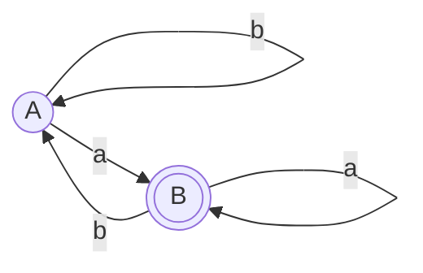

通常将正则表达式 (RE) 转换为确定性有限状态自动机 (DFA) 的流程是：`RE -> (Thompson) -> NFA -> (子集构造) -> DFA`。
然而，存在一种更高效的算法，称为**直接构造法**，它可以跳过 NFA，直接将 [[正规式|正则表达式]] 转换为 DFA。这在词法分析器生成工具（如 Lex/Flex）的底层实现中经常被使用，以提升构造效率。

## 2. 核心思想与前置处理
直接构造法的核心思想是：利用正则表达式的**语法树 (Syntax Tree)**，计算出每个叶子节点（即输入字符）在匹配过程中可能跟随的下一个叶子节点，从而直接建立状态转换关系。

### 2.1 扩充正则表达式
在构造语法树之前，我们必须对原正则表达式 $r$ 进行扩充：
将 $r$ 改写为 **$(r)\#$**，其中 $\#$ 是一个特殊的**结束符**（不在原字母表中）。
- **目的**：当我们在 DFA 运行过程中匹配到符号 $\#$ 的位置时，就意味着原正则表达式匹配成功了，这使得我们能轻易确定 DFA 的**接受状态**。

### 2.2 构造语法树
为扩充后的正则表达式 $(r)\#$ 构造一棵抽象语法树。
- **根节点唯一性**：因为我们在原表达式最后追加了拼接符 `·` 和 `#`（相当于把整个表达式包裹后，再跟 `#` 做一次“连接”运算），所以整棵语法树的**根节点必定是唯一的一个“连接($\cdot$)”节点**，它代表着整个正则表达式 $(r)\#$。
- **叶子节点**：对应正则表达式中的操作数（字符 $\epsilon$ 或具体字母，以及结束符 $\#$）。
- **内部节点**：对应操作符（如连接 $\cdot$、选择 $|$、闭包 $*$）。
- **节点编号**：为了区分相同的字符，我们给树中**每一个非 $\epsilon$ 的叶子节点**赋予一个唯一的整数编号（Position）。

## 3. 四个关键函数的计算

直接构造法依赖于对语法树中每个节点 $n$ 计算四个关键属性：

### 3.1 nullable(n)
**定义**：节点 $n$ 对应的子表达式是否可以匹配**空串 $\epsilon$**（即长度为 0 的字符串）。
**计算规则**：
- 叶子节点 $\epsilon$：`true`
- 叶子节点 $i$（字符）：`false`
- $n = c_1 | c_2$：`nullable(c1) or nullable(c2)`
- $n = c_1 \cdot c_2$：`nullable(c1) and nullable(c2)`
- $n = c_1^*$：`true`

### 3.2 firstpos(n)
**定义**：节点 $n$ 对应的子表达式中，所有可能作为**首字符**匹配的叶子节点的编号集合。
**计算规则**：
- 叶子节点 $\epsilon$：$\emptyset$
- 叶子节点 $i$（字符）：$\{i\}$
- $n = c_1 | c_2$：`firstpos(c1) ∪ firstpos(c2)`
- $n = c_1 \cdot c_2$：
  - 如果 `nullable(c1)` 为 true：`firstpos(c1) ∪ firstpos(c2)` （因为 c1 可能为空，所以 c2 的首字符也能成为整体的首字符）
  - 如果 `nullable(c1)` 为 false：`firstpos(c1)`
- $n = c_1^*$：`firstpos(c1)`

### 3.3 lastpos(n)
**定义**：节点 $n$ 对应的子表达式中，所有可能作为**末尾字符**匹配的叶子节点的编号集合。
**计算规则**（与 firstpos 类似，但方向相反）：
- 叶子节点 $\epsilon$：$\emptyset$
- 叶子节点 $i$（字符）：$\{i\}$
- $n = c_1 | c_2$：`lastpos(c1) ∪ lastpos(c2)`
- $n = c_1 \cdot c_2$：
  - 如果 `nullable(c2)` 为 true：`lastpos(c1) ∪ lastpos(c2)`
  - 如果 `nullable(c2)` 为 false：`lastpos(c2)`
- $n = c_1^*$：`lastpos(c1)`

### 3.4 followpos(i) （最核心）
**定义**：对于语法树中的某个叶子节点 $i$，$followpos(i)$ 表示在整个正则表达式的所有匹配串中，**紧跟在位置 $i$ 对应的字符之后**的叶子节点的编号集合。
**计算规则**（只有两种内部节点会产生 followpos 关系）：
1. **连接节点 $n = c_1 \cdot c_2$**：
   - 对于 $c_1$ 中的每一个位置 $i \in lastpos(c_1)$，它后面紧跟的自然是 $c_2$ 的开头。
   - 因此，把 $firstpos(c_2)$ 中的所有元素加入到 $followpos(i)$ 中。
2. **闭包节点 $n = c_1^*$**：
   - 因为是闭包，匹配完 $c_1$ 的末尾后，可以立刻再循环回到 $c_1$ 的开头继续匹配。
   - 因此，对于每一个 $i \in lastpos(c_1)$，把 $firstpos(c_1)$ 中的所有元素加入到 $followpos(i)$ 中。

## 4. 从 followpos 构造 DFA

有了 $firstpos$ 和每个叶子节点的 $followpos$ 后，构造 DFA 的过程如下：

1. **初始状态**：DFA 的开始状态 $S_0$ 就是整个语法树**根节点**的 $firstpos(root)$。
   > **为什么是根节点的 firstpos？** 根节点代表了整个正则表达式。那么整个正则表达式能匹配出的任何字符串，它的“第一个字符”必然落在根节点的 $firstpos$ 集合中。因此，DFA 在还没吃进任何字符时，等待被匹配的潜在首字符位置构成的集合，就是初始状态。
   将 $S_0$ 加入未处理状态队列。

2. **状态转移**：从队列取出一个状态集合 $S$，对于字母表中的每一个输入字符 $a$：
   - 找出当前集合 $S$ 中，**所有本身代表字符 $a$** 的叶子节点编号，记为集合 $P_a = \{p_1, p_2, \dots, p_k\}$。
   - 分别求这些位置的 $followpos$，并把它们**合并（求并集）**：$U = \bigcup_{j=1}^k followpos(p_j)$。
   - 集合 $U$ 就是从状态 $S$ 经过输入 $a$ 到达的**新 DFA 状态**。
   - **原理解释**：在 DFA 中处于状态 $S$ 时，意味着我们“目前正站在集合 $S$ 中包含的这些位置上等待输入”。如果此时真的输入了字符 $a$，那么只有集合 $S$ 中那些“刚好对应字符 $a$ 的位置（即集合 $P_a$）”才能真正“吃掉”这个字符 $a$。吃掉 $a$ 之后，按照正则表达式的顺序，我们下一步就该走向这些吃掉 $a$ 的位置**后面紧跟着的位置**，而这些紧跟的位置正是它们的 $followpos$！所以，把这些可能跳转到的下一步位置汇总起来（求并集），就构成了 DFA 接收 $a$ 之后的新状态集合 $U$。

3. **确定接受状态**：如果某个 DFA 状态集合 $S$ 中包含了**结束符 $\#$ 所在位置编号**，那么它就是 DFA 的接受状态。如果 $U$ 是之前从未出现过的集合，就将它作为新状态加入队列。

## 5. 实例演示：构造 `(a|b)*a` 的 DFA

**第 1 步：扩充表达式并编号**
扩充为 `(a|b)*a#`，为其非空叶子节点编号：
- $a_1$ (位置 1)
- $b_2$ (位置 2)
- $a_3$ (位置 3)
- $\#_4$ (位置 4)

**第 2 步：计算 firstpos, lastpos, followpos**
*（这里省略语法树内部节点的逐层推导，直接给出结果）*
- 根节点的 `firstpos` = $\{1, 2, 3\}$
- 各位置的 `followpos`：
  - `followpos(1)` = $\{1, 2, 3\}$ （闭包循环，以及连接后面的 a）
  - `followpos(2)` = $\{1, 2, 3\}$ （同上）
  - `followpos(3)` = $\{4\}$ （a 后面紧跟着\#）
  - `followpos(4)` = $\emptyset$

**第 3 步：构造 DFA 状态**
- **初始状态 A**：根节点的 `firstpos`，即 $A = \{1, 2, 3\}$
- **处理 A**：
  - 输入 $a$：A 中代表 $a$ 的位置是 1 和 3。$followpos(1) \cup followpos(3) = \{1, 2, 3\} \cup \{4\} = \{1, 2, 3, 4\}$。发现新状态 $B = \{1, 2, 3, 4\}$。
  - 输入 $b$：A 中代表 $b$ 的位置是 2。$followpos(2) = \{1, 2, 3\} = A$。状态 A 遇 b 转 A。
- **处理 B = $\{1, 2, 3, 4\}$**（包含 4，是接受状态）：
  - 输入 $a$：B 中代表 $a$ 的位置是 1 和 3。$followpos(1) \cup followpos(3) = \{1, 2, 3, 4\} = B$。
  - 输入 $b$：B 中代表 $b$ 的位置是 2。$followpos(2) = \{1, 2, 3\} = A$。
- 无新状态产生，算法结束。

**最终 DFA 状态图：**
