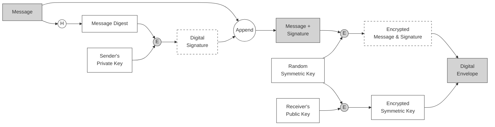
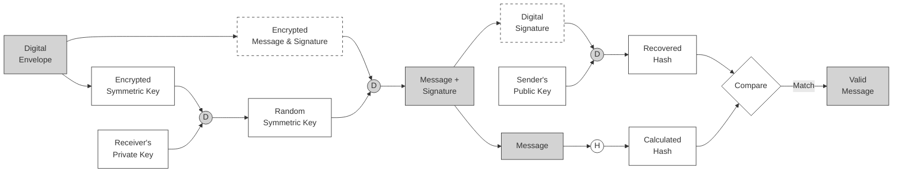

# 2.9 Digital Envelopes with Digital Signature

To authenticate the message in the digital envelope, we need to add a digital signature process. This typically involves the sender signing a hash of the message with their private key, and the receiver verifying it with the sender's public key.

Below are the diagrams for (a) Creation and (b) Opening of a digital envelope with a digital signature.

## (a) Creation of a digital envelope with signature

## (b) Opening a digital envelope with signature verification

## 说明 (Explanation)

### 节点 (Nodes)
在上述图中，主要的节点及其含义如下：
1.  **Message (消息)**: 原始的明文消息。
2.  **Sender's Private Key (发送者的私钥)**: 用于生成数字签名，证明消息来源。
3.  **Digital Signature (数字签名)**: 对消息（通常是消息的哈希值）使用发送者私钥加密后的结果。
4.  **Random Symmetric Key (随机对称密钥)**: 用于加密 "消息 + 签名" 的一次性密钥。
5.  **Receiver's Public Key (接收者的公钥)**: 用于加密对称密钥，确保只有接收者能解密。
6.  **Encrypted Message & Signature (加密的消息和签名)**: 使用对称密钥加密后的数据包。
7.  **Encrypted Symmetric Key (加密的对称密钥)**: 使用接收者公钥加密后的对称密钥。
8.  **Digital Envelope (数字信封)**: 包含 "加密的消息和签名" 以及 "加密的对称密钥" 的组合体。
9.  **Receiver's Private Key (接收者的私钥)**: 用于解密对称密钥。
10. **Sender's Public Key (发送者的公钥)**: 用于验证数字签名。

### 关系 (Relationships)
图中的箭头表示数据的流动和处理过程：
1.  **签名生成 (Signature Generation)**: 
    *   `Message` -> `Hash` -> `Digest` (生成摘要)。
    *   `Digest` + `Sender's Private Key` -> `Encrypt (Sign)` -> `Digital Signature` (使用发送者私钥加密摘要生成签名)。
2.  **数据打包与加密 (Data Packing & Encryption)**:
    *   `Message` + `Digital Signature` -> `Append` -> `Combined Data` (将签名附在消息后)。
    *   `Combined Data` + `Random Symmetric Key` -> `Encrypt (Symmetric)` -> `Encrypted Message & Signature` (使用对称密钥加密组合数据)。
3.  **密钥封装 (Key Encapsulation)**:
    *   `Random Symmetric Key` + `Receiver's Public Key` -> `Encrypt (Public)` -> `Encrypted Symmetric Key` (使用接收者公钥加密对称密钥)。
4.  **信封解包 (Envelope Opening)**:
    *   接收者首先使用 `Receiver's Private Key` 解密 `Encrypted Symmetric Key` 得到 `Random Symmetric Key`。
    *   使用 `Random Symmetric Key` 解密 `Encrypted Message & Signature` 得到 `Message` 和 `Digital Signature`。
5.  **签名验证 (Signature Verification)**:
    *   接收者使用 `Sender's Public Key` 解密 `Digital Signature` 得到 `Recovered Hash`。
    *   同时对解密出的 `Message` 进行哈希计算得到 `Calculated Hash`。
    *   比较两个哈希值，如果一致，则证明消息未被篡改且确由发送者发送。
