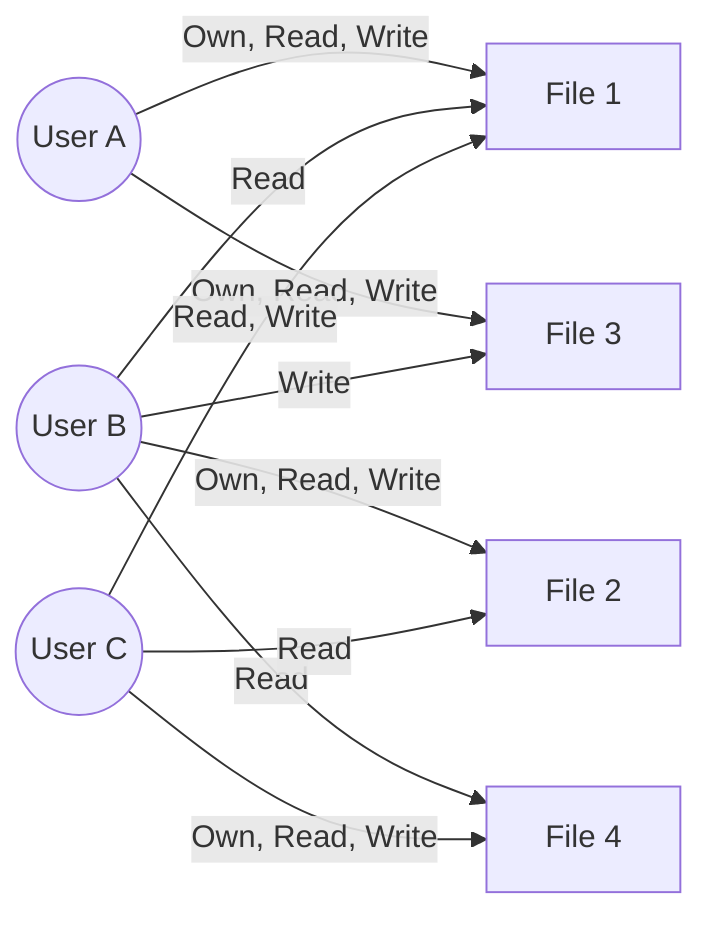
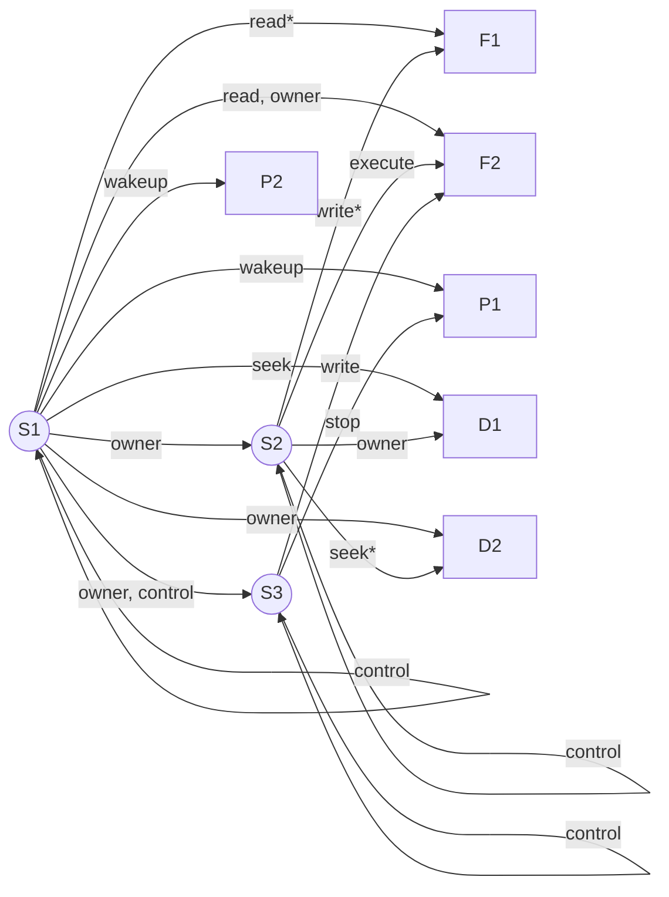

# 4.1 DAC 模型：有向图与访问矩阵

## a. 图 4.2a 的有向图表示

根据图 4.2a 的访问矩阵，主体为 User A、User B、User C，客体为 File 1 到 File 4。有向图如下所示：

## b. 图 4.3 的有向图表示

根据图 4.3 的扩展访问控制矩阵，主体包含 S1, S2, S3。注意主体同时也是客体。有向图如下：

## c. 有向图表示法和访问矩阵表示法之间是否存在一一对应关系？请解释。

**是的，这两种表示方法之间存在完美的一一对应关系（One-to-one correspondence）。**

**解释：**
这两种方法只是对同一“保护状态（Protection State）”的不同视觉呈现：
1. **从矩阵到有向图：** 访问矩阵中的每一行代表一个主体（Subject $S_i$），每一列代表一个客体（Object $O_j$）。如果矩阵单元格 $(S_i, O_j)$ 中包含访问权限（如 Read, Write），那么在有向图中，就必然存在一条从节点 $S_i$ 指向节点 $O_j$ 的有向边，并且该单元格中的权限列表就是这条边的标签。如果主体本身也是客体（如问题 b），那么在图中只用一个节点表示，对自身的权限体现为指向自身的闭环边。
2. **从有向图到矩阵：** 反过来，有向图中的每一个节点都可以被分类为主体或客体。图中的每一条边（假设从节点 A 指向节点 B，标签为 Rights）都可以直接无损地填入访问矩阵中：将节点 A 对应为矩阵的行，节点 B 对应为矩阵的列，并将边的标签（Rights）写入对应的单元格中。

因为没有任何信息的丢失或增加，任何一个访问矩阵都可以唯一地转换为一个有向图，任何一个有向图也可以唯一地转换为一个访问矩阵。
