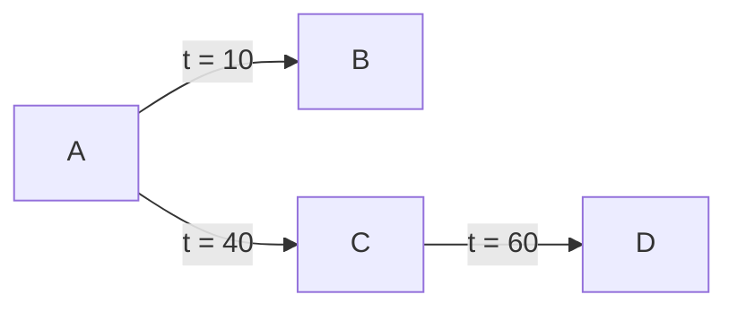

### 5.9 题解答

**问题描述：**
假设在 $t = 70$ 时，用户 B 撤销了授予用户 C 的访问权限。根据级联撤销的约定，画出最终的访问权限依赖关系图。

**分析与解答：**

根据大多数数据库实现的级联撤销约定：**当一个用户撤销访问权限时，所有由该授权级联产生的权限也会被撤销，除非该级联权限在没有原始授权的情况下依然能够存在（即有其他独立的时间线支撑）。** 权限的有效性严格依赖于授权发生时授权者所拥有的权限来源。

1. **撤销动作：** 在 $t=70$ 时，B 撤销了对 C 的授权。这意味着 $t=20$ 时的 `B -> C` 授权失效。
2. **对于用户 C：** 尽管 B 的授权被撤销，但 C 在 $t=40$ 时还直接从 A 处获得了授权（`A -> C`）。因此，C 依然保留访问权限。
3. **对于用户 D：** 
   - C 在 $t=30$ 时授予了 D 权限（`C -> D`）。在这个时间点，C 唯一的权限来源是 B（发生在 $t=20$）。因此，随着 B 撤销授权，这条 `C -> D (t=30)` 的授权被级联撤销。
   - C 在 $t=60$ 时再次授予了 D 权限（`C -> D`）。在这个时间点，C 已经从 A 处获得了独立的权限（发生在 $t=40$）。因此，这条 `C -> D (t=60)` 的授权有效并被保留。D 依然保留访问权限。
4. **对于用户 E：**
   - D 在 $t=50$ 时授予了 E 权限（`D -> E`）。在这个时间点，D 唯一的权限来源是 $t=30$ 时 C 的授权（此时 C 的权限又完全依赖于 B）。因为 `C -> D (t=30)` 被撤销了，所以 D 在 $t=50$ 时授予 E 的权限也失去了基础，随之被撤销。E 最终失去了访问权限。

**最终结果：**
被撤销的授权包括：`B -> C (t=20)`、`C -> D (t=30)` 和 `D -> E (t=50)`。
保留的授权关系仅剩下：`A -> B (t=10)`、`A -> C (t=40)` 和 `C -> D (t=60)`。

**结果图示（Mermaid 流程图）：**

