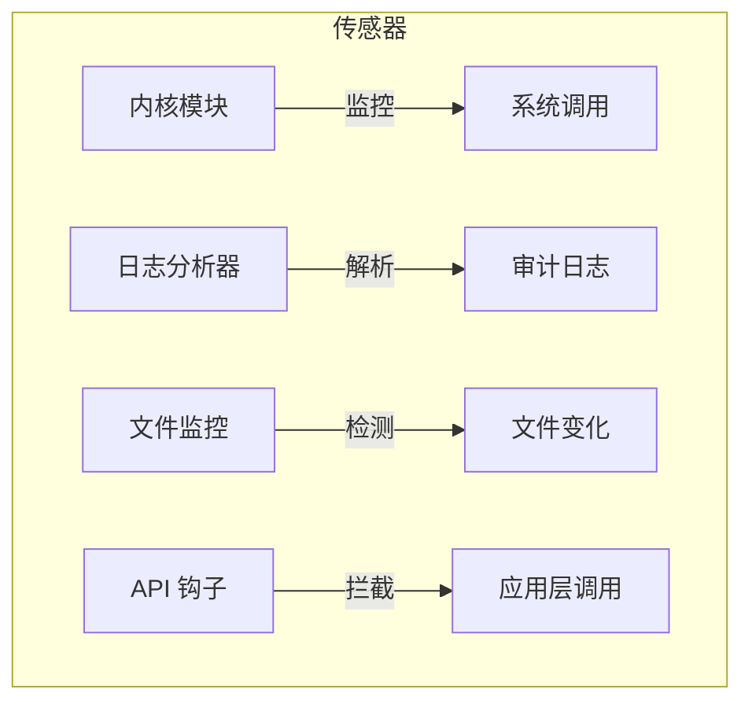

# HIDS 数据源与传感器

> [!info] HIDS 的"眼睛"
> HIDS 要检测主机上的攻击，首先要能看到主机上发生了什么。传感器就是它的"眼睛"——负责采集数据，把主机的活动信息喂给检测引擎。

## 数据源一览

| 数据源         | 能看到什么               | 典型威胁         |
| -------------- | ------------------------ | ---------------- |
| **系统调用**   | 程序调用了哪些内核接口   | 恶意程序行为分析 |
| **审计日志**   | 谁在什么时间做了什么     | 用户活动追踪     |
| **文件完整性** | 哪些文件被修改/新增/删除 | 篡改、后门植入   |
| **注册表**     | Windows 配置项变化       | 恶意配置修改     |
| **进程活动**   | 进程创建、终止、权限变化 | 恶意进程检测     |

> [!tip] 数据源越丰富，检测能力越强
> 单一数据源容易被绕过。例如只看日志，攻击者可以删日志；只看进程，攻击者可以注入合法进程。多数据源交叉验证才可靠。

## 传感器类型

| 传感器         | 监控什么           | 代表工具       |
| -------------- | ------------------ | -------------- |
| **内核模块**   | 系统调用和内核活动 | Linux Audit    |
| **日志分析器** | 系统日志           | OSSEC, Splunk  |
| **文件监控**   | 文件系统变化       | Tripwire, AIDE |
| **API 钩子**   | 应用程序 API 调用  | Windows ETW    |

> [!example] Tripwire 的工作方式
> 1. 初始阶段：计算关键文件的哈希值，建立"干净"的基线
> 2. 检测阶段：定期重新计算哈希值，与基线比对
> 3. 如果哈希值变了 → 文件被篡改 → 触发警报
