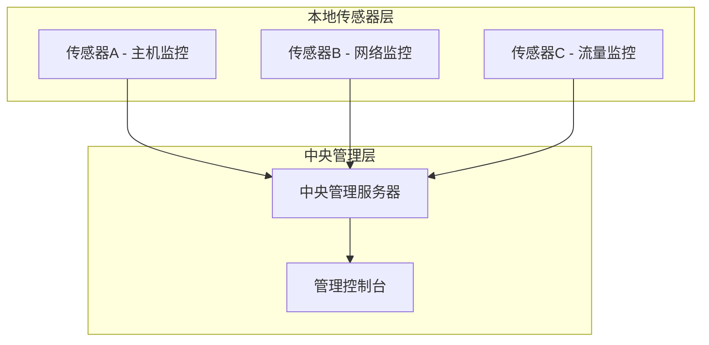

# 分布式 IDS 架构与设计

> [!info] 为什么需要分布式？
> 一台 NIDS 看一个网段，100 个网段就需要 100 台传感器。问题是：攻击者可能同时攻击多个网段，单台传感器看不到**跨网段的攻击链**。分布式 IDS 让所有传感器协同工作，实现"1+1 > 2"的检测效果。

## 整体架构



| 组件           | 作用               | 部署位置          |
| -------------- | ------------------ | ----------------- |
| **本地传感器** | 采集数据，初步分析 | 主机/网络节点     |
| **本地分析器** | 区域级威胁分析     | 分支机构/区域中心 |
| **中央服务器** | 全局关联分析和决策 | 企业数据中心      |
| **管理控制台** | 配置策略、查看告警 | 安全运维中心      |

## 三大关键技术

> [!example] 1. 数据融合 (Data Fusion)
> 把来自不同传感器的数据标准化、去重、聚合，形成统一视图。
>
> ```
> 传感器A报告: IP 10.0.0.5 端口扫描
> 传感器B报告: IP 10.0.0.5 大量 HTTP 请求
> 传感器C报告: IP 10.0.0.5 尝试 SQL 注入
> → 融合后判定: 同一攻击者正在从扫描→探测→利用的攻击链
> ```

> [!example] 2. 关联分析 (Correlation Analysis)
>
> | 类型 | 说明 | 例子 |
> | ---- | ---- | ---- |
> | **时间关联** | 不同时间的事件串联 | T1扫描 → T2探测 → T3攻击 |
> | **空间关联** | 不同位置的事件串联 | 主机A被攻陷 → 主机B异常 → 主机C被提权 |
> | **因果关联** | 事件的因果关系 | 开放了端口 → 攻击者连接 → 数据泄露 |

> [!example] 3. 威胁分级 (Threat Classification)
>
> | 级别 | 状态 | 响应 |
> | ---- | ---- | ---- |
> | **低** | 可疑活动 | 记录日志 |
> | **中** | 可能攻击 | 告警通知 |
> | **高** | 确认攻击 | 自动响应 |
> | **紧急** | 严重入侵 | 立即阻断 |

## 层次化部署

```
[企业总部] ← 中央服务器
     ↕
[分支机构A] ← 区域服务器 + 传感器群
[分支机构B] ← 区域服务器 + 传感器群
```

> [!tip] 带宽是关键瓶颈
> 如果所有传感器都把原始数据发到中央服务器，带宽会被撑爆。所以通常在本地先做**初步分析和过滤**，只把关键告警和摘要数据上传。
