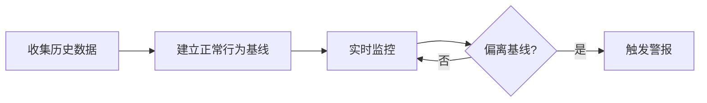

# 异常检测 (Anomaly Detection)

> [!info] 核心思想
> 先学习"正常"长什么样，然后发现"不正常"就报警。就像一个保安记住了所有员工的脸，见到陌生人就盘问。

## 工作原理

## 基线建立方法

| 方法         | 原理                       | 适用场景           |
| ------------ | -------------------------- | ------------------ |
| **统计方法** | 用标准差、置信区间衡量偏离 | 流量模式稳定的网络 |
| **机器学习** | 聚类、分类算法自动学习     | 复杂的用户行为建模 |
| **信息论**   | 基于熵值检测数据流异常     | 高速网络流量分析   |

## 典型监控指标

| 指标       | 正常范围 | 触发异常 |
| ---------- | -------- | -------- |
| CPU 使用率 | 20-60%   | >80%     |
| 网络连接数 | 100-500  | >1000    |
| 登录失败率 | <1%      | >5%      |
| 每日数据量 | ~100MB   | >1GB     |

> [!tip] 优势
> 能检测**零日攻击**（从未见过的攻击），因为不需要知道攻击长什么样——只要"不正常"就会被发现。

> [!danger] 局限
> 误报率高。系统升级、用户行为变化都可能被误判为异常。"正常"本身也在不断变化，基线需要持续更新。

---

> 三种检测方法的对比见 [[启发式检测]]。
