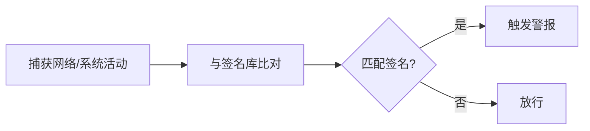

# 签名检测 (Signature Detection)

> [!info] 核心思想
> 维护一本"已知犯罪手法大全"（签名库），然后把每个行为跟书上比对，吻合就报警。就像警察拿着通缉令抓人。

## 工作原理



## 签名示例

```
# SQL 注入签名
URL 参数中包含: ' OR 1=1 --

# 端口扫描签名
同一 IP 在 1 分钟内连接超过 20 个不同端口
```

## 签名库来源

| 来源           | 说明                                  |
| -------------- | ------------------------------------- |
| **CVE 数据库** | 已知漏洞编号系统（如 CVE-2021-44228） |
| **厂商规则集** | 如 Snort、Suricata 社区规则           |
| **安全社区**   | 开源社区维护的签名库                  |

> [!tip] 优势
> 对已知攻击检测准确率极高，误报率低，速度快。签名匹配的逻辑简单明确。

> [!danger] 局限
> **不认识的攻击就抓不到**。签名库必须不断更新。攻击者也可以通过变形（如编码、拆分）绕过签名匹配。

---

> 三种检测方法的对比见 [[启发式检测]]。
