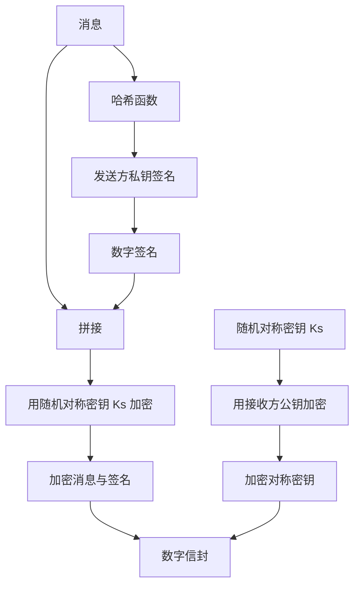
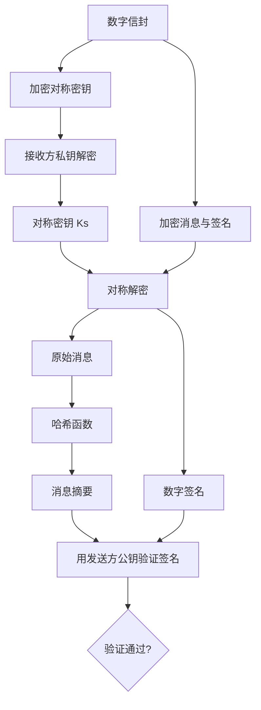

# 非对称加密 (Asymmetric Encryption)

## 基本概念

### 定义
非对称加密（又称公钥密码学）使用**一对数学上相关但不可互相推导的密钥**进行加密和解密：
- **公钥 (Public Key)**：对外公开，任何人都可以获取
- **私钥 (Private Key)**：仅所有者保管，严格保密

数学关系：虽然两个密钥数学上相关，但从公钥推导出私钥在计算上是不可行的。

---

## 非对称加密要解决的问题

对称加密存在两个根本性困难，非对称加密正是为解决它们而提出的：

| 问题           | 对称加密的困境                                                  | 非对称加密的解决方案                     |
| -------------- | --------------------------------------------------------------- | ---------------------------------------- |
| **密钥分发**   | 双方必须通过安全信道预先共享密钥；$N$ 用户需要约 $N^2/2$ 个密钥 | 公钥可以公开分发，无需安全信道           |
| **不可抵赖性** | 收发双方共享密钥，任何一方都能生成消息，无法向第三方证明来源    | 私钥仅个人持有，签名具有唯一性和可证明性 |

---

## 两种基本用法

非对称加密根据使用密钥的顺序不同，可以实现两种截然不同的安全目标：

| 应用场景     | 操作方式                                                  | 实现目标          |
| ------------ | --------------------------------------------------------- | ----------------- |
| **加密**     | 发送方用**接收方的公钥**加密 → 接收方用**自己的私钥**解密 | 机密性            |
| **数字签名** | 发送方用**自己的私钥**签名 → 任何人用**发送方的公钥**验证 | 认证 + 不可抵赖性 |

这两种用法互逆但目标完全不同，是理解非对称加密的关键。

---

## 核心算法

### 1. RSA (Rivest-Shamir-Adleman)

基于**大整数分解**的困难性，是最经典的非对称算法。

$$ C = M^e \bmod n $$
$$ M = C^d \bmod n $$

- 公钥：$(n, e)$
- 私钥：$d = e^{-1} \bmod \phi(n)$，其中 $\phi(n) = (p-1)(q-1)$
- 安全性依赖于：给定 $n = p \times q$，无法高效求出 $p$ 和 $q$

### 2. Diffie-Hellman 密钥交换

基于**离散对数问题**的困难性。注意：DH 本身**不是加密算法**，而是密钥协商协议——双方在不安全信道协商出一个共享秘密。

### 3. ECC (椭圆曲线密码学)

基于**椭圆曲线离散对数问题 (ECDLP)**。核心优势：

- 同等安全强度下密钥更短：256 位 ECC ≈ 3072 位 RSA
- 计算效率更高，适合移动设备和 IoT 场景
- 代表算法：ECDH（密钥交换）、ECDSA（数字签名）、Ed25519

---

## 实际应用：数字信封 (Digital Envelope)

### 问题背景
非对称加密计算量大，不适合加密大量数据。对称加密高效但面临密钥分发问题。

### 解决方案
数字信封将两者结合：**用对称密钥加密消息本体，用非对称加密保护这个对称密钥**。

### 创建流程

### 打开流程

### 数字信封同时实现四个安全目标

| 安全目标       | 实现机制                                           |
| -------------- | -------------------------------------------------- |
| **机密性**     | 消息和签名被对称密钥加密，对称密钥被接收方公钥保护 |
| **完整性**     | 数字签名绑定到原始消息                             |
| **认证**       | 数字签名验证发送方身份                             |
| **不可抵赖性** | 发送方私钥签名，无法伪造                           |

---

## 安全性基础

### 公钥的真实性挑战

非对称加密的前提是获取到正确的公钥。如果攻击者替换了公钥，整个安全体系崩溃。

### 公钥基础设施 (PKI)

PKI 通过信任链解决公钥真实性验证：

- **数字证书**：CA 签发的、绑定身份与公钥的数据结构
- **证书权威 (CA)**：签发和管理数字证书的受信任实体
- **证书撤销列表 (CRL)**：已作废证书的清单

信任链：终端实体证书 → 中间 CA → 根 CA（信任锚点）

---

## 对称加密 vs 非对称加密

| 维度         | [[对称加密                      | 对称加密]]                  | 非对称加密 |
| ------------ | ------------------------------- | --------------------------- |
| 密钥结构     | 单个共享密钥                    | 密钥对（公钥 + 私钥）       |
| 加密速度     | 快，适合大量数据                | 慢，适合少量数据 / 密钥交换 |
| 密钥分发     | 困难，需安全信道                | 简单，公钥可公开            |
| 密钥管理规模 | $N$ 用户需 $\approx N^2/2$ 密钥 | $N$ 用户需 $N$ 个密钥对     |
| 不可抵赖性   | ❌ 不提供                        | ✅ 提供（通过数字签名）      |
| 典型算法     | AES、ChaCha20                   | RSA、ECC、ElGamal           |
