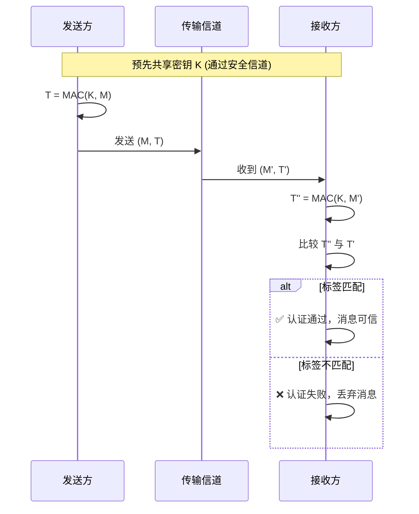

# 消息认证码 (MAC)

## 基本概念

### 定义
消息认证码 (Message Authentication Code, MAC) 是[[消息认证|消息认证]]的对称密码学实现方式，使用**共享密钥** $K$ 为消息生成短固定长度认证标签的密码学技术。

$$ T = MAC(K, M) $$

其中 $K$ 是收发双方共享的密钥，$M$ 是任意长度的消息，$T$ 是固定长度的认证标签。

---

## MAC 的使用过程

MAC 的使用涉及两个角色：发送方和接收方。双方通过安全途径预先共享一个密钥 $K$。

### 发送过程：生成认证标签

发送方将原始消息 $M$ 和密钥 $K$ 输入 MAC 算法，计算出一个固定长度的认证标签 $T$，然后将消息 $M$ 和标签 $T$ 一同发送。

### 接收过程：验证消息

接收方使用同样的密钥 $K$ 对收到的消息 $M'$ 重新计算认证标签 $T''$，并与收到的标签 $T'$ 比较：
- **相等**：消息在传输过程中未被篡改，且确实来自持有密钥 $K$ 的发送方
- **不等**：消息被篡改、或标签被伪造、或发送方不持有正确的密钥

### 使用流程示意

---

## MAC 提供的安全服务

| 安全服务         | 是否提供 | 说明                                                                                                 |
| ---------------- | :------: | ---------------------------------------------------------------------------------------------------- |
| **消息完整性**   |    ✅     | 任何对消息内容或标签的修改都会导致接收方计算出的标签不匹配                                           |
| **消息来源认证** |    ✅     | 只有知晓共享密钥的一方能生成有效标签，接收方可确认消息来自密钥持有方                                 |
| **防重放攻击**   |    ❌     | 单个 MAC 不包含时间或序列信息，相同的 (消息, 标签) 对被重放时依然通过验证                            |
| **不可抵赖性**   |    ❌     | 收发双方共享同一密钥，接收方可以自行生成任意消息的有效标签，因此不能向第三方证明消息确实由发送方发出 |

### 防重放攻击的补充机制

由于 MAC 本身不防重放，需要引入额外机制：

| 机制                         | 原理                                         |
| ---------------------------- | -------------------------------------------- |
| **序列号 (Sequence Number)** | 每条消息附带递增编号，接收方拒绝已见过的编号 |
| **时间戳 (Timestamp)**       | 消息包含发送时间，接收方拒绝过期消息         |
| **[[随机与伪随机数           | Nonce]] / Challenge-Response**               | 接收方先发送一次性随机数，发送方将其纳入 MAC 计算 |

---

## MAC 的构造方式

### 1. 基于哈希的 MAC (HMAC)

使用密码学哈希函数（如 SHA-256）构造 MAC，是最广泛使用的方案：

$$ HMAC(K, M) = H{\Large(}(K \oplus opad) \;\|\; H{\large(}(K \oplus ipad) \;\|\; M{\large)}{\Large)} $$

- $opad$ (outer padding) 和 $ipad$ (inner padding) 是固定的填充常量
- 双层哈希结构防止长度扩展攻击
- 安全性取决于底层哈希函数的安全性

### 2. 基于块密码的 MAC (CBC-MAC / CMAC)

使用块密码（如 AES）的 CBC 模式构造：

- **原理**：对消息分块后使用 CBC 模式加密，取最后一个密文块作为认证标签
- **CMAC (Cipher-based MAC)** 是 CBC-MAC 的改进版本，解决了变长消息的安全问题

### 3. 认证加密模式 (Authenticated Encryption)

现代方案直接将加密和 MAC 合并为单个安全操作：

| 算法                  | 结构                           | 特点                           |
| --------------------- | ------------------------------ | ------------------------------ |
| **AES-GCM**           | CTR 加密 + GHASH 认证          | 高性能，支持并行，TLS 1.3 标准 |
| **AES-CCM**           | CBC-MAC 认证 + CTR 加密        | 经典组合，受 IEEE 802.11 使用  |
| **ChaCha20-Poly1305** | ChaCha20 流加密 + Poly1305 MAC | 软件实现高效，移动设备友好     |

---

## MAC 与数字签名的区别

| 维度           |            MAC             |     [[数字签名\|数字签名]]     |
| -------------- | :------------------------: | :----------------------------: |
| **密码体制**   |         对称密码学         |           公钥密码学           |
| **密钥**       |        单个共享密钥        |     密钥对（私钥 + 公钥）      |
| **验证方**     |      仅共享密钥持有者      |        任何拥有公钥的人        |
| **不可抵赖性** |             ❌              |               ✅                |
| **计算效率**   |             高             |               低               |
| **适用场景**   | 通信双方互信（TLS、IPsec） | 需第三方验证（软件签名、证书） |

---

## 关键注意点

- MAC 应使用与加密密钥**不同的独立密钥**，或通过安全的密钥派生方式分离
- 认证标签的固定长度需足够长以抵御[[暴力破解攻击|暴力猜测]]（通常至少 96 位）
- HMAC 的安全性基于底层哈希函数，不应使用已被破解的哈希（如 MD5、SHA-1）构造 HMAC
- 当需要不可抵赖性时，必须使用[[数字签名]]而非 MAC
