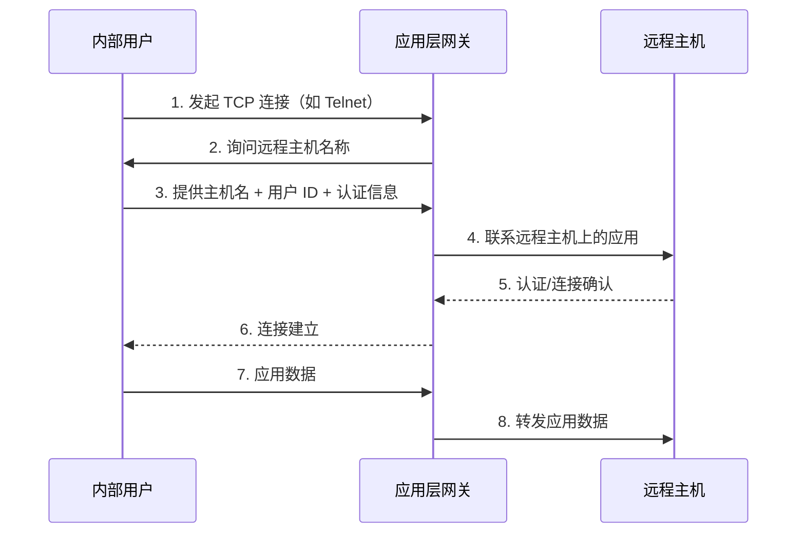

# 应用代理防火墙 (Application Proxy Firewall)

> [!info] 定义
> 也称为**应用层网关（Application-level Gateway）**，充当应用层流量的**中继**。用户通过 TCP/IP 应用（如 Telnet、FTP）联系网关，网关在验证用户身份后，将应用数据的 TCP 段在两端点之间转发。

---

## 工作流程

> [!tip] 关键特征
> 网关处于两条拼接连接（Spliced Connections）的**拼接点**，必须检查并转发两个方向的所有流量。

---

## 认证机制

> [!note] 用户必须向网关证明身份
> 用户联系网关后，网关要求提供**远程主机名称**、**用户 ID** 和**认证信息**。只有认证通过后，网关才会代为联系远程主机并建立连接。

---

## 功能控制

> [!warning] 未实现代理代码的服务不可用
> - 如果网关没有为特定应用实现代理代码，则该服务**不受支持**，无法穿越防火墙
> - 网关可配置为**仅支持特定功能**——管理员可只允许应用的某些特性，拒绝其余所有功能

> [!example] 举例
> FTP 代理可配置为允许 `RETR`（下载）但禁止 `STOR`（上传），从而阻止用户向外部服务器传输文件。

---

## 与其他防火墙的对比

| 对比维度 | [[包过滤防火墙]] | [[状态检测防火墙]] | 应用代理防火墙 |
| --- | --- | --- | --- |
| **工作层级** | 网络层/传输层 | 网络层/传输层 | **应用层** |
| **应用层检查** | 否 | 有限 | **完全** |
| **连接隔离** | 否 | 否 | **是（两条拼接连接）** |
| **安全性** | 低 | 中 | **高** |
| **性能** | 高 | 中 | **低** |
| **灵活性** | 高 | 中 | **低（每种协议需专门代理）** |

---

## 优势

> [!example] 相对于包过滤的改进
> - **安全性更高** — 不需要处理 TCP/IP 层的众多可能组合，只需审查少数允许的应用
> - **审计便捷** — 可轻松记录和审计所有应用层的入站流量
> - **细粒度控制** — 可对应用层协议的特定命令或参数进行过滤
> - **认证支持** — 可集成用户身份认证

---

## 局限性

> [!warning] 缺点
> - **额外处理开销** — 每个连接都需要在网关处进行拼接，网关必须检查并转发两个方向的所有流量
> - **灵活性差** — 每种应用协议需要专门的代理代码，新协议需开发新代理
> - **不适用于所有应用** — 未实现代理代码的应用无法穿越防火墙
> - **单点故障** — 代理服务器宕机将中断所有经其转发的连接

详见 [[防火墙类型]] 总览。
