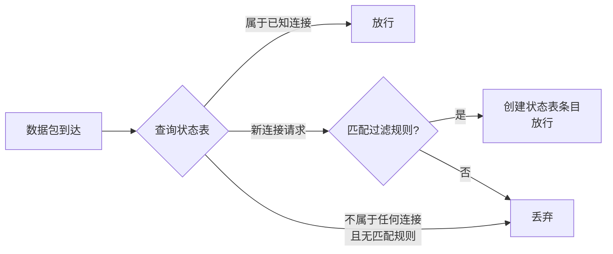

# 状态检测防火墙 (Stateful Inspection Firewall)

> [!info] 定义
> 在 [[包过滤防火墙|包过滤]] 的基础上引入**状态表（State Table）**，跟踪每个活跃连接的状态，从而能够判断数据包是否属于一个合法的、已建立的连接。

---

## 为什么需要状态检测

> [!note] TCP 端口知识背景
> - **熟知端口（Well-known Port）**：编号 $< 1024$，永久分配给特定应用（如 $25$ = SMTP，$80$ = HTTP）
> - **临时端口（Ephemeral Port）**：编号 $1024 \sim 65535$，动态生成，仅在 TCP 连接生命周期内有效
>
> 客户端/服务器模型中，服务器监听熟知端口，客户端使用临时端口发起连接。

> [!warning] 包过滤的困境
> 简单的包过滤防火墙必须允许所有 $> 1023$ 端口的入站流量，以支持 TCP 回程数据。这给未授权用户留下了可利用的漏洞。

---

## 工作原理

> [!note] 核心机制
> 状态检测防火墙维护一张**出站 TCP 连接目录**，每条记录对应一个当前已建立的连接。数据包到达时，只有与目录中某条记录匹配的入站流量才被允许进入高编号端口。

---

## 状态表示例

> [!example] 表 9.2 — 状态防火墙连接状态表（教材原表）

| 源地址 | 源端口 | 目的地址 | 目的端口 | 连接状态 |
| --- | --- | --- | --- | --- |
| $192.168.1.100$ | $1030$ | $210.9.88.29$ | $80$ | Established |
| $192.168.1.102$ | $1031$ | $216.32.42.123$ | $80$ | Established |
| $192.168.1.101$ | $1033$ | $173.66.32.122$ | $25$ | Established |
| $192.168.1.106$ | $1035$ | $177.231.32.12$ | $79$ | Established |
| $223.43.21.231$ | $1990$ | $192.168.1.6$ | $80$ | Established |
| $219.22.123.32$ | $2112$ | $192.168.1.6$ | $80$ | Established |
| $210.99.212.18$ | $3321$ | $192.168.1.6$ | $80$ | Established |
| $24.102.32.23$ | $1025$ | $192.168.1.6$ | $80$ | Established |
| $223.21.22.12$ | $1046$ | $192.168.1.6$ | $80$ | Established |

> [!tip] 表格解读
> - 前 4 行：内部主机主动访问外部 Web（端口 $80$）、邮件（端口 $25$）、finger（端口 $79$）
> - 后 5 行：外部主机访问内部 Web 服务器（$192.168.1.6:80$），说明这些外部连接是合法的回程流量
>
> 防火墙只允许与此目录中某条记录匹配的数据包进入高编号端口。

---

## 增强功能

> [!example] 部分状态检测防火墙还提供以下能力
> - **TCP 序列号跟踪** — 记录 TCP 序列号以防止**会话劫持（Session Hijacking）**等依赖序列号的攻击
> - **有限的应用层检查** — 对 FTP、IM、SIP 等知名协议的应用数据进行有限检查，以识别和跟踪关联连接

---

## 与包过滤的关键区别

| 对比维度 | [[包过滤防火墙]] | 状态检测防火墙 |
| --- | --- | --- |
| **连接状态** | 不跟踪 | 跟踪，维护状态表 |
| **数据包判断依据** | 仅规则集 | 规则集 + 状态表 |
| **TCP 握手感知** | 无 | 能识别 SYN、ACK 等阶段 |
| **对伪造包的防御** | 弱 | 较强 |
| **资源消耗** | 低 | 较高（需维护状态表） |

---

## 优势

> [!example] 相对于包过滤的改进
> - 能识别并拒绝不属于任何已建立连接的异常数据包
> - 可检测某些利用 TCP/IP 协议栈弱点的攻击（如未握手的连接请求）
> - 规则更简洁——只需定义"允许哪些类型的连接建立"，回程流量自动放行
> - 部分产品可跟踪 TCP 序列号，防止会话劫持

---

## 局限性

> [!warning] 仍存在的不足
> - **对应用层检查有限** — 虽然部分产品可对 FTP、SIP 等做有限检查，但远不如 [[应用代理防火墙]] 深入
> - **状态表资源开销** — 大量并发连接会消耗内存和 CPU 资源
> - **UDP 处理困难** — UDP 是无连接协议，状态检测防火墙需要模拟连接状态，增加了复杂性
> - **状态表溢出攻击** — 攻击者可通过大量伪造连接请求耗尽状态表空间

