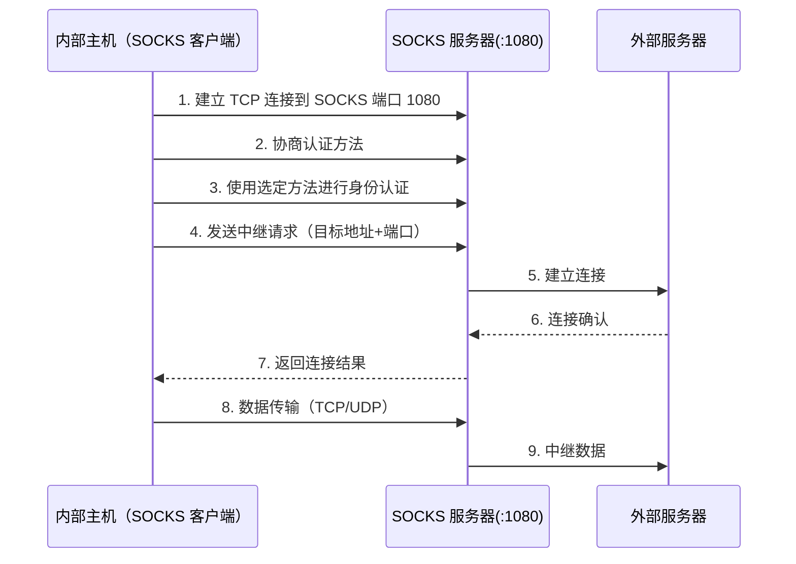

# 电路级代理防火墙 (Circuit-level Proxy Firewall)

> [!info] 定义
> 也称为**电路级网关（Circuit-level Gateway）**，可以是独立系统，也可以是 [[应用代理防火墙|应用层网关]] 为某些应用提供的**专用功能**。它在内部与外部之间建立两条 TCP 连接，但**不检查内容**，安全功能仅限于决定**允许哪些连接**。

---

## 工作原理

> [!note] 核心机制
> 与 [[应用代理防火墙]] 类似，电路级网关不允许端到端的 TCP 连接，而是建立两条独立的 TCP 连接（一条到内部主机，一条到外部主机）。连接建立后，网关将 TCP 段从一个连接中继到另一个，**不检查内容**。安全性完全取决于连接允许/拒绝策略。

> [!tip] 与 [[应用代理防火墙]] 的区别
> 应用代理在**应用层**解析并过滤数据；电路级网关在建立连接后仅做中继，**不检查**应用层内容。

---

## 混合配置模式

> [!example] 管理员信任内部用户时的典型配置
> - **入站连接** → 使用应用层/代理服务（检查外部访问内部的数据）
> - **出站连接** → 使用电路级功能（不检查内部访问外部的数据）
>
> 这样既对入站流量进行内容审查，又避免了出站流量的处理开销。

---

## 典型实现：SOCKS

> [!note] SOCKS 协议（RFC 1928, SOCKS v5）
> SOCKS 是最典型的电路级网关实现。它在概念上是应用层与传输层之间的**"垫片层"（Shim-layer）**，不提供网络层网关服务（如 ICMP 转发）。

### SOCKS 组件

| 组件 | 说明 |
| --- | --- |
| **SOCKS 服务器** | 运行在防火墙上（通常为 UNIX 系统，也支持 Windows），监听 TCP 端口 $1080$ |
| **SOCKS 客户端库** | 运行在受防火墙保护的内部主机上 |
| **SOCKS 化的客户端程序** | 如 FTP、Telnet 等标准客户端的 SOCKS 版本，通过重编译或动态加载 SOCKS 库来使用封装例程 |

### SOCKS 工作流程

### UDP 交换

> [!note] UDP 的特殊处理
> UDP 没有连接概念，SOCKS 通过建立一条**TCP 连接**来认证用户并授权收发 UDP 段。只要 TCP 连接保持打开，UDP 段就会被持续转发。

---

## 与其他防火墙的对比

| 对比维度 | [[包过滤防火墙]] | [[状态检测防火墙]] | [[应用代理防火墙]] | 电路级代理 |
| --- | --- | --- | --- | --- |
| **工作层级** | 网络层/传输层 | 网络层/传输层 | 应用层 | **传输层** |
| **应用层检查** | 否 | 有限 | 完全 | **否** |
| **连接隔离** | 否 | 否 | 是 | **是** |
| **性能** | 高 | 中 | 低 | **中高** |
| **安全性** | 低 | 中 | 高 | **中高** |

---

## 优势

> [!example] 优点
> - **比 [[包过滤防火墙]] 更安全** — 实现了连接隔离，隐藏内部地址
> - **比 [[应用代理防火墙]] 更快** — 不需解析应用层数据，处理开销较小
> - **通用性强** — SOCKS 可代理几乎所有基于 TCP 的应用
> - **配置灵活** — 可独立部署，也可作为应用层网关的辅助功能

---

## 局限性

> [!warning] 缺点
> - **无法检查应用层内容** — 不具备内容过滤和深度检查能力
> - **不能阻止应用层攻击** — 恶意数据可直接通过中继通道传输
> - **需要客户端支持** — 应用程序需使用 SOCKS 化的版本（重编译或替换动态库）
> - **单点故障** — 代理服务器故障将中断所有连接

详见 [[防火墙类型]] 总览。
