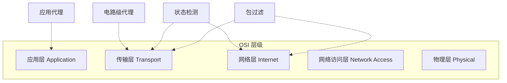

# 防火墙类型

> [!info] 概述
> 防火墙可以监控不同层级的网络流量，从底层的数据包到应用层协议。具体选择哪种层级，取决于所需的访问策略。防火墙可以作为**正向过滤器（Positive Filter）** 只放行满足条件的数据包，也可以作为**反向过滤器（Negative Filter）** 拒绝满足特定条件的数据包。

---

## 防火墙通用模型

> [!abstract] 基本部署拓扑
> 所有防火墙都位于受保护的内部网络（Internal / Protected Network）与不可信的外部网络（External / Untrusted Network，如 Internet）之间。

---

## 四种类型对比

| 类型                                       | 工作层级        | 是否维持连接状态 | 是否理解应用协议 | 安全性 |
| ------------------------------------------ | --------------- | ---------------- | ---------------- | ------ |
| **包过滤防火墙** (Packet Filtering)        | 网络层 / 传输层 | 否               | 否               | 低     |
| **状态检测防火墙** (Stateful Inspection)   | 网络层 / 传输层 | **是**           | 否               | 中     |
| **应用代理防火墙** (Application Proxy)     | **应用层**      | 是               | **是**           | 高     |
| **电路级代理防火墙** (Circuit-level Proxy) | 传输层          | 是               | 否               | 中高   |

---

## 各类型详解

| 防火墙类型     | 一句话概括                         | 笔记链接             |
| -------------- | ---------------------------------- | -------------------- |
| **包过滤**     | 逐包检查 IP/端口，速度快但安全性低 | [[包过滤防火墙]]     |
| **状态检测**   | 在包过滤基础上增加状态表，跟踪连接 | [[状态检测防火墙]]   |
| **应用代理**   | 深度检查应用层数据，安全性最高     | [[应用代理防火墙]]   |
| **电路级代理** | 传输层中继，隐藏内部地址           | [[电路级代理防火墙]] |

> [!note] 另外，[[防火墙部署#个人防火墙|个人防火墙]] 是面向个人计算机的轻量级防火墙软件，详见防火墙部署笔记。

---

## 工作层级示意

> [!tip] 选择建议
> 实际部署中，往往将多种类型的防火墙**组合使用**（如状态检测 + 应用代理），在性能与安全之间取得平衡。

详见 [[防火墙部署]] 了解各种部署平台（堡垒主机、主机防火墙等）。
