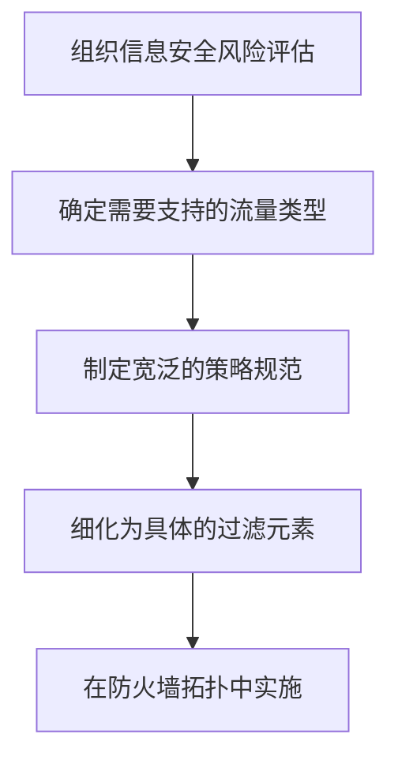

# 访问策略与过滤

> [!info] 防火墙访问策略 (Firewall Access Policy)
> 规定哪些类型的流量被允许通过防火墙的规则集合，包括地址范围、协议类型、应用和服务、内容类型等。访问策略是防火墙规划和实施中的**关键组件**。

---

## 访问策略的制定流程

> [!warning] 策略来源
> 访问策略应当从组织的**信息安全风险评估和整体安全策略**中推导出来，而非凭空设计。第 14、15 章会深入讨论相关内容。

---

## NIST SP 800-41 四大过滤特性

> [!quote] NIST SP 800-41《防火墙与防火墙策略指南》(2009.9) 列出了防火墙访问策略可使用的过滤特性

### 1. IP 地址与协议值 (IP Address and Protocol Values)

- **过滤依据**：源/目的 IP 地址、端口号、数据流方向（入站/出站）、网络层和传输层特征
- **适用防火墙类型**：包过滤防火墙、状态检测防火墙
- **用途**：限制对特定服务的访问

> [!example] 举例
> 一条规则示例：拒绝所有来自外部、目的端口为 $23$（Telnet）的数据包，但允许目的端口为 $443$（HTTPS）的数据包通过。

### 2. 应用协议 (Application Protocol)

- **过滤依据**：应用层协议数据的内容
- **适用防火墙类型**：应用层网关（Application-level Gateway）
- **用途**：中继并监控特定应用协议的信息交换

> [!example] 举例
> - 检查 SMTP 邮件中的垃圾邮件内容
> - 限制 HTTP Web 请求只能访问授权的网站

### 3. 用户身份 (User Identity)

- **过滤依据**：用户的身份标识
- **前提条件**：内部用户需要通过安全认证技术（如 IPSec）证明自己的身份
- **用途**：基于"谁在访问"进行访问控制，而非仅仅基于"从哪里访问"

> [!example] 举例
> 企业规定：只有研发部门员工经身份认证后才能访问外部代码仓库，普通访客网络不允许访问。

### 4. 网络活动 (Network Activity)

- **过滤依据**：时间、请求频率等网络行为模式
- **用途**：基于行为特征进行动态过滤

> [!example] 举例
> - **时间限制**：仅允许在工作时间（$9:00$–$18:00$）访问外部网站
> - **频率限制**：检测扫描行为，若某 IP 在短时间内发起大量连接请求则自动拦截

---

## 四种过滤特性对比

| 过滤特性 | 过滤层级 | 典型应用场景 |
| --- | --- | --- |
| **IP 地址与协议值** | 网络层 / 传输层 | 限制对特定服务或主机的访问 |
| **应用协议** | 应用层 | 内容过滤（垃圾邮件、URL 审查） |
| **用户身份** | 应用层（认证） | 基于角色的访问控制 |
| **网络活动** | 行为层 | 时间限制、速率限制、异常行为检测 |

> [!tip] 综合使用
> 实际部署中，通常需要组合多种过滤特性才能构建完整的安全策略。例如：先用 IP 地址过滤限制访问来源，再用应用协议过滤检查内容，最后用网络活动检测异常行为。
