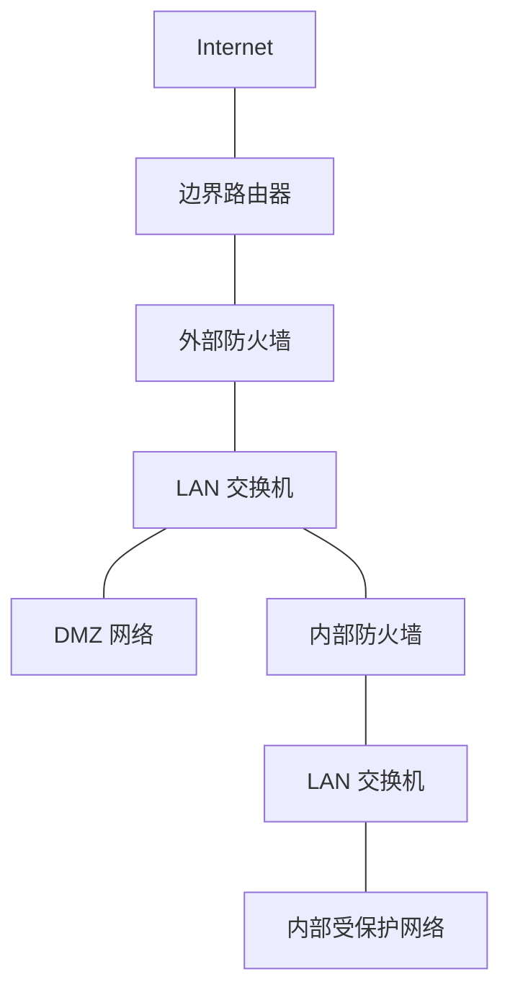
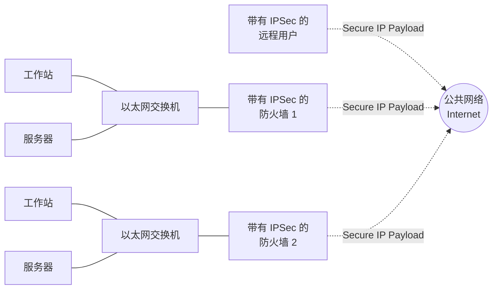

# 防火墙位置与配置 (Firewall Location and Configurations)

> [!info] 定义
> 防火墙位于外部（不可信）流量源与内部网络之间，提供保护屏障。安全管理员需要决定防火墙的**部署位置**和**数量**。最常见的配置方式是采用内外两层防火墙，并在之间设置 DMZ 网络。

---

## DMZ 网络 (DMZ Network)

> [!info] 定义
> **DMZ（Demilitarized Zone，非军事区）** 是位于外部防火墙与内部防火墙之间的网络区域。需要对外提供服务但又需要一定保护的系统通常部署在 DMZ 中，如企业网站、邮件服务器、DNS 服务器等。

### 典型拓扑

> [!note] 拓扑要点
> - **外部防火墙**部署在企业网络边缘，位于边界路由器内侧
> - **DMZ** 位于外部防火墙与内部防火墙之间，通过 LAN 交换机连接
> - **内部防火墙**保护企业内部网络的核心资源
> - DMZ 通常连接到外部防火墙的**不同于内部网络的网络接口**

---

## 外部防火墙的职责

> [!abstract] 为 DMZ 系统提供访问控制与保护

- 为 DMZ 系统提供与其外部连接需求一致的**访问控制和保护**
- 为整个企业网络提供**基础级别的保护**

---

## 内部防火墙的三大作用

> [!quote] 内部防火墙比外部防火墙承担更多的安全职责

### 1. 更严格的过滤

> 内部防火墙提供比外部防火墙**更严格的过滤能力**，保护企业服务器和工作站免受外部攻击。

### 2. 对 DMZ 的双向保护

> [!note] 双向保护机制

- **阻止 DMZ → 内部** — 防止从 DMZ 系统发起的攻击渗透到内部网络。此类攻击可能源于蠕虫、Rootkit、Bot 或其他驻留在 DMZ 系统中的恶意软件
- **阻止内部 → DMZ** — 同时也保护 DMZ 系统免受来自内部受保护网络的攻击

### 3. 内部网段隔离

> 多个内部防火墙可用于**隔离内部网络的不同区域**。例如：用内部防火墙将内部服务器与内部工作站相互保护，防止一个网段的威胁扩散到另一个网段。

---

## 关键设计原则

> [!warning] DMZ 配置注意事项

- **外部防火墙**侧重于基础过滤和 DMZ 的外部访问控制
- **内部防火墙**侧重于深度过滤和多方向保护
- DMZ 与内部网络应使用**不同的网络接口**连接到外部防火墙
- 多道防火墙构成**纵深防御**，任一道被突破后仍有后续防护

---

## 虚拟专用网 (Virtual Private Networks, VPN)

> [!info] 需求背景
> 企业常常需要将分布在不同地理位置的局域网（LAN）连接起来。使用 Internet 等公共网络互连可以节约成本并减轻广域网（WAN）管理负担，同时也方便远程办公的员工接入。但公共网络存在窃听和未授权访问风险。

> [!note] VPN 定义
> VPN 是由一组通过相对不安全的网络互连的计算机组成，利用**加密**和**特殊协议**来提供安全性。VPN 通过在底层协议中使用加密和认证，在不安全的网络（通常是 Internet）中提供安全连接。

### VPN 的实现机制 (IPSec)

> [!tip] IPSec
> 用于实现 VPN 的最常见协议机制位于 IP 层，称为 **IPSec**。

VPN 依赖于两端使用相同的加密和认证系统。这种加密可以由**防火墙软件**或路由器来执行。

**工作原理**：
1. **网关到网关**：网络设备（如带有 IPSec 的防火墙）将进入 WAN 的所有流量进行加密和压缩，并对来自 WAN 的流量进行解密和解压缩。。
2. **端到网关**：拨号进入 WAN 的个体远程用户工作站必须自行实现 IPSec 协议，并具备高水平的主机安全，因为它们直接暴露在 Internet 中，容易成为攻击者的目标。

> [!warning] IPSec 的实施位置
> - **在防火墙中实施**：最合乎逻辑。
> - **在防火墙内部（后方）实施**：如果 IPSec 在防火墙后方的独立设备中实施，那么双向穿过防火墙的 VPN 流量都是加密的，这会导致**防火墙无法执行其过滤、访问控制、日志记录或病毒扫描等安全功能**。
> - **在边界路由器（防火墙外部）实施**：设备通常不如防火墙安全，不是理想的 IPSec 平台。

---

## 分布式防火墙 (Distributed Firewalls)

> [!info] 定义
> 分布式防火墙配置包括**独立防火墙设备**和**主机防火墙**，它们在统一的中心管理控制下协同工作。

### 分布式防火墙的组成

1. **中心管理工具**：允许网络管理员在整个网络范围内设置策略并监控安全。
2. **主机防火墙**：配置在数百台服务器、工作站和远程用户系统上。针对特定机器和应用程序提供量身定制的保护，防止内部攻击。
3. **独立防火墙**：提供全局保护，包括前面讨论的内部防火墙和外部防火墙。

### 分布式防火墙拓扑示例

在分布式防火墙环境中，建立**内部 DMZ** 和**外部 DMZ** 可能是有意义的：

- **外部 DMZ**：位于外部防火墙之外（但在边界路由器内）。存放重要性较低、不需要太强保护的 Web 服务器。由于位于外部防火墙外，这些服务器上的主机防火墙负责提供所需的保护。
- **内部 DMZ**：位于外部防火墙与内部防火墙之间。存放更关键的对外服务。
- **内部受保护网络**：位于内部防火墙之后，其中每台工作站和服务器都配置有主机防火墙。

### 安全监控

> [!important] 监控的重要性
> 安全监控是分布式防火墙配置的重要方面。通常包括：
> - 日志聚合和分析
> - 防火墙统计数据
> - （必要时）对各个主机的细粒度远程监控

---

## 与其他防火墙概念的关系

| 相关主题           | 关系                                   |
| ------------------ | -------------------------------------- |
| [[防火墙概述]]     | 防火墙作为网络安全第一道防线的总体介绍 |
| [[防火墙部署]]     | 堡垒主机常部署在 DMZ 区域              |
| [[防火墙类型]]     | 外部/内部防火墙可采用不同类型组合      |
| [[访问策略与过滤]] | DMZ 和内部网络需要不同的访问策略       |
